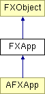

# FXApp

Application Object（应用程序对象）

### FXApp(name=Application, vendor=FoxDefault)

库的版权声明。

构造应用程序对象；名称和供应商字符串用作此应用程序设置注册表数据库的键。
| **参数** | **类型** | **默认值** | **描述** |
| --- | --- | --- | --- |
| name | String | Application | |
| vendor | String | FoxDefault | |

### addChore(tgt, sel)

添加一个空闲处理消息，当系统空闲（即没有要处理的事件）时将其发送到目标对象。
| **参数** | **类型** | **默认值** | **描述** |
| --- | --- | --- | --- |
| tgt | FXObject |  | |
| sel | Int |  | |

### addInput(fd, mode, tgt, sel)

添加一个要监视活动的文件描述符 fd，模式由 mode 确定，mode 是 INPUT_READ、INPUT_WRITE、INPUT_EXCEPT 的按位或。当在文件描述符上检测到指定活动时，将向目标发送 SEL_IO_READ、SEL_IO_WRITE 或 SEL_IO_EXCEPT 类型的消息。

在 Windows 上，必须指定 Win32 事件，而不是文件描述符。 此接口的客户端代码必须是平台相关的。参见下面的 addSocket 以获取可移植接口。CAE
| **参数** | **类型** | **默认值** | **描述** |
| --- | --- | --- | --- |
| fd | FXInputHandle |  | |
| mode | Int |  | |
| tgt | FXObject |  | |
| sel | Int |  | |

### addSocket(sd, mode, tgt, sel)

CAE 添加一个要监视活动的套接字描述符 sd，模式由 mode 确定，mode 是 INPUT_READ、INPUT_WRITE、INPUT_EXCEPT 的按位或。当在套接字描述符上检测到指定活动时，将向目标发送 SEL_IO_READ、SEL_IO_WRITE 或 SEL_IO_EXCEPT 类型的消息。

它在 Unix 上与 addInput 相同。在 Windows 上行为也相同。
| **参数** | **类型** | **默认值** | **描述** |
| --- | --- | --- | --- |
| sd | SOCKET |  | |
| mode | Int |  | |
| tgt | FXObject |  | |
| sel | Int |  | |

### addTimeout(ms, tgt, sel)

添加一个超时消息，将在 ms 毫秒后发送到目标对象；计时器只在间隔到期后触发一次。
| **参数** | **类型** | **默认值** | **描述** |
| --- | --- | --- | --- |
| ms | Int |  | |
| tgt | FXObject |  | |
| sel | Int |  | |

### beep()

蜂鸣。

### beginWaitCursor()

等待光标块的开始；等待光标块可以嵌套。

### create()

创建应用程序的窗口。

在 AFXApp 中重新实现。

### endWaitCursor()

等待光标块的结束。

### forceRefresh()

强制 GUI 刷新。

### getAppName()

获取应用程序名称。

### getBorderColor()

获取默认颜色。

### getMainWindow()

获取主窗口（如果有）。

### getMonoVisual()

获取单色视觉对象。

### getNormalFont()

返回默认字体。

### getRoot()

获取根窗口。

### getTypingSpeed()

获取应用程序范围的设置。

### init(argc, argv, connect=True)

初始化应用程序。解析并移除常见的命令行参数，读取注册表。最后，如果 connect 为 True，则打开显示。
| **参数** | **类型** | **默认值** | **描述** |
| --- | --- | --- | --- |
| argc | Int |  | |
| argv | String |  | |
| connect | Bool | True | |

### peekEvent()

查看是否有事件。

### refresh()

调度刷新。

### removeChore(c)

移除空闲处理消息。
| **参数** | **类型** | **默认值** | **描述** |
| --- | --- | --- | --- |
| c | FXChore |  | |

### removeInput(fd, mode)

移除指定文件描述符和模式的输入消息和目标对象，mode 是 INPUT_READ、INPUT_WRITE、INPUT_EXCEPT 的按位或。
| **参数** | **类型** | **默认值** | **描述** |
| --- | --- | --- | --- |
| fd | FXInputHandle |  | |
| mode | Int |  | |

### removeSocket(sd, mode)

CAE 移除指定套接字描述符和模式的输入消息和目标对象，mode 是 INPUT_READ、INPUT_WRITE、INPUT_EXCEPT 的按位或。
| **参数** | **类型** | **默认值** | **描述** |
| --- | --- | --- | --- |
| sd | SOCKET |  | |
| mode | Int |  | |

### removeTimeout(t)

移除计时器，返回 NULL。
| **参数** | **类型** | **默认值** | **描述** |
| --- | --- | --- | --- |
| t | FXTimer |  | |

### repaint()

绘制所有标记为重绘的窗口。返回时所有应用程序窗口都已绘制。

### run()

运行主应用程序事件循环，直到调用 stop()，并返回作为参数传递给 stop() 的退出代码。

在 AFXApp 中重新实现。

### runOneEvent()

执行一个事件调度。

### runUntil(condition)

运行事件循环直到某个标志变为非零。

在 AFXApp 中重新实现。
| **参数** | **类型** | **默认值** | **描述** |
| --- | --- | --- | --- |
| condition | Int |  | |

### runWhileEvents(window=None)

当队列中有可用事件时运行事件循环。当队列中的所有事件都被处理时返回 1，当事件循环因 stop() 或 stopModal() 而终止时返回 0。除模态窗口及其子项外，所有窗口的用户输入都被阻止；如果模态窗口为 NULL，则所有用户输入都被阻止。
| **参数** | **类型** | **默认值** | **描述** |
| --- | --- | --- | --- |
| window | FXWindow | None | |

### setBorderColor(color)

更改默认颜色。
| **参数** | **类型** | **默认值** | **描述** |
| --- | --- | --- | --- |
| color | FXColor |  | |

### setNormalFont(font)

更改默认字体。
| **参数** | **类型** | **默认值** | **描述** |
| --- | --- | --- | --- |
| font | FXFont |  | |

### setTypingSpeed(speed)

更改应用程序范围的设置。
| **参数** | **类型** | **默认值** | **描述** |
| --- | --- | --- | --- |
| speed | Int |  | |

### stop(value=0)

终止最外层事件循环及其所有内部模态循环；所有更深层嵌套的事件循环将以代码 0 终止，而最外层事件循环将返回等于 value 的代码。
| **参数** | **类型** | **默认值** | **描述** |
| --- | --- | --- | --- |
| value | Int | 0 | |

### useWidgetBackColor(state)

CAE 开始。

仅在 Windows 上，widget 的背景颜色通常从桌面主题获取，即使使用 widget 的 setBackColor 方法设置了 widget 的背景颜色。useWidgetBackColor 方法允许自定义项覆盖该行为，转而使用 widget 的 setBackColor 方法设置的颜色。如果使用 Windows 经典主题，则不需要使用此方法。
| **参数** | **类型** | **默认值** | **描述** |
| --- | --- | --- | --- |
| state | Bool |  | |

### 类标志

### **应用程序理解的消息。**

| **ID_QUIT** | 正常终止应用程序。 |
| --- | --- |
| **ID_DUMP** | 转储当前 widget 树。 |

### 全局标志

### **addInput 的文件输入模式**

| **INPUT_NONE** | 非活动。 |
| --- | --- |
| **INPUT_READ** | 读取输入 fd。 |
| **INPUT_WRITE** | 写入输入 fd。 |
| **INPUT_EXCEPT** | 输入 fd 异常。 |

### **所有模态方式**

| **MODAL_FOR_NONE** | 非模态事件循环（正常调度）。 |
| --- | --- |
| **MODAL_FOR_WINDOW** | 模态对话框（如果在模态对话框外则蜂鸣）。 |
| **MODAL_FOR_POPUP** | 弹出模态（始终调度到弹出窗口）。 |

### **应用程序提供的默认光标**

| **DEF_ARROW_CURSOR** | 箭头光标。 |
| --- | --- |
| **DEF_RARROW_CURSOR** | 反向箭头光标。 |
| **DEF_TEXT_CURSOR** | 文本光标。 |
| **DEF_HSPLIT_CURSOR** | 水平分割光标。 |
| **DEF_VSPLIT_CURSOR** | 垂直分割光标。 |
| **DEF_XSPLIT_CURSOR** | 交叉分割光标。 |
| **DEF_SWATCH_CURSOR** | 颜色样本拖动光标。 |
| **DEF_MOVE_CURSOR** | 移动光标。 |
| **DEF_DRAGH_CURSOR** | 调整水平边缘大小。 |
| **DEF_DRAGV_CURSOR** | 调整垂直边缘大小。 |
| **DEF_DRAGTL_CURSOR** | 调整左上角大小。 |
| **DEF_DRAGBR_CURSOR** | 调整右下角大小。 |
| **DEF_DRAGTR_CURSOR** | 调整右上角大小。 |
| **DEF_DRAGBL_CURSOR** | 调整左下角大小。 |
| **DEF_DNDSTOP_CURSOR** | 拖放停止。 |
| **DEF_DNDCOPY_CURSOR** | 拖放复制。 |
| **DEF_DNDMOVE_CURSOR** | 拖放移动。 |
| **DEF_DNDLINK_CURSOR** | 拖放链接。 |
| **DEF_CROSSHAIR_CURSOR** | 十字线光标。 |
| **DEF_CORNERNE_CURSOR** | 东北光标。 |
| **DEF_CORNERNW_CURSOR** | 西北光标。 |
| **DEF_CORNERSE_CURSOR** | 东南光标。 |
| **DEF_CORNERSW_CURSOR** | 西南光标。 |
| **DEF_ROTATE_CURSOR** | 旋转光标。 |

