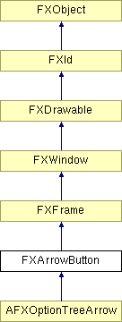

# FXArrowButton

带箭头的按钮；箭头可以指向任何方向。单击时，箭头按钮向其目标发送 SEL_COMMAND。当传递 ARROW_REPEAT 时，箭头按钮在按钮被按住时重复发送 SEL_COMMAND。

### FXArrowButton(p, tgt=None, sel=0, opts=ARROW_NORMAL, x=0, y=0, w=0, h=0, pl=DEFAULT_PAD, pr=DEFAULT_PAD, pt=DEFAULT_PAD, pb=DEFAULT_PAD)

构造箭头按钮。
| **参数** | **类型** | **默认值** | **描述** |
| --- | --- | --- | --- |
| p | FXComposite |  | |
| tgt | FXObject | None | |
| sel | Int | 0 | |
| opts | Int | ARROW_NORMAL | |
| x | Int | 0 | |
| y | Int | 0 | |
| w | Int | 0 | |
| h | Int | 0 | |
| pl | Int | DEFAULT_PAD | |
| pr | Int | DEFAULT_PAD | |
| pt | Int | DEFAULT_PAD | |
| pb | Int | DEFAULT_PAD | |

### canFocus()

因为按钮可以接收焦点，所以返回 True。

从 FXWindow 重新实现。

### disable()

禁用按钮。

从 FXWindow 重新实现。

### enable()

启用按钮。

从 FXWindow 重新实现。

### getArrowColor()

获取箭头的填充颜色。

### getArrowSize()

获取默认箭头大小。

### getArrowStyle()

获取箭头样式标志。

### getDefaultHeight()

获取默认高度。

从 FXFrame 重新实现。

### getDefaultWidth()

获取默认宽度。

从 FXFrame 重新实现。

### getJustify()

获取当前对齐模式。

### getState()

获取按钮状态（True 表示按钮被按下）。

### getTipText()

获取此箭头按钮的工具提示消息。

### setArrowColor(clr)

设置箭头的填充颜色。
| **参数** | **类型** | **默认值** | **描述** |
| --- | --- | --- | --- |
| clr | FXColor |  | |

### setArrowSize(size)

设置默认箭头大小。
| **参数** | **类型** | **默认值** | **描述** |
| --- | --- | --- | --- |
| size | Int |  | |

### setArrowStyle(style)

设置箭头样式标志。
| **参数** | **类型** | **默认值** | **描述** |
| --- | --- | --- | --- |
| style | Int |  | |

### setJustify(mode)

设置当前对齐模式。
| **参数** | **类型** | **默认值** | **描述** |
| --- | --- | --- | --- |
| mode | Int |  | |

### setState(s)

设置按钮状态（True 表示按钮被按下）。
| **参数** | **类型** | **默认值** | **描述** |
| --- | --- | --- | --- |
| s | Bool |  | |

### setTipText(text)

设置此箭头按钮的工具提示消息。
| **参数** | **类型** | **默认值** | **描述** |
| --- | --- | --- | --- |
| text | String |  | |

### 全局标志

### **箭头样式选项**

| **ARROW_NONE** | 无箭头。 |
| --- | --- |
| **ARROW_UP** | 箭头指向上。 |
| **ARROW_DOWN** | 箭头指向下。 |
| **ARROW_LEFT** | 箭头指向左。 |
| **ARROW_RIGHT** | 箭头指向右。 |
| **ARROW_REPEAT** | 按钮按住时重复。 |
| **ARROW_AUTOGRAY** | 更新时自动变灰。 |
| **ARROW_AUTOHIDE** | 更新时自动隐藏按钮。 |
| **ARROW_TOOLBAR** | 按钮是工具栏样式。 |
| **ARROW_SPINNER** | 按钮是微调器样式。 |

