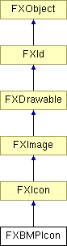

# FXBMPIcon

Microsoft Bitmap 图标。

### FXBMPIcon(a, pix=None, clr=FXRGB(192, 192, 192), opts=0, w=1, h=1)

从内存流构造图标，格式为 Microsoft BMP 格式。
| **参数** | **类型** | **默认值** | **描述** |
| --- | --- | --- | --- |
| a | FXApp |  | |
| pix | | None | |
| clr | FXColor | FXRGB(192, 192, 192) | |
| opts | Int | 0 | |
| w | Int | 1 | |
| h | Int | 1 | |

