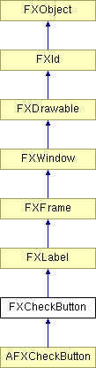

# FXCheckButton

复选按钮是一个三态按钮。通常，它为 True 或 False，每次按下时在 True 和 False 之间切换。可以设置第三种状态 MAYBE 以表示用户尚未做出选择或状态不明确。当按下时，复选按钮向其目标发送 SEL_COMMAND，消息数据表示复选按钮的状态。

### FXCheckButton(p, text, tgt=None, sel=0, opts=CHECKBUTTON_NORMAL, x=0, y=0, w=0, h=0, pl=DEFAULT_PAD, pr=DEFAULT_PAD, pt=DEFAULT_PAD, pb=DEFAULT_PAD)

构造新的复选按钮。
| **参数** | **类型** | **默认值** | **描述** |
| --- | --- | --- | --- |
| p | FXComposite |  | |
| text | String |  | |
| tgt | FXObject | None | |
| sel | Int | 0 | |
| opts | Int | CHECKBUTTON_NORMAL | |
| x | Int | 0 | |
| y | Int | 0 | |
| w | Int | 0 | |
| h | Int | 0 | |
| pl | Int | DEFAULT_PAD | |
| pr | Int | DEFAULT_PAD | |
| pt | Int | DEFAULT_PAD | |
| pb | Int | DEFAULT_PAD | |

### canFocus()

因为复选按钮可以接收焦点，所以返回 True。

从 FXWindow 重新实现。

### getCheck()

获取复选按钮状态（True、False 或 MAYBE）。

在 AFXCheckButton 中重新实现。

### getDefaultHeight()

获取默认高度。

从 FXLabel 重新实现。

### getDefaultWidth()

获取默认宽度。

从 FXLabel 重新实现。

### setCheck(state=True)

设置复选按钮状态（True、False 或 MAYBE）。
| **参数** | **类型** | **默认值** | **描述** |
| --- | --- | --- | --- |
| state | Bool | True | |

### 全局标志

### **CheckButton 样式**

| **CHECKBUTTON_AUTOGRAY** | 更新时自动变灰。 |
| --- | --- |
| **CHECKBUTTON_AUTOHIDE** | 更新时自动隐藏。 |

