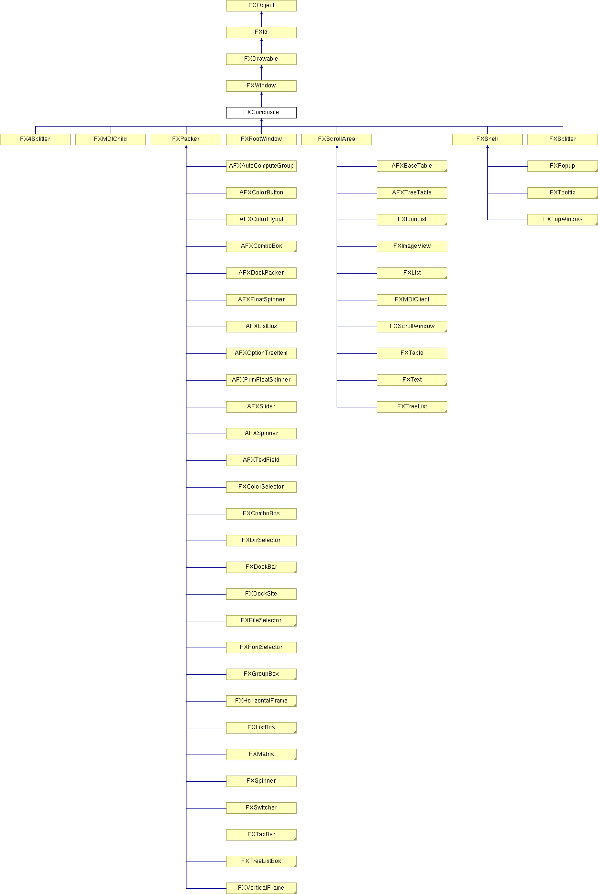

# FXComposite

基组合框。

### FXComposite(p, opts=0, x=0, y=0, w=0, h=0)

构造函数。
| **参数** | **类型** | **默认值** | **描述** |
| --- | --- | --- | --- |
| p | FXComposite |  | |
| opts | Int | 0 | |
| x | Int | 0 | |
| y | Int | 0 | |
| w | Int | 0 | |
| h | Int | 0 | |

### create()

创建服务器端资源。

从 FXWindow 重新实现。

在 FXColorSelector、FXComboBox、FXDirBox、FXDirList、FXDriveBox、FXFileList、FXFontSelector、FXGroupBox、FXIconList、FXImageView、FXList、FXListBox、FXMDIChild、FXPrintDialog、FXRootWindow、FXScrollWindow、FXShell、FXSpinner、FXTabBar、FXTable、FXText、FXToolbarShell、FXTooltip、FXTopWindow、FXTreeList、FXTreeListBox、AFXManagerMenuPane、AFXMainWindow、AFXPromptArea、AFXBaseTable、AFXColorButton、AFXColorFlyout、AFXComboBox、AFXDialog、AFXFloatSpinner、AFXListBox、AFXNote、AFXOptionTreeItem、AFXPrimFloatSpinner、AFXSpinner、AFXTable、AFXTextField 和 AFXVerticalAligner 中重新实现。

### destroy()

销毁服务器端资源。

从 FXWindow 重新实现。

在 FXComboBox、FXDirBox、FXDirList、FXDriveBox、FXFileList、FXListBox、FXRootWindow、FXTreeList、FXTreeListBox、AFXColorFlyout 和 AFXTable 中重新实现。

### detach()

分离服务器端资源。

从 FXWindow 重新实现。

在 FXComboBox、FXDirBox、FXDirList、FXDriveBox、FXFileList、FXGroupBox、FXIconList、FXImageView、FXList、FXListBox、FXMDIChild、FXRootWindow、FXTable、FXText、FXTooltip、FXTopWindow、FXTreeList、FXTreeListBox、AFXBaseTable、AFXColorFlyout、AFXNote 和 AFXTable 中重新实现。

### getDefaultHeight()

返回默认高度。

从 FXWindow 重新实现。

在 FX4Splitter、FXComboBox、FXDockSite、FXGroupBox、FXHorizontalFrame、FXList、FXListBox、FXMDIChild、FXMatrix、FXPacker、FXPopup、FXRootWindow、FXScrollArea、FXSpinner、FXSplitter、FXStatusbar、FXSwitcher、FXTabBar、FXTabBook、FXTable、FXText、FXToolbar、FXToolbarShell、FXTooltip、FXTopWindow、FXTreeList、FXTreeListBox、FXVerticalFrame、AFXMainWindow、AFXToolbarGroup、AFXBaseTable、AFXList、AFXOptionTreeList、AFXPrimFloatSpinner、AFXSlider、AFXTable、AFXTextField、AFXTreeTable 和 AFXVerticalAligner 中重新实现。

### getDefaultWidth()

返回默认宽度。

从 FXWindow 重新实现。

在 FX4Splitter、FXComboBox、FXDockSite、FXGroupBox、FXHorizontalFrame、FXList、FXListBox、FXMDIChild、FXMatrix、FXPacker、FXPopup、FXRootWindow、FXScrollArea、FXSpinner、FXSplitter、FXStatusbar、FXSwitcher、FXTabBar、FXTabBook、FXTable、FXText、FXToolbar、FXToolbarShell、FXTooltip、FXTopWindow、FXTreeList、FXTreeListBox、FXVerticalFrame、AFXMainWindow、AFXToolbarGroup、AFXBaseTable、AFXOptionTreeItem、AFXOptionTreeList、AFXPrimFloatSpinner、AFXSlider、AFXTable、AFXTextField、AFXTreeTable 和 AFXVerticalAligner 中重新实现。

### maxChildHeight()

返回最高子窗口的高度。

### maxChildWidth()

返回最宽子窗口的宽度。

