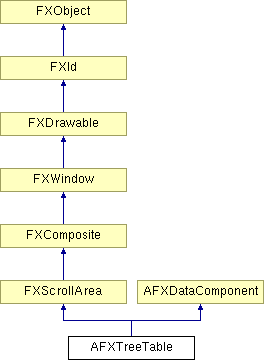

# AFXTreeTable

此类将树 widget 与表 widget 相结合，以允许将数据行与树中的项相关联。

### AFXTreeTable(p, numVisItems, numVisColumns, numColumns, tgt=None, sel=0, opts=AFXTREETABLE_NORMAL, x=0, y=0, w=0, h=0)

构造函数。
| **参数** | **类型** | **默认值** | **描述** |
| --- | --- | --- | --- |
| p | FXComposite |  | 父 widget。 |
| numVisItems | Int |  | 要显示的项数。 |
| numVisColumns | Int |  | 要显示的表列数。 |
| numColumns | Int |  | 表中的列数。 |
| tgt | FXObject | None | 消息目标。 |
| sel | Int | 0 | 消息 ID。 |
| opts | Int | AFXTREETABLE_NORMAL | 选项和提示。 |
| x | Int | 0 | 原点 X 坐标。 |
| y | Int | 0 | 原点 Y 坐标。 |
| w | Int | 0 | 表 widget 的宽度。 |
| h | Int | 0 | 表 widget 的高度。 |

### addItemAfter(other, text, oi=None, ci=None, notify=False)

在使用给定文本和可选图标在另一个树项之后追加一个新的树项。
| **参数** | **类型** | **默认值** | **描述** |
| --- | --- | --- | --- |
| other | FXTreeItem |  | |
| text | String |  | |
| oi | FXIcon | None | |
| ci | FXIcon | None | |
| notify | Bool | False | |

### addItemAfter(other, item, notify=False)

在另一个树项之后追加新的树项。
| **参数** | **类型** | **默认值** | **描述** |
| --- | --- | --- | --- |
| other | FXTreeItem |  | |
| item | FXTreeItem |  | |
| notify | Bool | False | |

### addItemBefore(other, text, oi=None, ci=None, notify=False)

在使用给定文本和可选图标在另一个项之前预先添加一个新的树项。
| **参数** | **类型** | **默认值** | **描述** |
| --- | --- | --- | --- |
| other | FXTreeItem |  | |
| text | String |  | |
| oi | FXIcon | None | |
| ci | FXIcon | None | |
| notify | Bool | False | |

### addItemBefore(other, item, notify=False)

在另一个树项之前预先添加新的项。
| **参数** | **类型** | **默认值** | **描述** |
| --- | --- | --- | --- |
| other | FXTreeItem |  | |
| item | FXTreeItem |  | |
| notify | Bool | False | |

### addItemFirst(p, text, oi=None, ci=None, notify=False)

使用给定文本和可选图标作为第一个子项预先添加一个新的树项。
| **参数** | **类型** | **默认值** | **描述** |
| --- | --- | --- | --- |
| p | FXTreeItem |  | |
| text | String |  | |
| oi | FXIcon | None | |
| ci | FXIcon | None | |
| notify | Bool | False | |

### addItemFirst(p, item, notify=False)

作为第一个子项预先添加新的树项。
| **参数** | **类型** | **默认值** | **描述** |
| --- | --- | --- | --- |
| p | FXTreeItem |  | |
| item | FXTreeItem |  | |
| notify | Bool | False | |

### addItemLast(p, text, oi=None, ci=None, notify=False)

使用给定文本和可选图标作为最后一个子项追加一个新的树项。
| **参数** | **类型** | **默认值** | **描述** |
| --- | --- | --- | --- |
| p | FXTreeItem |  | |
| text | String |  | |
| oi | FXIcon | None | |
| ci | FXIcon | None | |
| notify | Bool | False | |

### addItemLast(p, item, notify=False)

作为最后一个子项追加新的树项。
| **参数** | **类型** | **默认值** | **描述** |
| --- | --- | --- | --- |
| p | FXTreeItem |  | |
| item | FXTreeItem |  | |
| notify | Bool | False | |

### addList(text, opts=AFXTREETABLE_LIST_NORMAL)

向表添加一个只有文本项的列表，并返回列表 ID。列表项的文本字符串由给定文本中的制表符"\\t"分隔。该列表由类型为 LIST 的项使用。
| **参数** | **类型** | **默认值** | **描述** |
| --- | --- | --- | --- |
| text | String |  | 制表符"\\t"分隔的文本字符串（例如"0\\t50\\t100\\t150"）。 |
| opts | Int | AFXTREETABLE_LIST_NORMAL | 选项。 |

### addList(opts=AFXTREETABLE_LIST_NORMAL)

向表添加一个列表，并返回列表 ID。该列表由类型为 LIST 的项使用。
| **参数** | **类型** | **默认值** | **描述** |
| --- | --- | --- | --- |
| opts | Int | AFXTREETABLE_LIST_NORMAL | 列表标志。 |

### appendListItem(listId, text, icon=None)

向指定的表列表追加一个项；返回新项的索引。
| **参数** | **类型** | **默认值** | **描述** |
| --- | --- | --- | --- |
| listId | Int |  | 要追加到的列表的 ID。 |
| text | String |  | 项的文本。 |
| icon | FXIcon | None | 项的图标。 |

### beginEdit(item, column)

如果项可编辑，则将指定的项设置为编辑模式。
| **参数** | **类型** | **默认值** | **描述** |
| --- | --- | --- | --- |
| item | FXTreeItem |  | 树项。 |
| column | Int |  | 项的列索引。 |

### cancelEdit()

取消编辑模式。

### clearContents(startItem, startColumn, endItem, endColumn, clearEditableOnly=True)

清除指定范围内各项的文本。
| **参数** | **类型** | **默认值** | **描述** |
| --- | --- | --- | --- |
| startItem | FXTreeItem |  | 开始清除的树项。 |
| startColumn | Int |  | 开始清除的列。 |
| endItem | FXTreeItem |  | 结束清除的树项。 |
| endColumn | Int |  | 结束清除的列。 |
| clearEditableOnly | Bool | True | 指定 True 仅清除可编辑项的文本。 |

### clearItems(notify=False)

移除所有树项和表行。
| **参数** | **类型** | **默认值** | **描述** |
| --- | --- | --- | --- |
| notify | Bool | False | |

### clearListItems(listId)

从指定的表列表中移除所有项。
| **参数** | **类型** | **默认值** | **描述** |
| --- | --- | --- | --- |
| listId | Int |  | 要清除的列表的 ID。 |

### closeItem(item, notify=False)

关闭指定的项。
| **参数** | **类型** | **默认值** | **描述** |
| --- | --- | --- | --- |
| item | FXTreeItem |  | |
| notify | Bool | False | |

### collapseTree(item, notify=False)

折叠指定的项以隐藏其子项。
| **参数** | **类型** | **默认值** | **描述** |
| --- | --- | --- | --- |
| item | FXTreeItem |  | |
| notify | Bool | False | |

### deleteColumns(startColumn, numColumns=1, notify=False)

从指定列开始删除列。
| **参数** | **类型** | **默认值** | **描述** |
| --- | --- | --- | --- |
| startColumn | Int |  | 起始列。 |
| numColumns | Int | 1 | 要删除的列数。 |
| notify | Bool | False | 指定 True 通知目标删除操作。 |

### deselectItem(item, column, notify=False)

取消选择指定的项。
| **参数** | **类型** | **默认值** | **描述** |
| --- | --- | --- | --- |
| item | FXTreeItem |  | 树项。 |
| column | Int |  | 项的列索引。 |
| notify | Bool | False | |

### deselectRow(item, notify=False)

取消选择行中的所有项。
| **参数** | **类型** | **默认值** | **描述** |
| --- | --- | --- | --- |
| item | FXTreeItem |  | 树项。 |
| notify | Bool | False | |

### expandTree(item, notify=False)

展开指定的项以显示其子项。
| **参数** | **类型** | **默认值** | **描述** |
| --- | --- | --- | --- |
| item | FXTreeItem |  | |
| notify | Bool | False | |

### getColumnWidth(column)

返回指定列的宽度（像素）。
| **参数** | **类型** | **默认值** | **描述** |
| --- | --- | --- | --- |
| column | Int |  | 列索引。 |

### getCurrentColumn()

返回当前项的列索引。

### getCurrentItem()

返回当前项（如果有）。

### getDefaultColumnWidth()

返回表的默认列宽（像素）。

### getDefaultHeight()

返回默认高度。

从 FXScrollArea 重新实现。

### getDefaultWidth()

返回默认宽度。

从 FXScrollArea 重新实现。

### getFirstItem()

返回第一个根树项。

### getItemBoolValue(item, column)

返回类型为 BOOL 的表项的值。
| **参数** | **类型** | **默认值** | **描述** |
| --- | --- | --- | --- |
| item | FXTreeItem |  | 树项。 |
| column | Int |  | 表项的列索引。 |

### getItemCheck(item)

返回项的选中状态。
| **参数** | **类型** | **默认值** | **描述** |
| --- | --- | --- | --- |
| item | FXTreeItem |  | |

### getItemClosedIcon(item)

返回树项的闭合图标。
| **参数** | **类型** | **默认值** | **描述** |
| --- | --- | --- | --- |
| item | FXTreeItem |  | |

### getItemColor(item, column)

返回类型为 COLOR 的表项的颜色。颜色可以是"As is"、"Default"，或者是"RRGGBB"形式的颜色十六进制规范（例如"#0A1B2C"）。
| **参数** | **类型** | **默认值** | **描述** |
| --- | --- | --- | --- |
| item | FXTreeItem |  | 树项。 |
| column | Int |  | 表项的列索引。 |

### getItemFloatValue(item, column)

返回类型为 FLOAT 的表项的值。
| **参数** | **类型** | **默认值** | **描述** |
| --- | --- | --- | --- |
| item | FXTreeItem |  | 树项。 |
| column | Int |  | 表项的列索引。 |

### getItemFormat(item, column)

返回类型为 REAL 的表项的格式（参见 RealFormat）。
| **参数** | **类型** | **默认值** | **描述** |
| --- | --- | --- | --- |
| item | FXTreeItem |  | 树项。 |
| column | Int |  | 表项的列索引。 |

### getItemIcon(item, column)

返回类型为 ICON 的表项的图标。
| **参数** | **类型** | **默认值** | **描述** |
| --- | --- | --- | --- |
| item | FXTreeItem |  | 树项。 |
| column | Int |  | 表项的列索引。 |

### getItemIntValue(item, column)

返回类型为 INT 的表项的值。
| **参数** | **类型** | **默认值** | **描述** |
| --- | --- | --- | --- |
| item | FXTreeItem |  | 树项。 |
| column | Int |  | 表项的列索引。 |

### getItemListId(item, column)

返回类型为 LIST 的表项的列表 ID。
| **参数** | **类型** | **默认值** | **描述** |
| --- | --- | --- | --- |
| item | FXTreeItem |  | 树项。 |
| column | Int |  | 表项的列索引。 |

### getItemListIndex(item, column)

返回类型为 LIST 的表项的列表索引（选择）。
| **参数** | **类型** | **默认值** | **描述** |
| --- | --- | --- | --- |
| item | FXTreeItem |  | 树项。 |
| column | Int |  | 表项的列索引。 |

### getItemNumDigits(item, column)

返回类型为 REAL 的表项的小数点左边的位数。
| **参数** | **类型** | **默认值** | **描述** |
| --- | --- | --- | --- |
| item | FXTreeItem |  | 树项。 |
| column | Int |  | 表项的列索引。 |

### getItemOpenIcon(item)

返回树项的展开图标。
| **参数** | **类型** | **默认值** | **描述** |
| --- | --- | --- | --- |
| item | FXTreeItem |  | |

### getItemPrecision(item, column)

返回类型为 REAL 的表项的精度。
| **参数** | **类型** | **默认值** | **描述** |
| --- | --- | --- | --- |
| item | FXTreeItem |  | 树项。 |
| column | Int |  | 表项的列索引。 |

### getItemText(item, column)

返回类型为 TEXT 的项的文本。
| **参数** | **类型** | **默认值** | **描述** |
| --- | --- | --- | --- |
| item | FXTreeItem |  | 树项。 |
| column | Int |  | 项的列索引。 |

### getItemType(item, column)

返回表项的类型。
| **参数** | **类型** | **默认值** | **描述** |
| --- | --- | --- | --- |
| item | FXTreeItem |  | 树项。 |
| column | Int |  | 表项的列索引。 |

### getItemValue(item, column)

返回任何类型表项的文本形式值。
| **参数** | **类型** | **默认值** | **描述** |
| --- | --- | --- | --- |
| item | FXTreeItem |  | 树项。 |
| column | Int |  | 表项的列索引。 |

### getLastItem()

返回最后一个根树项。

### getListItemIcon(listId, index)

返回指定表列表中指定索引处的项的图标。
| **参数** | **类型** | **默认值** | **描述** |
| --- | --- | --- | --- |
| listId | Int |  | 列表的 ID。 |
| index | Int |  | 要返回的项在列表中的索引。 |

### getListItemIndex(listId, icon)

返回具有指定图标的指定表列表中项的索引。如果不存在这样的项，则返回 -1。
| **参数** | **类型** | **默认值** | **描述** |
| --- | --- | --- | --- |
| listId | Int |  | 列表的 ID。 |
| icon | FXIcon |  | 图标。 |

### getListItemIndex(listId, text)

返回具有指定文本的指定表列表中项的索引。如果不存在这样的项，则返回 -1。
| **参数** | **类型** | **默认值** | **描述** |
| --- | --- | --- | --- |
| listId | Int |  | 列表的 ID。 |
| text | String |  | 文本。 |

### getListItemText(listId, index)

返回指定表列表中指定索引处的项的文本。
| **参数** | **类型** | **默认值** | **描述** |
| --- | --- | --- | --- |
| listId | Int |  | 列表的 ID。 |
| index | Int |  | 要返回的项在列表中的索引。 |

### getNumColumns()

返回列数。

### getNumItems()

返回项数。

### getNumListItems(listId)

返回指定表列表中的项数。
| **参数** | **类型** | **默认值** | **描述** |
| --- | --- | --- | --- |
| listId | Int |  | 列表的 ID。 |

### getTableStyle()

返回仅与表相关的选项。

### getTreeColumn()

返回树的列索引。

### getVisibleColumns()

返回可见列数。

### getVisibleItems()

返回可见项数。

### insertColumns(startColumn, numColumns=1, notify=False)

在指定位置插入列。
| **参数** | **类型** | **默认值** | **描述** |
| --- | --- | --- | --- |
| startColumn | Int |  | 起始列。 |
| numColumns | Int | 1 | 要插入的列数。 |
| notify | Bool | False | 指定 True 通知目标插入操作。 |

### isAnyItemInColumnSelected(column)

如果列中的任何项被选中，则返回 True。
| **参数** | **类型** | **默认值** | **描述** |
| --- | --- | --- | --- |
| column | Int |  | 列索引。 |

### isAnyItemInRowSelected(item)

如果行中的任何项被选中，则返回 True。
| **参数** | **类型** | **默认值** | **描述** |
| --- | --- | --- | --- |
| item | FXTreeItem |  | 树项。 |

### isColumnSelected(column)

如果列中的所有项都被选中，则返回 True。
| **参数** | **类型** | **默认值** | **描述** |
| --- | --- | --- | --- |
| column | Int |  | 列索引。 |

### isItemBool(item, column)

如果指定的表项是 BOOL 类型，则返回 True。
| **参数** | **类型** | **默认值** | **描述** |
| --- | --- | --- | --- |
| item | FXTreeItem |  | 树项。 |
| column | Int |  | 表项的列索引。 |

### isItemColor(item, column)

如果指定的表项是 COLOR 类型，则返回 True。
| **参数** | **类型** | **默认值** | **描述** |
| --- | --- | --- | --- |
| item | FXTreeItem |  | 树项。 |
| column | Int |  | 表项的列索引。 |

### isItemEditable(item, column)

如果表项可编辑，则返回 True。
| **参数** | **类型** | **默认值** | **描述** |
| --- | --- | --- | --- |
| item | FXTreeItem |  | 树项。 |
| column | Int |  | 表项的列索引。 |

### isItemEmpty(item, column)

如果指定的表项没有值，则返回 True。
| **参数** | **类型** | **默认值** | **描述** |
| --- | --- | --- | --- |
| item | FXTreeItem |  | 树项。 |
| column | Int |  | 表项的列索引。 |

### isItemExpanded(item)

如果树项已展开，则返回 True，否则返回 False。
| **参数** | **类型** | **默认值** | **描述** |
| --- | --- | --- | --- |
| item | FXTreeItem |  | |

### isItemFloat(item, column)

如果指定的表项是 FLOAT 类型，则返回 True。
| **参数** | **类型** | **默认值** | **描述** |
| --- | --- | --- | --- |
| item | FXTreeItem |  | 树项。 |
| column | Int |  | 表项的列索引。 |

### isItemIcon(item, column)

如果指定的表项是 ICON 类型，则返回 True。
| **参数** | **类型** | **默认值** | **描述** |
| --- | --- | --- | --- |
| item | FXTreeItem |  | 树项。 |
| column | Int |  | 表项的列索引。 |

### isItemInt(item, column)

如果指定的表项是 INT 类型，则返回 True。
| **参数** | **类型** | **默认值** | **描述** |
| --- | --- | --- | --- |
| item | FXTreeItem |  | 树项。 |
| column | Int |  | 表项的列索引。 |

### isItemLeaf(item)

如果树项是叶项（没有子项），则返回 True，否则返回 False。
| **参数** | **类型** | **默认值** | **描述** |
| --- | --- | --- | --- |
| item | FXTreeItem |  | |

### isItemList(item, column)

如果指定的表项是 LIST 类型，则返回 True。
| **参数** | **类型** | **默认值** | **描述** |
| --- | --- | --- | --- |
| item | FXTreeItem |  | 树项。 |
| column | Int |  | 表项的列索引。 |

### isItemOpened(item)

如果树项已打开，则返回 True，否则返回 False。
| **参数** | **类型** | **默认值** | **描述** |
| --- | --- | --- | --- |
| item | FXTreeItem |  | |

### isItemSelected(item, column)

如果指定的项被选中，则返回 True。
| **参数** | **类型** | **默认值** | **描述** |
| --- | --- | --- | --- |
| item | FXTreeItem |  | 树项。 |
| column | Int |  | 项的列索引。 |

### isItemText(item, column)

如果指定的表项是 TEXT 类型，则返回 True。
| **参数** | **类型** | **默认值** | **描述** |
| --- | --- | --- | --- |
| item | FXTreeItem |  | 树项。 |
| column | Int |  | 表项的列索引。 |

### isItemVisible(item, column)

如果指定的项可见，则返回 True。
| **参数** | **类型** | **默认值** | **描述** |
| --- | --- | --- | --- |
| item | FXTreeItem |  | 树项。 |
| column | Int |  | 项的列索引。 |

### isRowSelected(item)

如果行中的所有项都被选中，则返回 True。
| **参数** | **类型** | **默认值** | **描述** |
| --- | --- | --- | --- |
| item | FXTreeItem |  | |

### killSelection(notify=False)

取消选择所有项。
| **参数** | **类型** | **默认值** | **描述** |
| --- | --- | --- | --- |
| notify | Bool | False | |

### makePositionVisible(item, column)

滚动以使指定的行、列完全可见。
| **参数** | **类型** | **默认值** | **描述** |
| --- | --- | --- | --- |
| item | FXTreeItem |  | 树项。 |
| column | Int |  | 项的列索引。 |

### makeRowVisible(item)

仅垂直滚动以使指定的行完全可见。
| **参数** | **类型** | **默认值** | **描述** |
| --- | --- | --- | --- |
| item | FXTreeItem |  | 树项。 |

### openItem(item, notify=False)

打开指定的项。
| **参数** | **类型** | **默认值** | **描述** |
| --- | --- | --- | --- |
| item | FXTreeItem |  | |
| notify | Bool | False | |

### removeItem(item, notify=False)

移除指定的树项和相应的表行。
| **参数** | **类型** | **默认值** | **描述** |
| --- | --- | --- | --- |
| item | FXTreeItem |  | |
| notify | Bool | False | |

### removeItems(from, to, notify=False)

移除指定的树项及其相应的表行，包括起始和结束项。
| **参数** | **类型** | **默认值** | **描述** |
| --- | --- | --- | --- |
| from | FXTreeItem |  | |
| to | FXTreeItem |  | |
| notify | Bool | False | |

### removeListItem(listId, index)

从指定表列表中移除指定索引处的项；返回列表中剩余的项数。
| **参数** | **类型** | **默认值** | **描述** |
| --- | --- | --- | --- |
| listId | Int |  | 要移除的列表的 ID。 |
| index | Int |  | 要移除的列表项的索引。 |

### selectItem(item, column, notify=False)

选择指定的项。
| **参数** | **类型** | **默认值** | **描述** |
| --- | --- | --- | --- |
| item | FXTreeItem |  | 树项。 |
| column | Int |  | 项的列索引。 |
| notify | Bool | False | |

### selectRow(item, notify=False)

选择行中的所有项。
| **参数** | **类型** | **默认值** | **描述** |
| --- | --- | --- | --- |
| item | FXTreeItem |  | 树项。 |
| notify | Bool | False | |

### setColumnBoolIcons(column, trueIcon=None, falseIcon=None)

设置类型为 BOOL 的列中所有现有和未来表项的 True 和 False 图标。为列指定 -1 将更改表中的所有列并为表设置默认值。
| **参数** | **类型** | **默认值** | **描述** |
| --- | --- | --- | --- |
| column | Int |  | 表列索引。 |
| trueIcon | FXIcon | None | 值为 True 时显示的图标；0 = 默认图标。 |
| falseIcon | FXIcon | None | 值为 False 时显示的图标；0 = 默认图标。 |

### setColumnBoolValue(column, value)

设置类型为 BOOL 的列中所有现有和未来表项的值。为列指定 -1 将更改表中的所有列并为表设置默认值。
| **参数** | **类型** | **默认值** | **描述** |
| --- | --- | --- | --- |
| column | Int |  | 表列索引。 |
| value | Bool |  | 指定 True 或 False。 |

### setColumnColor(column, color)

设置类型为 COLOR 的列中所有现有和未来表项的颜色。颜色可以是"As is"、"Default"、"RRGGBB"形式的颜色十六进制规范（例如"#0A1B2C"），或者是预定义的颜色名称（例如"Red"）。为列指定 -1 将更改表中的所有列并为表设置默认值。
| **参数** | **类型** | **默认值** | **描述** |
| --- | --- | --- | --- |
| column | Int |  | 表列索引。 |
| color | String |  | 颜色。 |

### setColumnColorItemDefault(column, color)

设置类型为 COLOR 的列中所有显示"As is"或"Default"的现有和未来表项的颜色弹出菜单中颜色项的颜色。颜色或者是"RRGGBB"形式的颜色十六进制规范（例如"#0A1B2C"），或者是预定义的颜色名称（例如"Red"）。为列指定 -1 将更改表中的所有列并为表设置默认值。
| **参数** | **类型** | **默认值** | **描述** |
| --- | --- | --- | --- |
| column | Int |  | 表列索引。 |
| color | String |  | 颜色。 |

### setColumnColorOptions(column, opts)

设置类型为 COLOR 的列中所有现有和未来表项的颜色弹出选项。为列指定 -1 将更改表中的所有列并为表设置默认值。
| **参数** | **类型** | **默认值** | **描述** |
| --- | --- | --- | --- |
| column | Int |  | 表列索引。 |
| opts | Int |  | 选项（参见 ColorFlyoutOptions）。 |

### setColumnEditable(column, editable)

设置列中所有现有和未来表项的可编辑性。为列指定 -1 将更改表中的所有列并为表设置默认值。
| **参数** | **类型** | **默认值** | **描述** |
| --- | --- | --- | --- |
| column | Int |  | 表列索引。 |
| editable | Bool |  | 指定 True 为可编辑，False 为只读。 |

### setColumnFloatValue(column, value)

设置类型为 FLOAT 的列中所有现有和未来表项的值。为列指定 -1 将更改表中的所有列并为表设置默认值。
| **参数** | **类型** | **默认值** | **描述** |
| --- | --- | --- | --- |
| column | Int |  | 表列索引。 |
| value | Float |  | 浮点值。 |

### setColumnFormat(column, format)

设置类型为 REAL 的列中所有现有和未来表项的实数格式。
| **参数** | **类型** | **默认值** | **描述** |
| --- | --- | --- | --- |
| column | Int |  | 表列索引。 |
| format | Int |  | 列中 REAL 值的默认格式（参见 RealFormat）。 |

### setColumnIcon(column, icon=None)

设置类型为 ICON 的列中所有现有和未来表项的图标。为列指定 -1 将更改表中的所有列并为表设置默认值。
| **参数** | **类型** | **默认值** | **描述** |
| --- | --- | --- | --- |
| column | Int |  | 表列索引。 |
| icon | FXIcon | None | 图标。 |

### setColumnIntValue(column, value)

设置类型为 INT 的列中所有现有和未来表项的值。为列指定 -1 将更改表中的所有列并为表设置默认值。
| **参数** | **类型** | **默认值** | **描述** |
| --- | --- | --- | --- |
| column | Int |  | 表列索引。 |
| value | Int |  | 整数值。 |

### setColumnJustify(column, justify)

设置列中所有现有和未来表项的对齐方式。为列指定 -1 将更改表中的所有列并为表设置默认值。
| **参数** | **类型** | **默认值** | **描述** |
| --- | --- | --- | --- |
| column | Int |  | 表列索引。 |
| justify | Int |  | 对齐方式（参见 ItemJustify）。 |

### setColumnListId(column, listId)

设置类型为 LIST 的列中所有现有和未来表项的列表 ID。为列指定 -1 将更改表中的所有列并为表设置默认值。
| **参数** | **类型** | **默认值** | **描述** |
| --- | --- | --- | --- |
| column | Int |  | 表列索引。 |
| listId | Int |  | 列表 ID。 |

### setColumnListIndex(column, index)

设置类型为 LIST 的列中所有现有和未来表项的列表索引（选择）。为列指定 -1 将更改表中的所有列并为表设置默认值。
| **参数** | **类型** | **默认值** | **描述** |
| --- | --- | --- | --- |
| column | Int |  | 表列索引。 |
| index | Int |  | 要选择的项的索引。 |

### setColumnNumDigits(column, numDigits)

设置类型为 REAL 的列中所有现有和未来表项的小数点左边的位数。
| **参数** | **类型** | **默认值** | **描述** |
| --- | --- | --- | --- |
| column | Int |  | 表列索引。 |
| numDigits | Int |  | 小数点左边的默认位数。 |

### setColumnPrecision(column, precision)

设置类型为 REAL 的列中所有现有和未来表项的精度。
| **参数** | **类型** | **默认值** | **描述** |
| --- | --- | --- | --- |
| column | Int |  | 表列索引。 |
| precision | Int |  | 小数点右边的位数。 |

### setColumnText(column, text)

设置类型为 TEXT 的列中所有现有和未来表项的文本。为列指定 -1 将更改表中的所有列并为表设置默认值。
| **参数** | **类型** | **默认值** | **描述** |
| --- | --- | --- | --- |
| column | Int |  | 表列索引。 |
| text | String |  | 文本。 |

### setColumnType(column, type)

设置列的类型。为表列指定 -1 将更改表中的所有列并为表设置默认值。
| **参数** | **类型** | **默认值** | **描述** |
| --- | --- | --- | --- |
| column | Int |  | 表列索引。 |
| type | Int |  | 类型（参见项类型的标志）。 |

### setColumnWidth(column, width)

设置指定列的宽度（像素）。为列指定 -1 将更改表中的所有非前导和非尾随列并为表设置默认值。为宽度指定 -1 将调整每个指定列的宽度以最佳适应其前导项和尾随项中当前显示的标题宽度。
| **参数** | **类型** | **默认值** | **描述** |
| --- | --- | --- | --- |
| column | Int |  | 列索引。 |
| width | Int |  | 宽度（像素）。 |

### setColumnWidthInChars(column, numChars)

设置指定列的宽度（字符数）。为列指定 -1 将更改表中的所有非前导和非尾随列并为表设置默认值。
| **参数** | **类型** | **默认值** | **描述** |
| --- | --- | --- | --- |
| column | Int |  | 列索引。 |
| numChars | Int |  | 宽度（字符数）。 |

### setCurrentItem(item, column, notify=False)

设置当前项。
| **参数** | **类型** | **默认值** | **描述** |
| --- | --- | --- | --- |
| item | FXTreeItem |  | 树项。 |
| column | Int |  | 项的列索引。 |
| notify | Bool | False | |

### setDefaultBoolIcons(trueIcon=None, falseIcon=None)

设置表的默认 True 和 False 图标（0 = 默认图标）。
| **参数** | **类型** | **默认值** | **描述** |
| --- | --- | --- | --- |
| trueIcon | FXIcon | None | 值为 True 时显示的图标；0 = 默认图标。 |
| falseIcon | FXIcon | None | 值为 False 时显示的图标；0 = 默认图标。 |

### setDefaultBoolValue(value)

设置表的默认布尔值。
| **参数** | **类型** | **默认值** | **描述** |
| --- | --- | --- | --- |
| value | Bool |  | 指定 True 或 False。 |

### setDefaultColor(color)

设置表中所有类型为 COLOR 的项的默认颜色。颜色可以是"As is"、"Default"、"RRGGBB"形式的颜色十六进制规范（例如"#0A1B2C"），或者是预定义的颜色名称（例如"Red"）。
| **参数** | **类型** | **默认值** | **描述** |
| --- | --- | --- | --- |
| color | String |  | 颜色。 |

### setDefaultColumnWidth(width)

设置所有列的默认宽度（像素）。
| **参数** | **类型** | **默认值** | **描述** |
| --- | --- | --- | --- |
| width | Int |  | 宽度（像素）。 |

### setDefaultFloatValue(value)

设置表的默认浮点值。
| **参数** | **类型** | **默认值** | **描述** |
| --- | --- | --- | --- |
| value | Float |  | 浮点值。 |

### setDefaultFormat(format)

设置表的默认实数格式。
| **参数** | **类型** | **默认值** | **描述** |
| --- | --- | --- | --- |
| format | Int |  | 格式标志。 |

### setDefaultIntValue(value)

设置表的默认整数值。
| **参数** | **类型** | **默认值** | **描述** |
| --- | --- | --- | --- |
| value | Int |  | 整数值。 |

### setDefaultJustify(justify)

设置表的默认对齐方式。
| **参数** | **类型** | **默认值** | **描述** |
| --- | --- | --- | --- |
| justify | Int |  | 对齐方式（参见 ItemJustify）。 |

### setDefaultNumDigits(numDigits)

设置表的小数点左边默认位数。
| **参数** | **类型** | **默认值** | **描述** |
| --- | --- | --- | --- |
| numDigits | Int |  | 位数。 |

### setDefaultPrecision(precision)

设置表的精度。
| **参数** | **类型** | **默认值** | **描述** |
| --- | --- | --- | --- |
| precision | Int |  | 精度。 |

### setDefaultText(text)

设置表的默认文本。
| **参数** | **类型** | **默认值** | **描述** |
| --- | --- | --- | --- |
| text | String |  | 文本。 |

### setDefaultType(type)

设置表的默认类型。
| **参数** | **类型** | **默认值** | **描述** |
| --- | --- | --- | --- |
| type | Int |  | 类型（参见项类型的标志）。 |

### setItemBoolIcons(item, column, trueIcon=None, falseIcon=None)

设置类型为 BOOL 的表项的 True 和 False 图标。
| **参数** | **类型** | **默认值** | **描述** |
| --- | --- | --- | --- |
| item | FXTreeItem |  | 树项。 |
| column | Int |  | 表项的列索引。 |
| trueIcon | FXIcon | None | 值为 True 时显示的图标；0 = 默认图标。 |
| falseIcon | FXIcon | None | 值为 False 时显示的图标；0 = 默认图标。 |

### setItemBoolValue(item, column, value)

设置类型为 BOOL 的表项的值。
| **参数** | **类型** | **默认值** | **描述** |
| --- | --- | --- | --- |
| item | FXTreeItem |  | 树项。 |
| column | Int |  | 表项的列索引。 |
| value | Bool |  | 指定 True 或 False。 |

### setItemCheck(item, check, notify=False)

设置项的选中状态。有效状态为 True、False 和 MAYBE。如果选中值已更改则返回 True，否则返回 False。
| **参数** | **类型** | **默认值** | **描述** |
| --- | --- | --- | --- |
| item | FXTreeItem |  | |
| check | Int |  | |
| notify | Bool | False | |

### setItemClosedIcon(item, icon)

更改树项的闭合图标。
| **参数** | **类型** | **默认值** | **描述** |
| --- | --- | --- | --- |
| item | FXTreeItem |  | |
| icon | FXIcon |  | |

### setItemColor(item, column, color)

设置类型为 COLOR 的表项的颜色。颜色可以是"As is"、"Default"、"RRGGBB"形式的颜色十六进制规范（例如"#0A1B2C"），或者是预定义的颜色名称（例如"Red"）。
| **参数** | **类型** | **默认值** | **描述** |
| --- | --- | --- | --- |
| item | FXTreeItem |  | 树项。 |
| column | Int |  | 表项的列索引。 |
| color | String |  | 颜色。 |

### setItemEditable(item, column, editable)

设置表项的可编辑性。
| **参数** | **类型** | **默认值** | **描述** |
| --- | --- | --- | --- |
| item | FXTreeItem |  | 树项。 |
| column | Int |  | 表项的列索引。 |
| editable | Bool |  | 指定 True 为可编辑，False 为只读。 |

### setItemFloatValue(item, column, value)

设置类型为 FLOAT 的表项的值。
| **参数** | **类型** | **默认值** | **描述** |
| --- | --- | --- | --- |
| item | FXTreeItem |  | 树项。 |
| column | Int |  | 表项的列索引。 |
| value | Float |  | 浮点值。 |

### setItemFormat(item, column, format)

设置类型为 REAL 的表项的格式（参见 RealFormat）。
| **参数** | **类型** | **默认值** | **描述** |
| --- | --- | --- | --- |
| item | FXTreeItem |  | 树项。 |
| column | Int |  | 表项的列索引。 |
| format | Int |  | 表项的格式（参见 RealFormat）。 |

### setItemIcon(item, column, icon=None)

设置类型为 ICON 的表项的图标。
| **参数** | **类型** | **默认值** | **描述** |
| --- | --- | --- | --- |
| item | FXTreeItem |  | 树项。 |
| column | Int |  | 表项的列索引。 |
| icon | FXIcon | None | 图标。 |

### setItemIntValue(item, column, value)

设置类型为 INT 的表项的值。
| **参数** | **类型** | **默认值** | **描述** |
| --- | --- | --- | --- |
| item | FXTreeItem |  | 树项。 |
| column | Int |  | 表项的列索引。 |
| value | Int |  | 整数值。 |

### setItemJustify(item, column, justify)

设置项的对齐方式。
| **参数** | **类型** | **默认值** | **描述** |
| --- | --- | --- | --- |
| item | FXTreeItem |  | 树项。 |
| column | Int |  | 表项的列索引。 |
| justify | Int |  | 对齐方式（参见 ItemJustify）。 |

### setItemListId(item, column, listId)

设置类型为 LIST 的表项的列表 ID。
| **参数** | **类型** | **默认值** | **描述** |
| --- | --- | --- | --- |
| item | FXTreeItem |  | 树项。 |
| column | Int |  | 表项的列索引。 |
| listId | Int |  | 列表 ID。 |

### setItemListIndex(item, column, index)

设置类型为 LIST 的表项的列表索引（选择）。
| **参数** | **类型** | **默认值** | **描述** |
| --- | --- | --- | --- |
| item | FXTreeItem |  | 树项。 |
| column | Int |  | 表项的列索引。 |
| index | Int |  | 要选择的项的索引。 |

### setItemNumDigits(item, column, numDigits)

设置类型为 REAL 的表项的小数点左边的位数。
| **参数** | **类型** | **默认值** | **描述** |
| --- | --- | --- | --- |
| item | FXTreeItem |  | 树项。 |
| column | Int |  | 表项的列索引。 |
| numDigits | Int |  | 位数。 |

### setItemOpenIcon(item, icon)

设置树项的展开图标。
| **参数** | **类型** | **默认值** | **描述** |
| --- | --- | --- | --- |
| item | FXTreeItem |  | |
| icon | FXIcon |  | |

### setItemPrecision(item, column, precision)

设置类型为 REAL 的表项的精度。
| **参数** | **类型** | **默认值** | **描述** |
| --- | --- | --- | --- |
| item | FXTreeItem |  | 树项。 |
| column | Int |  | 表项的列索引。 |
| precision | Int |  | 小数点右边的位数。 |

### setItemText(item, column, text)

设置类型为 TEXT 的项的文本。
| **参数** | **类型** | **默认值** | **描述** |
| --- | --- | --- | --- |
| item | FXTreeItem |  | 树项。 |
| column | Int |  | 项的列索引。 |
| text | String |  | 文本。 |

### setItemType(item, column, type)

设置表项的类型。
| **参数** | **类型** | **默认值** | **描述** |
| --- | --- | --- | --- |
| item | FXTreeItem |  | 树项。 |
| column | Int |  | 表项的列索引。 |
| type | Int |  | 类型（参见项类型的标志）。 |

### setItemValue(item, column, valueText)

设置任何可以解释其值的文本字符串的类型的表项的值。如果指定项的值设置成功，则返回 True。
| **参数** | **类型** | **默认值** | **描述** |
| --- | --- | --- | --- |
| item | FXTreeItem |  | 树项。 |
| column | Int |  | 表项的列索引。 |
| valueText | String |  | 表项的文本形式值。 |

### setLeadingRowLabels(str)

设置前导行的标签。注意：必须使用此 API 设置标题行标签，否则标签将被自动编号覆盖。
| **参数** | **类型** | **默认值** | **描述** |
| --- | --- | --- | --- |
| str | String |  | 制表符"\\t"分隔的列表，也可以包含换行符，表示标签包含多行文本（例如"Young's\\nModulus\\tPoisson's\\nRatio"）。 |

### setListMaxVisible(maxVisible)

设置所有表列表中可见项的最大数量。
| **参数** | **类型** | **默认值** | **描述** |
| --- | --- | --- | --- |
| maxVisible | Int |  | 可见项的最大数量。 |

### setTableStyle(style)

设置表选项。
| **参数** | **类型** | **默认值** | **描述** |
| --- | --- | --- | --- |
| style | Int |  | 样式标志（参见 AFX 表选项的标志）。 |

### setVisibleColumns(visibleColumns)

设置可见列数。
| **参数** | **类型** | **默认值** | **描述** |
| --- | --- | --- | --- |
| visibleColumns | Int |  | 可见列数。 |

### setVisibleItems(visibleItems)

设置可见项数。
| **参数** | **类型** | **默认值** | **描述** |
| --- | --- | --- | --- |
| visibleItems | Int |  | 可见项数。 |

### shadeReadOnlyItems(shadeItems)

如果向方法传递 True，则使表对只读项使用不同的（通常是阴影色的）背景颜色。如果向方法传递 False，则表对可编辑项和只读项使用相同的常规背景颜色。
| **参数** | **类型** | **默认值** | **描述** |
| --- | --- | --- | --- |
| shadeItems | Bool |  | 指定 True 对只读项使用不同的背景颜色。 |

### 类标志

### **颜色弹出按钮的标志（用于类型为 COLOR 的项）。**

| **COLOR_INCLUDE_COLOR_ONLY** | 颜色项的弹出按钮中没有 As Is 和 Default。 |
| --- | --- |
| **COLOR_INCLUDE_AS_IS** | 颜色项的弹出按钮中有 As Is。 |
| **COLOR_INCLUDE_DEFAULT** | 颜色项的弹出按钮中有 Default。 |
| **COLOR_INCLUDE_ALL** | 颜色项的弹出按钮中有 As Is 和 Default。这是默认选项。 |

### **项对齐的标志。**

| **REAL** | 尚未实现（Real）。 |
| --- | --- |
| **LEFT** | 左对齐。 |
| **RIGHT** | 右对齐。 |
| **CENTER** | 居中对齐（水平）。 |
| **TOP** | 顶部对齐。 |
| **BOTTOM** | 底部对齐。 |
| **MIDDLE** | 中间对齐（垂直）。 |

### **项类型的标志。**

| **TEXT** | 项通过文本字段接受文本字符串。 |
| --- | --- |
| **FLOAT** | 项通过文本字段接受浮点数。 |
| **INT** | 项通过文本字段接受整数。 |
| **LIST** | 项从列表接受输入。 |
| **BOOL** | 项是布尔值；显示为图标。 |
| **ICON** | 项显示图标，不接受输入。 |
| **COLOR** | 项通过颜色弹出按钮接受颜色选择。 |

### **实数格式的标志。**

| **GENERAL** | 通用。 |
| --- | --- |
| **SCIENTIFIC** | 科学计数法。 |
| **AUTOMATIC** | 自动。 |

### 全局标志

### **AFX 树表选项的标志。**

| **AFXTREETABLE_COLUMN_RESIZABLE** | 允许用户调整列大小。 |
| --- | --- |
| **AFXTREETABLE_NO_COLUMN_SELECT** | 禁止列选择（选择列中的标题/页脚项会选中整列）。 |
| **AFXTREETABLE_ROW_MODE** | 选择行中的任何项会选中整行。 |
| **AFXTREETABLE_EXTENDED_SELECT** | 使用扩展选择模式，允许选择多项并允许用户拖动选择一系列项。 |
| **AFXTREETABLE_SINGLE_SELECT** | 使用单一选择模式，最多允许选择一项。 |
| **AFXTREETABLE_BROWSE_SELECT** | 使用浏览选择模式，强制始终只选择一项。 |
| **AFXTREETABLE_CHECK_BOXES** | 显示项复选框。 |
| **AFXTREETABLE_PROPAGATE_CHECKS** | 将选中状态传播到子项和父项。 |
| **AFXTREETABLE_NORMAL** | 默认表选项——使用扩展选择模式，列可调整大小，布局填充 X 和 Y 方向。 |

### **表的列表标志（用于类型为 LIST 的项）。**

| **AFXTREETABLE_LIST_PRESELECT_NONE** | 不预选择任何列表项。 |
| --- | --- |

