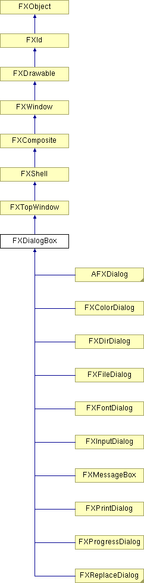

# FXDialogBox

DialogBox 窗口。当接收到 ID_CANCEL 或 ID_ACCEPT 时，DialogBox 退出模态循环并分别返回 False 或 True。要在非模态运行时关闭 DialogBox，只需向其发送 ID_HIDE。

### FXDialogBox(a, name, opts=DECOR_TITLE| DECOR_BORDER, x=0, y=0, w=0, h=0, pl=10, pr=10, pt=10, pb=10, hs=4, vs=4)

构造自由浮动对话框。
| **参数** | **类型** | **默认值** | **描述** |
| --- | --- | --- | --- |
| a | FXApp |  | |
| name | String |  | |
| opts | Int | DECOR_TITLE| DECOR_BORDER | |
| x | Int | 0 | |
| y | Int | 0 | |
| w | Int | 0 | |
| h | Int | 0 | |
| pl | Int | 10 | |
| pr | Int | 10 | |
| pt | Int | 10 | |
| pb | Int | 10 | |
| hs | Int | 4 | |
| vs | Int | 4 | |

### FXDialogBox(owner, name, opts=DECOR_TITLE| DECOR_BORDER, x=0, y=0, w=0, h=0, pl=10, pr=10, pt=10, pb=10, hs=4, vs=4)

构造将始终浮动在所有者窗口上方的对话框。
| **参数** | **类型** | **默认值** | **描述** |
| --- | --- | --- | --- |
| owner | FXWindow |  | |
| name | String |  | |
| opts | Int | DECOR_TITLE| DECOR_BORDER | |
| x | Int | 0 | |
| y | Int | 0 | |
| w | Int | 0 | |
| h | Int | 0 | |
| pl | Int | 10 | |
| pr | Int | 10 | |
| pt | Int | 10 | |
| pb | Int | 10 | |
| hs | Int | 4 | |
| vs | Int | 4 | |

### execute(placement=PLACEMENT_CURSOR)

运行对话框的模态调用。
| **参数** | **类型** | **默认值** | **描述** |
| --- | --- | --- | --- |
| placement | Int | PLACEMENT_CURSOR | |

在 FXInputDialog 和 FXReplaceDialog 中重新实现。

### 类标志

### ** **

| **ID_CANCEL** | 关闭对话框，取消输入。 |
| --- | --- |
| **ID_ACCEPT** | 关闭对话框，接受输入。 |

