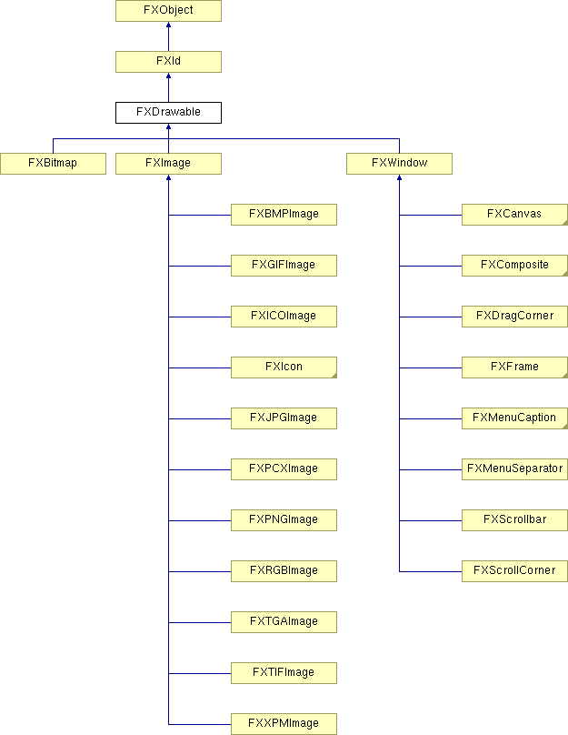

# FXDrawable

Drawable 是一个抽象基类，适用于任何可绘制内容的表面，如 FXWindow 或 FXImage。

### getHeight()

可绘制区域的高度。

### getVisual()

获取视觉对象。

### getWidth()

可绘制区域的宽度。

### resize(w, h)

将可绘制区域调整为指定的宽度和高度。

在 FXBitmap、FXIcon、FXIconList、FXImage、FXMDIChild、FXRootWindow、FXText、FXTopWindow 和 FXWindow 中重新实现。
| **参数** | **类型** | **默认值** | **描述** |
| --- | --- | --- | --- |
| w | Int |  | |
| h | Int |  | |

