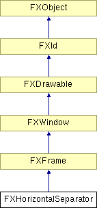

# FXHorizontalSeparator

水平分隔符

### FXHorizontalSeparator(p, opts=SEPARATOR_GROOVE| LAYOUT_FILL_X, x=0, y=0, w=0, h=0, pl=1, pr=1, pt=0, pb=0)

构造函数。
| **参数** | **类型** | **默认值** | **说明** |
| --- | --- | --- | --- |
| p | FXComposite |  |  |
| opts | Int | SEPARATOR_GROOVE| LAYOUT_FILL_X |  |
| x | Int | 0 |  |
| y | Int | 0 |  |
| w | Int | 0 |  |
| h | Int | 0 |  |
| pl | Int | 1 |  |
| pr | Int | 1 |  |
| pt | Int | 0 |  |
| pb | Int | 0 |  |

### getDefaultHeight()

返回默认高度。

从 FXFrame 重新实现。

### getDefaultWidth()

返回默认宽度。

从 FXFrame 重新实现。

### 全局标志

### **分隔符选项**

| **SEPARATOR_NONE** | 无可见内容。 |
| --- | --- |
| **SEPARATOR_GROOVE** | 蚀刻凹槽效果。 |
| **SEPARATOR_RIDGE** | 浮雕脊效果。 |
| **SEPARATOR_LINE** | 简单线条。 |

