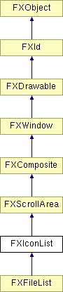

# FXIconList

图标列表窗口部件

### FXIconList(p, tgt=None, sel=0, opts=ICONLIST_NORMAL, x=0, y=0, w=0, h=0)

构造图标列表。
| **参数** | **类型** | **默认值** | **说明** |
| --- | --- | --- | --- |
| p | FXComposite |  |  |
| tgt | FXObject | None |  |
| sel | Int | 0 |  |
| opts | Int | ICONLIST_NORMAL |  |
| x | Int | 0 |  |
| y | Int | 0 |  |
| w | Int | 0 |  |
| h | Int | 0 |  |

### appendHeader(text, icon=None, size=1)

使用给定文本和可选图标追加表头。
| **参数** | **类型** | **默认值** | **说明** |
| --- | --- | --- | --- |
| text | String |  |  |
| icon | FXIcon | None |  |
| size | Int | 1 |  |

### appendItem(text, big=None, mini=None, ptr=None, notify=False)

使用给定文本、可选图标和用户数据指针追加新项。
| **参数** | **类型** | **默认值** | **说明** |
| --- | --- | --- | --- |
| text | String |  |  |
| big | FXIcon | None |  |
| mini | FXIcon | None |  |
| ptr | String | None |  |
| notify | Bool | False |  |

### appendItem(item, notify=False)

将[可能的子类]项追加到列表末尾。
| **参数** | **类型** | **默认值** | **说明** |
| --- | --- | --- | --- |
| item | FXIconItem |  |  |
| notify | Bool | False |  |

### canFocus()

图标列表可以接收焦点。

从 FXWindow 重新实现。

### clearItems(notify=False)

从列表中移除所有项。
| **参数** | **类型** | **默认值** | **说明** |
| --- | --- | --- | --- |
| notify | Bool | False |  |

### create()

创建服务器端资源。

从 FXComposite 重新实现。

在 FXFileList 中重新实现。

### deselectItem(index, notify=False)

取消选择索引处的项。
| **参数** | **类型** | **默认值** | **说明** |
| --- | --- | --- | --- |
| index | Int |  |  |
| notify | Bool | False |  |

### detach()

分离服务器端资源。

从 FXComposite 重新实现。

在 FXFileList 中重新实现。

### disableItem(index)

禁用索引处的项。
| **参数** | **类型** | **默认值** | **说明** |
| --- | --- | --- | --- |
| index | Int |  |  |

### enableItem(index)

启用索引处的项。
| **参数** | **类型** | **默认值** | **说明** |
| --- | --- | --- | --- |
| index | Int |  |  |

### extendSelection(index, notify=False)

从锚点索引到索引处扩展选择。
| **参数** | **类型** | **默认值** | **说明** |
| --- | --- | --- | --- |
| index | Int |  |  |
| notify | Bool | False |  |

### findItem(text, start=-1, flags=SEARCH_FORWARD| SEARCH_WRAP)

按名称搜索项，从起始项开始；flags 参数控制搜索方向和大小写敏感性。
| **参数** | **类型** | **默认值** | **说明** |
| --- | --- | --- | --- |
| text | String |  |  |
| start | Int | -1 |  |
| flags | Int | SEARCH_FORWARD| SEARCH_WRAP |  |

### getAnchorItem()

返回锚点项索引，如果没有则返回 -1。

### getContentHeight()

返回内容高度。

从 FXScrollArea 重新实现。

### getContentWidth()

计算并返回内容宽度。

从 FXScrollArea 重新实现。

### getCurrentItem()

返回当前项索引，如果没有则返回 -1。

### getCursorItem()

返回光标下项的索引，如果没有则返回 -1。

### getFont()

返回文本字体。

### getHeader()

返回表头控件。

### getHeaderIcon(index)

返回索引处表头的图标。
| **参数** | **类型** | **默认值** | **说明** |
| --- | --- | --- | --- |
| index | Int |  |  |

### getHeaderSize(index)

返回索引处表头的宽度。
| **参数** | **类型** | **默认值** | **说明** |
| --- | --- | --- | --- |
| index | Int |  |  |

### getHeaderText(index)

返回索引处表头的文本。
| **参数** | **类型** | **默认值** | **说明** |
| --- | --- | --- | --- |
| index | Int |  |  |

### getHelpText()

获取此窗口部件的状态栏帮助文本。

### getItemAt(x, y)

返回 x,y 处的项索引，如果没有则返回 -1。
| **参数** | **类型** | **默认值** | **说明** |
| --- | --- | --- | --- |
| x | Int |  |  |
| y | Int |  |  |

### getItemBigIcon(index)

返回索引处项的大图标。
| **参数** | **类型** | **默认值** | **说明** |
| --- | --- | --- | --- |
| index | Int |  |  |

### getItemData(index)

返回项的用户数据指针。
| **参数** | **类型** | **默认值** | **说明** |
| --- | --- | --- | --- |
| index | Int |  |  |

### getItemHeight()

返回项高度。

### getItemMiniIcon(index)

返回索引处项的小图标。
| **参数** | **类型** | **默认值** | **说明** |
| --- | --- | --- | --- |
| index | Int |  |  |

### getItemSpace()

返回最大项间距。

### getItemText(index)

返回项文本。
| **参数** | **类型** | **默认值** | **说明** |
| --- | --- | --- | --- |
| index | Int |  |  |

### getItemWidth()

返回项宽度。

### getListStyle()

获取当前图标列表样式。

### getNumCols()

返回列数。

### getNumHeaders()

返回表头数。

### getNumItems()

返回项数。

### getNumRows()

返回行数。

### getSelBackColor()

返回选中文本背景。

### getSelTextColor()

返回选中文本颜色。

### getSortFunc()

返回排序函数。

### getTextColor()

返回正常文本颜色。

### getViewportHeight()

返回视口大小。

从 FXScrollArea 重新实现。

### hitItem(index, x, y, ww=1, hh=1)

返回项命中代码：0 外部、1 图标、2 文本。
| **参数** | **类型** | **默认值** | **说明** |
| --- | --- | --- | --- |
| index | Int |  |  |
| x | Int |  |  |
| y | Int |  |  |
| ww | Int | 1 |  |
| hh | Int | 1 |  |

### insertItem(index, text, big=None, mini=None, ptr=None, notify=False)

使用给定文本、图标和用户数据指针在索引处插入项。
| **参数** | **类型** | **默认值** | **说明** |
| --- | --- | --- | --- |
| index | Int |  |  |
| text | String |  |  |
| big | FXIcon | None |  |
| mini | FXIcon | None |  |
| ptr | String | None |  |
| notify | Bool | False |  |

### insertItem(index, item, notify=False)

在给定索引处插入新的[可能的子类]项。
| **参数** | **类型** | **默认值** | **说明** |
| --- | --- | --- | --- |
| index | Int |  |  |
| item | FXIconItem |  |  |
| notify | Bool | False |  |

### isItemCurrent(index)

如果索引处的项是当前项则返回 True。
| **参数** | **类型** | **默认值** | **说明** |
| --- | --- | --- | --- |
| index | Int |  |  |

### isItemEnabled(index)

如果索引处的项已启用则返回 True。
| **参数** | **类型** | **默认值** | **说明** |
| --- | --- | --- | --- |
| index | Int |  |  |

### isItemSelected(index)

如果索引处的项已选中则返回 True。
| **参数** | **类型** | **默认值** | **说明** |
| --- | --- | --- | --- |
| index | Int |  |  |

### isItemVisible(index)

如果索引处的项可见则返回 True。
| **参数** | **类型** | **默认值** | **说明** |
| --- | --- | --- | --- |
| index | Int |  |  |

### killFocus()

从此窗口移除焦点。

从 FXWindow 重新实现。

### killSelection(notify=False)

取消选择所有项。
| **参数** | **类型** | **默认值** | **说明** |
| --- | --- | --- | --- |
| notify | Bool | False |  |

### makeItemVisible(index)

滚动使索引处的项可见。
| **参数** | **类型** | **默认值** | **说明** |
| --- | --- | --- | --- |
| index | Int |  |  |

### moveContents(x, y)

将内容移动到指定位置。

从 FXScrollArea 重新实现。
| **参数** | **类型** | **默认值** | **说明** |
| --- | --- | --- | --- |
| x | Int |  |  |
| y | Int |  |  |

### position(x, y, w, h)

在父坐标中移动并调整此窗口的大小。

从 FXWindow 重新实现。
| **参数** | **类型** | **默认值** | **说明** |
| --- | --- | --- | --- |
| x | Int |  |  |
| y | Int |  |  |
| w | Int |  |  |
| h | Int |  |  |

### prependItem(text, big=None, mini=None, ptr=None, notify=False)

使用给定文本、可选图标和用户数据指针追加新项。
| **参数** | **类型** | **默认值** | **说明** |
| --- | --- | --- | --- |
| text | String |  |  |
| big | FXIcon | None |  |
| mini | FXIcon | None |  |
| ptr | String | None |  |
| notify | Bool | False |  |

### prependItem(item, notify=False)

将[可能的子类]项追加到列表末尾。
| **参数** | **类型** | **默认值** | **说明** |
| --- | --- | --- | --- |
| item | FXIconItem |  |  |
| notify | Bool | False |  |

### recalc()

重新计算布局。

从 FXWindow 重新实现。

### removeHeader(index)

移除索引处的表头。
| **参数** | **类型** | **默认值** | **说明** |
| --- | --- | --- | --- |
| index | Int |  |  |

### removeItem(index, notify=False)

从列表中移除项。
| **参数** | **类型** | **默认值** | **说明** |
| --- | --- | --- | --- |
| index | Int |  |  |
| notify | Bool | False |  |

### replaceItem(index, text, big=None, mini=None, ptr=None, notify=False)

替换项的文本、图标和用户数据指针。
| **参数** | **类型** | **默认值** | **说明** |
| --- | --- | --- | --- |
| index | Int |  |  |
| text | String |  |  |
| big | FXIcon | None |  |
| mini | FXIcon | None |  |
| ptr | String | None |  |
| notify | Bool | False |  |

### replaceItem(index, item, notify=False)

用[可能的子类]项替换该项。
| **参数** | **类型** | **默认值** | **说明** |
| --- | --- | --- | --- |
| index | Int |  |  |
| item | FXIconItem |  |  |
| notify | Bool | False |  |

### resize(w, h)

将窗口调整到指定的宽度和高度。

从 FXWindow 重新实现。
| **参数** | **类型** | **默认值** | **说明** |
| --- | --- | --- | --- |
| w | Int |  |  |
| h | Int |  |  |

### retrieveItem(index)

返回给定索引处的项。
| **参数** | **类型** | **默认值** | **说明** |
| --- | --- | --- | --- |
| index | Int |  |  |

### selectInRectangle(x, y, w, h, notify=False)

在矩形中选择项。
| **参数** | **类型** | **默认值** | **说明** |
| --- | --- | --- | --- |
| x | Int |  |  |
| y | Int |  |  |
| w | Int |  |  |
| h | Int |  |  |
| notify | Bool | False |  |

### selectItem(index, notify=False)

选择索引处的项。
| **参数** | **类型** | **默认值** | **说明** |
| --- | --- | --- | --- |
| index | Int |  |  |
| notify | Bool | False |  |

### setAnchorItem(index)

更改锚点项索引。
| **参数** | **类型** | **默认值** | **说明** |
| --- | --- | --- | --- |
| index | Int |  |  |

### setCurrentItem(index, notify=False)

更改当前项索引。
| **参数** | **类型** | **默认值** | **说明** |
| --- | --- | --- | --- |
| index | Int |  |  |
| notify | Bool | False |  |

### setFocus()

将焦点移至此窗口。

从 FXWindow 重新实现。

### setFont(fnt)

更改文本字体。
| **参数** | **类型** | **默认值** | **说明** |
| --- | --- | --- | --- |
| fnt | FXFont |  |  |

### setHeaderIcon(index, icon)

更改索引处表头的图标。
| **参数** | **类型** | **默认值** | **说明** |
| --- | --- | --- | --- |
| index | Int |  |  |
| icon | FXIcon |  |  |

### setHeaderSize(index, size)

更改索引处表头的大小。
| **参数** | **类型** | **默认值** | **说明** |
| --- | --- | --- | --- |
| index | Int |  |  |
| size | Int |  |  |

### setHeaderText(index, text)

更改索引处表头的文本。
| **参数** | **类型** | **默认值** | **说明** |
| --- | --- | --- | --- |
| index | Int |  |  |
| text | String |  |  |

### setHelpText(text)

设置此窗口部件的状态栏帮助文本。
| **参数** | **类型** | **默认值** | **说明** |
| --- | --- | --- | --- |
| text | String |  |  |

### setItemBigIcon(index, icon)

更改项的大图标。
| **参数** | **类型** | **默认值** | **说明** |
| --- | --- | --- | --- |
| index | Int |  |  |
| icon | FXIcon |  |  |

### setItemData(index, ptr)

更改项的用户数据指针。
| **参数** | **类型** | **默认值** | **说明** |
| --- | --- | --- | --- |
| index | Int |  |  |
| ptr | String |  |  |

### setItemMiniIcon(index, icon)

更改项的小图标。
| **参数** | **类型** | **默认值** | **说明** |
| --- | --- | --- | --- |
| index | Int |  |  |
| icon | FXIcon |  |  |

### setItemSpace(s)

更改每个项的最大项间距。
| **参数** | **类型** | **默认值** | **说明** |
| --- | --- | --- | --- |
| s | Int |  |  |

### setItemText(index, text)

更改项文本。
| **参数** | **类型** | **默认值** | **说明** |
| --- | --- | --- | --- |
| index | Int |  |  |
| text | String |  |  |

### setListStyle(style)

设置当前图标列表样式。
| **参数** | **类型** | **默认值** | **说明** |
| --- | --- | --- | --- |
| style | Int |  |  |

### setSelBackColor(clr)

更改选中文本背景。
| **参数** | **类型** | **默认值** | **说明** |
| --- | --- | --- | --- |
| clr | FXColor |  |  |

### setSelTextColor(clr)

更改选中文本颜色。
| **参数** | **类型** | **默认值** | **说明** |
| --- | --- | --- | --- |
| clr | FXColor |  |  |

### setSortFunc(func)

更改排序函数。
| **参数** | **类型** | **默认值** | **说明** |
| --- | --- | --- | --- |
| func | FXIconListSortFunc |  |  |

### setTextColor(clr)

更改正常文本颜色。
| **参数** | **类型** | **默认值** | **说明** |
| --- | --- | --- | --- |
| clr | FXColor |  |  |

### sortItems()

对项进行排序。

### toggleItem(index, notify=False)

切换索引处的项。
| **参数** | **类型** | **默认值** | **说明** |
| --- | --- | --- | --- |
| index | Int |  |  |
| notify | Bool | False |  |

### updateItem(index)

重绘索引处的项。
| **参数** | **类型** | **默认值** | **说明** |
| --- | --- | --- | --- |
| index | Int |  |  |

### 全局标志

### **图标列表样式**

| **ICONLIST_EXTENDEDSELECT** | 扩展选择模式。 |
| --- | --- |
| **ICONLIST_SINGLESELECT** | 最多选择一个项。 |
| **ICONLIST_BROWSESELECT** | 必须恰好选择一个项。 |
| **ICONLIST_MULTIPLESELECT** | 多重选择模式。 |
| **ICONLIST_AUTOSIZE** | 自动调整项间距大小。 |
| **ICONLIST_DETAILED** | 列表模式。 |
| **ICONLIST_MINI_ICONS** | 小图标模式。 |
| **ICONLIST_BIG_ICONS** | 大图标模式。 |
| **ICONLIST_ROWS** | 按行模式。 |
| **ICONLIST_COLUMNS** | 按列模式。 |

