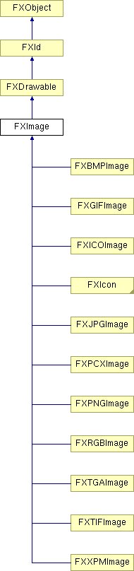

# FXImage

图像类

### FXImage(a, pix=None, opts=0, w=1, h=1)

创建图像。
| **参数** | **类型** | **默认值** | **说明** |
| --- | --- | --- | --- |
| a | FXApp |  |  |
| pix |  | None |  |
| opts | Int | 0 |  |
| w | Int | 1 |  |
| h | Int | 1 |  |

### blend(color, sharpen=True)

将图标与指定颜色混合；仅适用于支持 alpha 通道的图标，例如 PNG。
| **参数** | **类型** | **默认值** | **说明** |
| --- | --- | --- | --- |
| color | FXColor |  |  |
| sharpen | Bool | True |  |

### create()

创建图像资源。

从 FXId 重新实现。

在 FXIcon 中重新实现。

### destroy()

销毁图像资源。

从 FXId 重新实现。

在 FXIcon 中重新实现。

### detach()

分离图像资源。

从 FXId 重新实现。

在 FXIcon 中重新实现。

### getOptions()

获取选项标志。

### getPixel(x, y)

获取 x,y 处的像素。
| **参数** | **类型** | **默认值** | **说明** |
| --- | --- | --- | --- |
| x | Int |  |  |
| y | Int |  |  |

### render()

从客户端像素缓冲区渲染图像。

在 FXIcon 中重新实现。

### resize(w, h)

将像素图调整到指定的宽度和高度。

从 FXDrawable 重新实现。

在 FXIcon 中重新实现。
| **参数** | **类型** | **默认值** | **说明** |
| --- | --- | --- | --- |
| w | Int |  |  |
| h | Int |  |  |

### scale(w, h)

将像素图像重新缩放到指定的宽度和高度。
| **参数** | **类型** | **默认值** | **说明** |
| --- | --- | --- | --- |
| w | Int |  |  |
| h | Int |  |  |

### setPixel(x, y, color)

更改 x,y 处的像素。
| **参数** | **类型** | **默认值** | **说明** |
| --- | --- | --- | --- |
| x | Int |  |  |
| y | Int |  |  |
| color | FXColor |  |  |

### 全局标志

### **图像渲染提示**

| **IMAGE_KEEP** | 在客户端保留像素数据。 |
| --- | --- |
| **IMAGE_OWNED** | 像素数据由图像拥有。 |
| **IMAGE_DITHER** | 抖动图像以获得更好的效果。 |
| **IMAGE_NEAREST** | 关闭抖动并映射到最近的颜色。 |
| **IMAGE_ALPHA** | 数据有 alpha 通道。 |
| **IMAGE_OPAQUE** | 强制不透明背景。 |
| **IMAGE_ALPHACOLOR** | 覆盖透明度颜色。 |
| **IMAGE_SHMI** | 使用共享内存图像。 |
| **IMAGE_SHMP** | 使用共享内存像素图。 |
| **IMAGE_ALPHAGUESS** | 从角落猜测透明度颜色。 |

