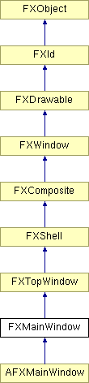

# FXMainWindow

主应用程序窗口。

### FXMainWindow(a, name, ic=None, mi=None, opts=DECOR_ALL, x=0, y=0, w=0, h=0, pl=0, pr=0, pt=0, pb=0, hs=0, vs=0)

构造主窗口。
| **参数** | **类型** | **默认值** | **说明** |
| --- | --- | --- | --- |
| a | FXApp |  |  |
| name | String |  |  |
| ic | FXIcon | None |  |
| mi | FXIcon | None |  |
| opts | Int | DECOR_ALL |  |
| x | Int | 0 |  |
| y | Int | 0 |  |
| w | Int | 0 |  |
| h | Int | 0 |  |
| pl | Int | 0 |  |
| pr | Int | 0 |  |
| pt | Int | 0 |  |
| pb | Int | 0 |  |
| hs | Int | 0 |  |
| vs | Int | 0 |  |

