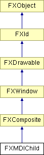

# FXMDIChild

MDI 子窗口包含多文档界面应用程序中的应用程序工作区。

### FXMDIChild(p, name, ic=None, mn=None, opts=0, x=0, y=0, w=0, h=0)

使用给定名称和图标构造 MDI 子窗口。
| **参数** | **类型** | **默认值** | **说明** |
| --- | --- | --- | --- |
| p | FXMDIClient |  |  |
| name | String |  |  |
| ic | FXIcon | None |  |
| mn | FXMenuPane | None |  |
| opts | Int | 0 |  |
| x | Int | 0 |  |
| y | Int | 0 |  |
| w | Int | 0 |  |
| h | Int | 0 |  |

### canFocus()

MDI 子窗口可以接收焦点。

从 FXWindow 重新实现。

### contentWindow()

返回内容窗口。

### create()

创建窗口。

从 FXComposite 重新实现。

### detach()

分离窗口。

从 FXComposite 重新实现。

### getDefaultHeight()

返回默认高度。

从 FXComposite 重新实现。

### getDefaultWidth()

计算默认大小。

从 FXComposite 重新实现。

### getFont()

获取标题字体。

### getHiliteColor()

获取颜色。

### getIconX()

返回图标化位置。

### getMDINext()

获取下一个 MDI 子窗口。

### getMDIPrev()

获取上一个 MDI 子窗口。

### getNormalX()

返回正常（恢复）位置。

### getTitle()

获取当前标题。

### getWindowIcon()

获取窗口图标。

### getWindowMenu()

获取窗口菜单。

### isMaximized()

如果是最大化则返回 True。

### isMinimized()

如果是最小化则返回 True。

### maximize(notify=False)

最大化 MDI 子窗口。
| **参数** | **类型** | **默认值** | **说明** |
| --- | --- | --- | --- |
| notify | Bool | False |  |

### minimize(notify=False)

最小化/图标化 MDI 子窗口。
| **参数** | **类型** | **默认值** | **说明** |
| --- | --- | --- | --- |
| notify | Bool | False |  |

### move(x, y)

在父坐标中移动此窗口到指定位置。

从 FXWindow 重新实现。
| **参数** | **类型** | **默认值** | **说明** |
| --- | --- | --- | --- |
| x | Int |  |  |
| y | Int |  |  |

### position(x, y, w, h)

在父坐标中移动并调整此窗口的大小。

从 FXWindow 重新实现。
| **参数** | **类型** | **默认值** | **说明** |
| --- | --- | --- | --- |
| x | Int |  |  |
| y | Int |  |  |
| w | Int |  |  |
| h | Int |  |  |

### resize(w, h)

将窗口调整到指定的宽度和高度。

从 FXWindow 重新实现。
| **参数** | **类型** | **默认值** | **说明** |
| --- | --- | --- | --- |
| w | Int |  |  |
| h | Int |  |  |

### restore(notify=False)

将 MDI 子窗口恢复到正常状态。
| **参数** | **类型** | **默认值** | **说明** |
| --- | --- | --- | --- |
| notify | Bool | False |  |

### setFont(fnt)

设置标题字体。
| **参数** | **类型** | **默认值** | **说明** |
| --- | --- | --- | --- |
| fnt | FXFont |  |  |

### setHiliteColor(clr)

更改颜色。
| **参数** | **类型** | **默认值** | **说明** |
| --- | --- | --- | --- |
| clr | FXColor |  |  |

### setIconX(x)

更改图标化位置。
| **参数** | **类型** | **默认值** | **说明** |
| --- | --- | --- | --- |
| x | Int |  |  |

### setNormalX(x)

更改正常（恢复）位置。
| **参数** | **类型** | **默认值** | **说明** |
| --- | --- | --- | --- |
| x | Int |  |  |

### setTitle(name)

更改 MDI 子窗口的标题。
| **参数** | **类型** | **默认值** | **说明** |
| --- | --- | --- | --- |
| name | String |  |  |

### setWindowIcon(icon)

设置窗口图标。
| **参数** | **类型** | **默认值** | **说明** |
| --- | --- | --- | --- |
| icon | FXIcon |  |  |

### setWindowMenu(menu)

设置窗口菜单。
| **参数** | **类型** | **默认值** | **说明** |
| --- | --- | --- | --- |
| menu | FXPopup |  |  |

### 全局标志

### **MDI 子窗口样式**

| **MDI_NORMAL** | 正常显示模式。 |
| --- | --- |
| **MDI_MAXIMIZED** | 窗口显示为最大化。 |
| **MDI_MINIMIZED** | 窗口被图标化或最小化。 |

