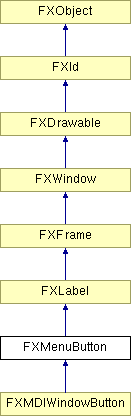

# FXMenuButton

菜单按钮在点击时弹出一个弹出菜单。有多种方式可以控制弹出窗口出现的位置：首先，弹出窗口可以相对于菜单按钮的四个边中的任意一边放置；这由标志 MENUBUTTON_DOWN 等控制。其次，有几种附着模式；弹出窗口的左/下边缘可以附着到菜单按钮的左/上边缘，或者弹出窗口的右/上边缘可以附着到菜单按钮的右/下边缘，或者两者都可以。此外，弹出窗口可以相对于菜单按钮居中显示。最后，可以指定一个小偏移量来将弹出窗口的位置偏移几个像素，以补偿边框等。通常，菜单按钮显示一个指向弹出窗口设置方向的箭头；可以通过传递选项 MENUBUTTON_NOARROWS 来关闭箭头。

### FXMenuButton(p, text, ic=None, pup=None, opts=JUSTIFY_NORMAL| ICON_BEFORE_TEXT| MENUBUTTON_DOWN, x=0, y=0, w=0, h=0, pl=DEFAULT_PAD, pr=DEFAULT_PAD, pt=DEFAULT_PAD, pb=DEFAULT_PAD)

构造函数。
| **参数** | **类型** | **默认值** | **说明** |
| --- | --- | --- | --- |
| p | FXComposite |  |  |
| text | String |  |  |
| ic | FXIcon | None |  |
| pup | FXPopup | None |  |
| opts | Int | JUSTIFY_NORMAL| ICON_BEFORE_TEXT| MENUBUTTON_DOWN |  |
| x | Int | 0 |  |
| y | Int | 0 |  |
| w | Int | 0 |  |
| h | Int | 0 |  |
| pl | Int | DEFAULT_PAD |  |
| pr | Int | DEFAULT_PAD |  |
| pt | Int | DEFAULT_PAD |  |
| pb | Int | DEFAULT_PAD |  |

### canFocus()

返回 True，因为菜单按钮可以接收焦点。

从 FXWindow 重新实现。

### create()

创建服务器端资源。

从 FXLabel 重新实现。

### detach()

分离服务器端资源。

从 FXLabel 重新实现。

### getAttachment()

获取附着方式。

### getButtonStyle()

获取菜单按钮样式。

### getDefaultHeight()

返回默认高度。

从 FXLabel 重新实现。

在 FXMDIWindowButton 中重新实现。

### getDefaultWidth()

返回默认宽度。

从 FXLabel 重新实现。

在 FXMDIWindowButton 中重新实现。

### getMenu()

返回当前弹出菜单。

### getPopupStyle()

获取弹出样式。

### getXOffset()

返回当前 X 偏移量。

### getYOffset()

返回当前 Y 偏移量。

### setAttachment(att)

更改附着方式。
| **参数** | **类型** | **默认值** | **说明** |
| --- | --- | --- | --- |
| att | Int |  |  |

### setButtonStyle(style)

更改菜单按钮样式。
| **参数** | **类型** | **默认值** | **说明** |
| --- | --- | --- | --- |
| style | Int |  |  |

### setMenu(pup)

更改弹出菜单。
| **参数** | **类型** | **默认值** | **说明** |
| --- | --- | --- | --- |
| pup | FXPopup |  |  |

### setPopupStyle(style)

更改弹出样式。
| **参数** | **类型** | **默认值** | **说明** |
| --- | --- | --- | --- |
| style | Int |  |  |

### setXOffset(offx)

设置菜单相对于按钮弹出的 X 偏移量。
| **参数** | **类型** | **默认值** | **说明** |
| --- | --- | --- | --- |
| offx | Int |  |  |

### setYOffset(offy)

设置菜单相对于按钮弹出的 Y 偏移量。
| **参数** | **类型** | **默认值** | **说明** |
| --- | --- | --- | --- |
| offy | Int |  |  |

### 全局标志

### **菜单按钮选项**

| **MENUBUTTON_AUTOGRAY** | 当没有目标时自动变灰。 |
| --- | --- |
| **MENUBUTTON_AUTOHIDE** | 当没有目标时自动隐藏。 |
| **MENUBUTTON_TOOLBAR** | 工具栏样式。 |
| **MENUBUTTON_COMBOBOX** | CAE - 组合框样式。 |
| **MENUBUTTON_DOWN** | 弹出窗口显示在菜单按钮下方。 |
| **MENUBUTTON_UP** | 弹出窗口显示在菜单按钮上方。 |
| **MENUBUTTON_LEFT** | 弹出窗口在菜单按钮左侧。 |
| **MENUBUTTON_RIGHT** | 弹出窗口在菜单按钮右侧。 |
| **MENUBUTTON_NOARROWS** | 不显示箭头。 |
| **MENUBUTTON_ATTACH_LEFT** | 弹出窗口附着在菜单按钮左侧。 |
| **MENUBUTTON_ATTACH_TOP** | 弹出窗口附着在菜单按钮顶部。 |
| **MENUBUTTON_ATTACH_RIGHT** | 弹出窗口附着在菜单按钮右侧。 |
| **MENUBUTTON_ATTACH_BOTTOM** | 弹出窗口附着在菜单按钮底部。 |
| **MENUBUTTON_ATTACH_CENTER** | 弹出窗口附着在菜单按钮中央。 |
| **MENUBUTTON_ATTACH_BOTH** | 弹出窗口附着在菜单按钮两侧。 |

