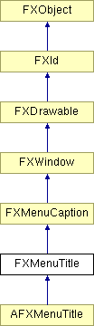

# FXMenuTitle

菜单标题是菜单栏的子项，负责弹出下拉菜单。

### FXMenuTitle(p, text, ic=None, pup=None, opts=0)

构造函数。
| **参数** | **类型** | **默认值** | **说明** |
| --- | --- | --- | --- |
| p | FXComposite |  |  |
| text | String |  |  |
| ic | FXIcon | None |  |
| pup | FXPopup | None |  |
| opts | Int | 0 |  |

### canFocus()

是的，它可以接收焦点。

从 FXWindow 重新实现。

### create()

创建服务器端资源。

从 FXMenuCaption 重新实现。

### detach()

分离服务器端资源。

从 FXMenuCaption 重新实现。

### getDefaultHeight()

返回默认高度。

从 FXMenuCaption 重新实现。

### getDefaultWidth()

返回默认宽度。

从 FXMenuCaption 重新实现。

### getMenu()

返回弹出菜单。

### setMenu(menu)

设置要弹出的弹出菜单。
| **参数** | **类型** | **默认值** | **说明** |
| --- | --- | --- | --- |
| menu | FXPopup |  |  |

