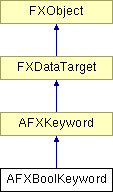

# AFXBoolKeyword

This class is designed for command keywords that have Boolean values. 

### AFXBoolKeyword(command, name, booleanType=ON_OFF, isRequired=False, defaultValue=False)

Constructor.
| **Argument** | **Type** | **Default** | **Description** |
| --- | --- | --- | --- |
| command | AFXCommand |  | Host command. |
| name | String |  | Keyword name. |
| booleanType | Type | ON_OFF | Type of boolean used in the command. |
| isRequired | Bool | False | True if the keyword is a required argument of the command. |
| defaultValue | Bool | False | Default value. |

### getTypeName()

Returns the name of the keyword type.

Implements AFXKeyword.

### getValue()

Returns the keyword's current value.

### getValueAsString()

Returns the text string that represents the keyword's current value.

Implements AFXKeyword.

### isValueChanged()

Returns True if the keyword value differs from its previous value.

Implements AFXKeyword.

### setDefaultValue(defaultValue)

Sets the keyword's default value.
| **Argument** | **Type** | **Default** | **Description** |
| --- | --- | --- | --- |
| defaultValue | Bool |  | Default value. |

### setDefaultValueByString(defaultValueString)

Sets the keyword's default value (returns True if the given text string is valid).
| **Argument** | **Type** | **Default** | **Description** |
| --- | --- | --- | --- |
| defaultValueString | String |  | Default value in text string form. |

### setDefaultValueByString(defaultValueString)

Sets the keyword's default value (returns True if the given text string is valid).
| **Argument** | **Type** | **Default** | **Description** |
| --- | --- | --- | --- |
| defaultValueString | String |  | Default value in text string form. |

### setValue(newValue)

Sets the keyword's current value.
| **Argument** | **Type** | **Default** | **Description** |
| --- | --- | --- | --- |
| newValue | Bool |  | New value. |

### setValueByString(newValueString)

Sets the keyword's current value (returns True if the given text string is valid).
| **Argument** | **Type** | **Default** | **Description** |
| --- | --- | --- | --- |
| newValueString | String |  | New value in text string form. |

### setValueByString(newValueString)

Sets the keyword's current value (returns True if the given text string is valid).
| **Argument** | **Type** | **Default** | **Description** |
| --- | --- | --- | --- |
| newValueString | String |  | New value in text string form. |

### setValueToDefault(ignoreUnspecified=False)

Sets the keyword value to its default.
| **Argument** | **Type** | **Default** | **Description** |
| --- | --- | --- | --- |
| ignoreUnspecified | Bool | False | Not used. |

### setValueToPrevious()

Sets the keyword value to its previous value.

Implements AFXKeyword.

### syncPreviousValue()

Sets the keyword's previous value to its current value.

Implements AFXKeyword.

### Class flags

### **Flags for the type of the boolean.**

| **ON_OFF** | Keyword value will be ON or OFF. |
| --- | --- |
| **TRUE_FALSE** | Keyword value will be True or False. |

