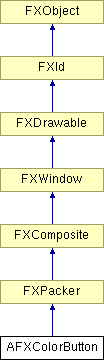

# AFXColorButton

This class contains a label that precedes a color well, which allows the user to bring up a color dialog box by double clicking. When connected to an AFXStringKeyword, this widget will assign the value of the button's current color to the keyword in hex format (for example, "FF0000").

### AFXColorButton(p, text, tgt=None, sel=0, opts=0, x=0, y=0, w=0, h=0, pl=DEFAULT_SPACING, pr=DEFAULT_SPACING, pt=DEFAULT_SPACING, pb=DEFAULT_SPACING)

Constructor.
| **Argument** | **Type** | **Default** | **Description** |
| --- | --- | --- | --- |
| p | FXComposite |  | Parent widget. |
| text | String |  | Label string. |
| tgt | FXObject | None | Message target. |
| sel | Int | 0 | Message ID. |
| opts | Int | 0 | Options and hints. |
| x | Int | 0 | X coordinate of origin. |
| y | Int | 0 | Y coordinate of origin. |
| w | Int | 0 | Width of the widget. |
| h | Int | 0 | Width of the widget. |
| pl | Int | DEFAULT_SPACING | Left padding (margin). |
| pr | Int | DEFAULT_SPACING | Right padding (margin). |
| pt | Int | DEFAULT_SPACING | Top padding (margin). |
| pb | Int | DEFAULT_SPACING | Bottom padding (margin). |

### create()

Creates the color button widget.

Reimplemented from FXComposite.

### disable()

Disables the color button.

Reimplemented from FXWindow.

### enable()

Enables the color button.

Reimplemented from FXWindow.

### getHelpText()

Returns the status line help text.

### getLabelFont()

Returns the label font.

### getLabelText()

Returns the label string.

### getRGBA()

Returns the color of the button.

### getTipText()

Returns the tool tip message.

### setHelpText(text)

Sets the status line help text.
| **Argument** | **Type** | **Default** | **Description** |
| --- | --- | --- | --- |
| text | String |  |  |

### setLabelFont(fnt)

Sets the label font.
| **Argument** | **Type** | **Default** | **Description** |
| --- | --- | --- | --- |
| fnt | FXFont |  |  |

### setLabelText(txt)

Sets the label string.
| **Argument** | **Type** | **Default** | **Description** |
| --- | --- | --- | --- |
| txt | String |  |  |

### setRGBA(clr)

Sets the color of the button.
| **Argument** | **Type** | **Default** | **Description** |
| --- | --- | --- | --- |
| clr | FXColor |  |  |

### setTipText(text)

Sets the tool tip message.
| **Argument** | **Type** | **Default** | **Description** |
| --- | --- | --- | --- |
| text | String |  |  |

### Class flags

### **Message ID's.**

| **ID_COLORWELL** | ID for color button. |
| --- | --- |

### Global flags

### **Flags for AFX color button options.**

| **AFXCOLORBUTTON_VERTICAL** | Orient label above button. |
| --- | --- |

