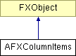

# AFXColumnItems

This class connects the selected items in a single column of an AFXTable to a keyword (typically a tuple keyword). 

### AFXColumnItems(table, referenceColumn, opts=0)

Constructor.
| **Argument** | **Type** | **Default** | **Description** |
| --- | --- | --- | --- |
| table | AFXTable |  | Table to use. |
| referenceColumn | Int |  | Index of the reference column. |
| opts | Int | 0 | Selection options (not used). |

### AFXColumnItems(referenceColumn, tgt=None, sel=0, opts=0)

Constructor for use with a keyword.
| **Argument** | **Type** | **Default** | **Description** |
| --- | --- | --- | --- |
| referenceColumn | Int |  | Index of the reference column. |
| tgt | FXObject | None | Message target. |
| sel | Int | 0 | Message ID. |
| opts | Int | 0 | Selection options (not used). |

### getReferenceColumn()

Returns the index of the table reference column.

### getSelector()

Returns the message ID.

### getTarget()

Returns the message target.

### setReferenceColumn(index)

Sets the table reference column, whose selected items will be sent to the target.
| **Argument** | **Type** | **Default** | **Description** |
| --- | --- | --- | --- |
| index | Int |  | Table column index. |

### setSelector(sel)

Sets the message ID.
| **Argument** | **Type** | **Default** | **Description** |
| --- | --- | --- | --- |
| sel | Int |  | New message ID. |

### setTarget(tgt)

Sets the message target.
| **Argument** | **Type** | **Default** | **Description** |
| --- | --- | --- | --- |
| tgt | FXObject |  | New message target. |

### Class flags

### **Message ID's.**

| **ID_TABLE** | Table ID. |
| --- | --- |

