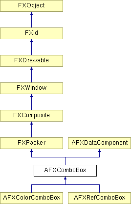

# AFXComboBox

This class contains a label that precedes a combo box, which allows the user to select entries from a drop-down list.

### AFXComboBox(p, ncols, nvis, text, tgt=None, sel=0, opts=0, x=0, y=0, w=0, h=0, pl=DEFAULT_PAD, pr=DEFAULT_PAD, pt=DEFAULT_PAD, pb=DEFAULT_PAD)

Constructor.
| **Argument** | **Type** | **Default** | **Description** |
| --- | --- | --- | --- |
| p | FXComposite |  | Parent widget. |
| ncols | Int |  | Number of columns in the combo box (use 0 for auto-sizing). |
| nvis | Int |  | Number of visible items in the combo box's drop down list. |
| text | String |  | Label string. |
| tgt | FXObject | None | Message target. |
| sel | Int | 0 | Message ID. |
| opts | Int | 0 | Options and hints. |
| x | Int | 0 | X coordinate of origin. |
| y | Int | 0 | Y coordinate of origin. |
| w | Int | 0 | Width of the widget. |
| h | Int | 0 | Height of the widget. |
| pl | Int | DEFAULT_PAD | Left padding (margin). |
| pr | Int | DEFAULT_PAD | Right padding (margin). |
| pt | Int | DEFAULT_PAD | Top padding (margin). |
| pb | Int | DEFAULT_PAD | Bottom padding (margin). |

### appendItem(text, sel=0)

Adds an item to the end of the list.
| **Argument** | **Type** | **Default** | **Description** |
| --- | --- | --- | --- |
| text | String |  | Text. |
| sel | Int | 0 | Selector. |

### clearItems()

Removes all items from the list.

### create()

Creates the combo box.

Reimplemented from FXComposite.

### disable()

Disables the combo box.

Reimplemented from FXWindow.

### enable()

Enables the combo box.

Reimplemented from FXWindow.

### getCheck()

Returns the state of the check button or the radio button.

### getCurrentItem()

Returns the index of the current item.

### getHelpText()

Returns the status line help text.

### getItemData(index)

Returns the data for the specified item.
| **Argument** | **Type** | **Default** | **Description** |
| --- | --- | --- | --- |
| index | Int |  | Index. |

### getItemIndexForData(data)

Returns the index of the first item with the associated data or -1 if not found.
| **Argument** | **Type** | **Default** | **Description** |
| --- | --- | --- | --- |
| data |  |  |  |

### getItemIndexForFloat(val)

Returns the index of the first item with the text evaluating to the given value.
| **Argument** | **Type** | **Default** | **Description** |
| --- | --- | --- | --- |
| val | Float |  |  |

### getItemProvider()

Returns the provider of the combo box's items.

### getItemText(index)

Returns the text for the specified item.
| **Argument** | **Type** | **Default** | **Description** |
| --- | --- | --- | --- |
| index | Int |  | Index. |

### getLabelFont()

Returns the label font.

### getLabelText()

Returns the label string.

### getNumColumns()

Returns the number of columns.

### getNumItems()

Returns the number of items in the list.

### getNumVisible()

Returns the number of visible items.

### getText()

Returns the text displayed in input field.

### getTipText()

Returns the tool tip message.

### insertItem(index, text, sel=0)

Inserts a new item at the specified index position.
| **Argument** | **Type** | **Default** | **Description** |
| --- | --- | --- | --- |
| index | Int |  | Index. |
| text | String |  | Text. |
| sel | Int | 0 | Selector. |

### isEditable()

Returns True if the text in the input field may be edited.

### isItemCurrent(index)

Returns True if the item at the specified index position is the current item.
| **Argument** | **Type** | **Default** | **Description** |
| --- | --- | --- | --- |
| index | Int |  | Index. |

### isReadOnlyState()

Returns True if the combo box appears in the read-only state.

### removeItem(index)

Removes the item at the specified index position from the list.
| **Argument** | **Type** | **Default** | **Description** |
| --- | --- | --- | --- |
| index | Int |  | Index. |

### replaceItem(index, text, sel=0)

Replaces the item at the specified index position.
| **Argument** | **Type** | **Default** | **Description** |
| --- | --- | --- | --- |
| index | Int |  | Index. |
| text | String |  | Text. |
| sel | Int | 0 | Selector. |

### setCheck(state)

Sets the state of the check button or the radio button.
| **Argument** | **Type** | **Default** | **Description** |
| --- | --- | --- | --- |
| state | Bool |  | Button state. |

### setCheckButtonSelector(sel)

Sets the message ID of the check button or the radio button.
| **Argument** | **Type** | **Default** | **Description** |
| --- | --- | --- | --- |
| sel | Int |  | Selector. |

### setCheckButtonTarget(tgt, checkVal=False)

Sets the message target of the check button or the radio button.
| **Argument** | **Type** | **Default** | **Description** |
| --- | --- | --- | --- |
| tgt | FXObject |  | Target. |
| checkVal | Bool | False | Value of check button. |

### setCurrentItem(index)

Sets the current item (the index is zero-based).
| **Argument** | **Type** | **Default** | **Description** |
| --- | --- | --- | --- |
| index | Int |  | Index. |

### setEditable(edit=True)

Sets the editable state for the input field.
| **Argument** | **Type** | **Default** | **Description** |
| --- | --- | --- | --- |
| edit | Bool | True | Editable state. |

### setFocusAndSelection()

Moves the focus to the input field and selects its contents if the combo box is editable.

### setFocusToCheckButton()

Moves the focus to the check button or the radio button (if existed) of the widget.

### setFocusToComboBox()

Moves the focus to the input field of the widget.

### setHelpText(text)

Sets the status line help text.
| **Argument** | **Type** | **Default** | **Description** |
| --- | --- | --- | --- |
| text | String |  | Help text. |

### setItemData(index, ptr)

Sets the data for the specified item.
| **Argument** | **Type** | **Default** | **Description** |
| --- | --- | --- | --- |
| index | Int |  | Index. |
| ptr | String |  | Data. |

### setItemProvider(cp)

Sets the provider of this object items.
| **Argument** | **Type** | **Default** | **Description** |
| --- | --- | --- | --- |
| cp | FXObject |  | Item provider. |

### setItemText(index, text)

Sets the text for the specified item.
| **Argument** | **Type** | **Default** | **Description** |
| --- | --- | --- | --- |
| index | Int |  | Index. |
| text | String |  | Text. |

### setLabelFont(fnt)

Sets the label font.
| **Argument** | **Type** | **Default** | **Description** |
| --- | --- | --- | --- |
| fnt | FXFont |  | Label font. |

### setLabelText(txt)

Sets the label string.
| **Argument** | **Type** | **Default** | **Description** |
| --- | --- | --- | --- |
| txt | String |  | Label text. |

### setMaxVisible(maxVis)

Sets the maximum number of visible items. The combo box will show up to the given maximum number of items in its list. If the combo box has more items, its list will show a scroll bar.
| **Argument** | **Type** | **Default** | **Description** |
| --- | --- | --- | --- |
| maxVis | Int |  | Maximum number of visible items. |

### setNumColumns(cols)

Sets the number of columns in the combo box; passing zero will cause the combo box to always have the number of columns equal to the maximum item length.
| **Argument** | **Type** | **Default** | **Description** |
| --- | --- | --- | --- |
| cols | Int |  | Number of columns. |

### setNumVisible(nvis)

Sets the number of visible items.
| **Argument** | **Type** | **Default** | **Description** |
| --- | --- | --- | --- |
| nvis | Int |  | Number of visible items. |

### setReadOnlyState(readonly=True)

Sets the read-only state of the combo box.
| **Argument** | **Type** | **Default** | **Description** |
| --- | --- | --- | --- |
| readonly | Bool | True | Read-only state. |

### setText(txt)

Sets the text displayed in the input field.
| **Argument** | **Type** | **Default** | **Description** |
| --- | --- | --- | --- |
| txt | String |  | Input field text. |

### setTipText(text)

Sets the tool tip message.
| **Argument** | **Type** | **Default** | **Description** |
| --- | --- | --- | --- |
| text | String |  | Tooltip text. |

### Class flags

### **Message ID's.**

| **ID_BUTTON** | Label or button ID. |
| --- | --- |
| **ID_COMBO** | Combo box ID. |
| **ID_INCREMENT** | Up arrow button ID. |
| **ID_DECREMENT** | Down arrow button ID. |

### Global flags

### **Flags for AFX combo box options.**

| **AFXCOMBOBOX_CHECKBUTTON** | Use a check button instead of a label. |
| --- | --- |
| **AFXCOMBOBOX_RADIOBUTTON** | Use a radio button instead of a label. |
| **AFXCOMBOBOX_VERTICAL** | Orient label or button above combo box. |
| **AFXCOMBOBOX_FLOAT** | Allow interaction with float keywords. |
| **AFXCOMBOBOX_READONLY** | Configure combo box to the read-only state. |
| **AFXCOMBOBOX_SPINNER** | Include spinner buttons. |

