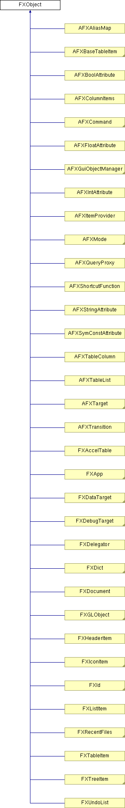

# FXObject

Base of all FOX object.

### getClassName()

Get class name of some object.

### isMemberOf(metaclass)

Check if object is member of metaclass.
| **Argument** | **Type** | **Default** | **Description** |
| --- | --- | --- | --- |
| metaclass | FXMetaClass |  |  |

### onDefault()

Called for unhandled messages.

Reimplemented in FXDelegator, FXGLViewer, FXMDIChild, and FXMDIClient.

### handle(sender, sel, ptr)

Handles messages sent to this class.
| **Argument** | **Type** | **Default** | **Description** |
| --- | --- | --- | --- |
| sender | FXObject |  | The sender of the message. |
| sel | FXSelector |  | The selector of the message. |
| ptr | void* |  | Associated data. |

