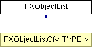

# FXObjectList

List of pointers to objects.

### FXObjectList()

Default constructor.

### FXObjectList(orig)

Copy constructor.
| **Argument** | **Type** | **Default** | **Description** |
| --- | --- | --- | --- |
| orig | FXObjectList |  |  |

### append(p)

Append element.
| **Argument** | **Type** | **Default** | **Description** |
| --- | --- | --- | --- |
| p | FXObject |  |  |

### clear()

Remove all elements.

### findb(p, pos=2147483647)

Find object in list, searching backward; return position or -1.
| **Argument** | **Type** | **Default** | **Description** |
| --- | --- | --- | --- |
| p | FXObject |  |  |
| pos | Int | 2147483647 |  |

### findf(p, pos=0)

Find object in list, searching forward; return position or -1.
| **Argument** | **Type** | **Default** | **Description** |
| --- | --- | --- | --- |
| p | FXObject |  |  |
| pos | Int | 0 |  |

### insert(pos, p)

Insert element at certain position.
| **Argument** | **Type** | **Default** | **Description** |
| --- | --- | --- | --- |
| pos | Int |  |  |
| p | FXObject |  |  |

### no(n)

Set number of elements.
| **Argument** | **Type** | **Default** | **Description** |
| --- | --- | --- | --- |
| n | Int |  |  |

### no()

Return number of elements.

### remove(p)

Remove element p.
| **Argument** | **Type** | **Default** | **Description** |
| --- | --- | --- | --- |
| p | FXObject |  |  |

### remove(pos)

Remove element at pos.
| **Argument** | **Type** | **Default** | **Description** |
| --- | --- | --- | --- |
| pos | Int |  |  |

### size(m)

Set max number of elements.
| **Argument** | **Type** | **Default** | **Description** |
| --- | --- | --- | --- |
| m | Int |  |  |

### size()

Return size of list.

