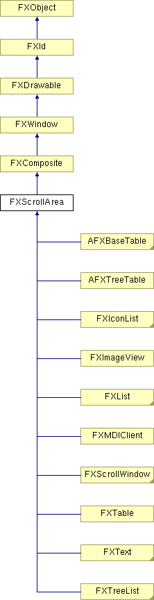

# FXScrollArea

The scroll area widget manages a content area and a viewport area through which the content is viewed. When the content area becomes larger than the viewport area, scrollbars are placed to permit viewing of the entire content by scrolling the content. Depending on the mode, scrollbars may be displayed on an as-needed basis, always, or never. Normally, the scroll area's size and the content's size are independent; however, it is possible to disable scrolling in the horizontal (vertical) direction. In this case, the content width (height) will influence the width (height) of the scroll area widget. For content which is time-consuming to repaint, continuous scrolling may be turned off.

### getContentWidth()

Return content size.

Reimplemented in FXIconList, FXImageView, FXList, FXMDIClient, FXScrollWindow, FXTable, FXText, FXTreeList, AFXBaseTable, and AFXOptionTreeList.

### getDefaultHeight()

Return default height.

Reimplemented from FXComposite.

Reimplemented in FXList, FXTable, FXText, FXTreeList, AFXBaseTable, AFXList, AFXOptionTreeList, AFXTable, and AFXTreeTable.

### getDefaultWidth()

Return default width.

Reimplemented from FXComposite.

Reimplemented in FXList, FXTable, FXText, FXTreeList, AFXBaseTable, AFXOptionTreeList, AFXTable, and AFXTreeTable.

### getPosition(x, y)

Get the current position.
| **Argument** | **Type** | **Default** | **Description** |
| --- | --- | --- | --- |
| x | Int |  |  |
| y | Int |  |  |

### getScrollStyle()

Return scroll style.

### getViewportHeight()

Return viewport size.

Reimplemented in FXIconList.

### getXPosition()

Return the current x-position.

### getYPosition()

Return the current y-position.

### horizontalScrollbar()

Return a pointer to the horizontal scrollbar.

### isHorizontalScrollable()

Return True if horizontally scrollable.

### isVerticalScrollable()

Return True if vertically scrollable.

### moveContents(x, y)

Move contents to the specified position.

Reimplemented in FXIconList, FXMDIClient, FXScrollWindow, FXTable, FXText, AFXBaseTable, AFXOptionTreeList, and AFXTable.
| **Argument** | **Type** | **Default** | **Description** |
| --- | --- | --- | --- |
| x | Int |  |  |
| y | Int |  |  |

### setPosition(x, y)

Set the current position.
| **Argument** | **Type** | **Default** | **Description** |
| --- | --- | --- | --- |
| x | Int |  |  |
| y | Int |  |  |

### setScrollStyle(style)

Change scroll style.
| **Argument** | **Type** | **Default** | **Description** |
| --- | --- | --- | --- |
| style | Int |  |  |

### verticalScrollbar()

Return a pointer to the vertical scrollbar.

### Global flags

### **Scrollbar options**

| **SCROLLERS_NORMAL** | Show the scrollbars when needed. |
| --- | --- |
| **HSCROLLER_ALWAYS** | Always show horizontal scrollers. |
| **HSCROLLER_NEVER** | Never show horizontal scrollers. |
| **VSCROLLER_ALWAYS** | Always show vertical scrollers. |
| **VSCROLLER_NEVER** | Never show vertical scrollers. |
| **HSCROLLING_ON** | Horizontal scrolling turned on (default). |
| **HSCROLLING_OFF** | Horizontal scrolling turned off. |
| **VSCROLLING_ON** | Vertical scrolling turned on (default). |
| **VSCROLLING_OFF** | Vertical scrolling turned off. |
| **SCROLLERS_TRACK** | Scrollers track continuously for smooth scrolling. |
| **SCROLLERS_DONT_TRACK** | Scrollers don't track continuously. |

