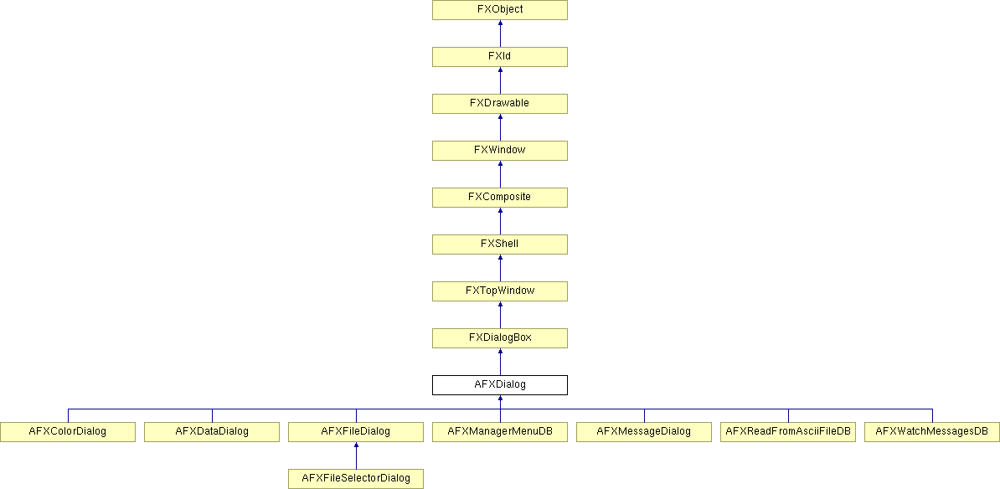

# AFXDialog

This class is the base class for all Abaqus GUI Toolkit dialog boxes.

### AFXDialog(title, actionButtonIds=0, opts=DIALOG_NORMAL, x=0, y=0, w=0, h=0)

Constructor that creates a dialog box that always occludes the main window when overlapping with the main window.
| **Argument** | **Type** | **Default** | **Description** |
| --- | --- | --- | --- |
| title | String |  | Title string. |
| actionButtonIds | Int | 0 | ID's of action buttons to be created. |
| opts | Int | DIALOG_NORMAL | Options and hints. |
| x | Int | 0 | X coordinate of origin. |
| y | Int | 0 | Y coordinate of origin. |
| w | Int | 0 | Width of the widget. |
| h | Int | 0 | Height of the widget. |

### AFXDialog(owner, title, actionButtonIds=0, opts=DIALOG_NORMAL, x=0, y=0, w=0, h=0)

Constructor that creates a dialog box that always occludes its owner widget when overlapping with the widget.
| **Argument** | **Type** | **Default** | **Description** |
| --- | --- | --- | --- |
| owner | FXWindow |  | Owner widget. |
| title | String |  | Title string. |
| actionButtonIds | Int | 0 | ID's of action buttons to be created. |
| opts | Int | DIALOG_NORMAL | Options and hints. |
| x | Int | 0 | X coordinate of origin. |
| y | Int | 0 | Y coordinate of origin. |
| w | Int | 0 | Width of the widget. |
| h | Int | 0 | Height of the widget. |

### AFXDialog(app, title, actionButtonIds=0, opts=DIALOG_NORMAL, x=0, y=0, w=0, h=0)

Constructor that creates a dialog box that may be occluded by any other windows of the application.
| **Argument** | **Type** | **Default** | **Description** |
| --- | --- | --- | --- |
| app | FXApp |  | Application. |
| title | String |  | Title string. |
| actionButtonIds | Int | 0 | ID's of action buttons to be created. |
| opts | Int | DIALOG_NORMAL | Options and hints. |
| x | Int | 0 | X coordinate of origin. |
| y | Int | 0 | Y coordinate of origin. |
| w | Int | 0 | Width of the widget. |
| h | Int | 0 | Height of the widget. |

### appendActionButton(text, tgt, sel)

Adds a custom action button in the action area of the dialog box.
| **Argument** | **Type** | **Default** | **Description** |
| --- | --- | --- | --- |
| text | String |  | Label string. |
| tgt | FXObject |  | Message target. |
| sel | Int |  | Message ID. |

### appendActionButton(buttonID)

Adds a standard action button in the action area of the dialog box.
| **Argument** | **Type** | **Default** | **Description** |
| --- | --- | --- | --- |
| buttonID | ButtonID |  | Button ID. |

### bailout()

Performs checks to determine whether it is OK to cancel the dialog box. The implementaton of this class always returns True, and the derived class should reimplement this method to perform specific checks.

Reimplemented in AFXDataDialog.

### create()

Creates the dialog box.

Reimplemented from FXTopWindow.

### createButton(parent, text, icon, tgt, sel, opts)

Creates an action area button.
| **Argument** | **Type** | **Default** | **Description** |
| --- | --- | --- | --- |
| parent | FXComposite |  | Parent widget. |
| text | String |  | Label string. |
| icon | FXIcon |  | Icon. |
| tgt | FXObject |  | Message target. |
| sel | Int |  | Message ID. |
| opts | Int |  | Options and hints. |

### getActionButton(sel)

Returns the action button with the specified message ID; returns 0 if none of the action buttons has the message ID.
| **Argument** | **Type** | **Default** | **Description** |
| --- | --- | --- | --- |
| sel | Int |  | Message ID. |

### getInitialFocusWidget()

Returns the widget that will receive the initial focus.

### getUnpostHints()

Returns the action that the poster should perform on this dialog box when it is unposted. Possible return values are: DIALOG_UNPOST_DELETE - delete the C++ dialog box object together with the associated window. (default) DIALOG_UNPOST_DESTROY - keep the C++ dialog box object, but destroy the associated window to release resources. DIALOG_UNPOST_NOTHING - do nothing.

### hide()

Unpost the dialog box.

Reimplemented from FXTopWindow.

Reimplemented in AFXManagerMenuDB, and AFXMessageDialog.

### onKeywordError(kwd)

Handles the error that occurs when the given keyword or target contains invalid contents. This method will select the contents of the widget that has the keyword or target as its message target.
| **Argument** | **Type** | **Default** | **Description** |
| --- | --- | --- | --- |
| kwd | FXObject |  | Object that contains invalid contents. |

### onTableError(tableKwd, row, col)

Handles the error that occurs when the given table keyword or target contains an invalid element. This method will select the contents of the widget that has the keyword or target as its message target.
| **Argument** | **Type** | **Default** | **Description** |
| --- | --- | --- | --- |
| tableKwd | FXObject |  | Object that contains invalid element. |
| row | Int |  | Row index. |
| col | Int |  | Column index. |

### onTupleError(tupleKwd, index)

Handles the error that occurs when the given tuple keyword or target contains an invalid element. This method will select the contents of the widget that has the keyword or target as its message target.
| **Argument** | **Type** | **Default** | **Description** |
| --- | --- | --- | --- |
| tupleKwd | FXObject |  | Object that contains invalid element. |
| index | Int |  | Element index. |

### selectContents(widget)

Selects the contents of the given widget.
| **Argument** | **Type** | **Default** | **Description** |
| --- | --- | --- | --- |
| widget | FXWindow |  | Widget to select. |

### selectTableElement(widget, row, col)

Selects the given (row,col) element in the 2D array of elements displayed by the given widget.
| **Argument** | **Type** | **Default** | **Description** |
| --- | --- | --- | --- |
| widget | FXWindow |  | Widget to select. |
| row | Int |  | Row index. |
| col | Int |  | Column index. |

### selectTupleElement(widget, index)

Selects the element at the given index in the sequence of elements displayed by the given widget.
| **Argument** | **Type** | **Default** | **Description** |
| --- | --- | --- | --- |
| widget | FXWindow |  | Widget to select. |
| index | Int |  | Element index. |

### setInitialFocusWidget(w)

Sets the widget that will receive the initial focus.
| **Argument** | **Type** | **Default** | **Description** |
| --- | --- | --- | --- |
| w | FXWindow |  | Widget that will receive the initial focus. |

### setOnPopdownTarget(target)

Sets the object to be notified when the dialog box is unposted.
| **Argument** | **Type** | **Default** | **Description** |
| --- | --- | --- | --- |
| target | FXObject |  | Object to be notified when the dialog box is unposted. |

### setUnpostHints(hints)

Sets the action that the poster should perform on this dialog box when it is unposted.
| **Argument** | **Type** | **Default** | **Description** |
| --- | --- | --- | --- |
| hints | Int |  |  |

### show()

Posts the dialog box.

Reimplemented from FXTopWindow.

Reimplemented in AFXFileDialog, and AFXMessageDialog.

### showModal(occludedWindow=None)

Posts the dialog box as a modal dialog box. The dialog box is centered against the given widget or its owner widget if 0 is given.
| **Argument** | **Type** | **Default** | **Description** |
| --- | --- | --- | --- |
| occludedWindow | FXWindow | None | Widget to be occluded (0 for the owner widget). |

### Class flags

### **Message ID's.**

| **ID_CLICKED_OK** | OK button ID. |
| --- | --- |
| **ID_CLICKED_CONTINUE** | Contiue button ID. |
| **ID_CLICKED_YES** | Yes button ID. |
| **ID_CLICKED_YES_TO_ALL** | Yes to All button ID. |
| **ID_CLICKED_APPLY** | Apply button ID. |
| **ID_CLICKED_DEFAULTS** | Defaults button ID. |
| **ID_CLICKED_NO** | No button ID. |
| **ID_CLICKED_CANCEL** | Cacncel button ID. |
| **ID_CLICKED_DISMISS** | Dismiss button ID. |

### **Standard action button ID's.**

| **APPLY** | Adds an Apply button to action area. |
| --- | --- |
| **CANCEL** | Adds a Cancel button to action area. |
| **CONTINUE** | Adds a Continue button to action area. |
| **DEFAULTS** | Adds a Defaults button to action area. |
| **DISMISS** | Adds a Dismiss button to action area. |
| **NO** | Adds a No button to action area. |
| **OK** | Adds an OK button to action area. |
| **YES** | Adds a Yes button to action area. |
| **YES_TO_ALL** | Adds a Yes to All button to action area. |

### Global flags

### **Flags for dialog box options.**

| **DIALOG_ACTIONS_BOTTOM** | Creates the action area horizontally at the bottom of the dialog box. |
| --- | --- |
| **DIALOG_ACTIONS_RIGHT** | Creates the action area vertically at the right side of the dialog box. |
| **DIALOG_ACTIONS_NONE** | Do not create the action area. |
| **DIALOG_ACTIONS_SEPARATOR** | Creates a separator in the action area. |
| **DIALOG_UNPOST_DELETE** | Deletes the dialog box when unposted. |
| **DIALOG_UNPOST_DESTROY** | Destroys the dialog box when unposted. |
| **DIALOG_UNPOST_NOTHING** | Do nothing when unposted. |
| **DIALOG_NORMAL** | Default dialog box options. |

