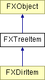

# FXTreeItem

Tree list Item

### Global flags

### **Tree list styles**

| **TREELIST_EXTENDEDSELECT** | Extended selection mode allows for drag-selection of ranges of items. |
| --- | --- |
| **TREELIST_SINGLESELECT** | Single selection mode allows up to one item to be selected. |
| **TREELIST_BROWSESELECT** | Browse selection mode enforces one single item to be selected at all times. |
| **TREELIST_MULTIPLESELECT** | Multiple selection mode is used for selection of individual items. |
| **TREELIST_AUTOSELECT** | Automatically select under cursor. |
| **TREELIST_SHOWS_LINES** | Lines shown. |
| **TREELIST_SHOWS_BOXES** | Boxes to expand shown. |
| **TREELIST_ROOT_BOXES** | Display root boxes also. |
| **TREELIST_CHECK_BOXES** | Display check boxes. |
| **TREELIST_PROPAGATE_CHECKS** | Propagate checked state to children and parents. |

