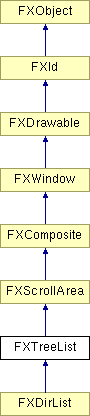

# FXTreeList

Tree list Widget

### FXTreeList(p, nvis, tgt=None, sel=0, opts=TREELIST_NORMAL, x=0, y=0, w=0, h=0)

Construct a tree list with nvis visible items; the tree list is initially empty.
| **Argument** | **Type** | **Default** | **Description** |
| --- | --- | --- | --- |
| p | FXComposite |  |  |
| nvis | Int |  |  |
| tgt | FXObject | None |  |
| sel | Int | 0 |  |
| opts | Int | TREELIST_NORMAL |  |
| x | Int | 0 |  |
| y | Int | 0 |  |
| w | Int | 0 |  |
| h | Int | 0 |  |

### addItemAfter(other, text, oi=None, ci=None, ptr=None, notify=False)

Append new item with given text and optional icon, and user-data pointer after to other item.
| **Argument** | **Type** | **Default** | **Description** |
| --- | --- | --- | --- |
| other | FXTreeItem |  |  |
| text | String |  |  |
| oi | FXIcon | None |  |
| ci | FXIcon | None |  |
| ptr | String | None |  |
| notify | Bool | False |  |

### addItemAfter(other, text, oi=None, ci=None, ptr=None, notify=False)

Append new item with given text and optional icon, and user-data pointer after to other item.
| **Argument** | **Type** | **Default** | **Description** |
| --- | --- | --- | --- |
| other | FXTreeItem |  |  |
| text | String |  |  |
| oi | FXIcon | None |  |
| ci | FXIcon | None |  |
| ptr | String | None |  |
| notify | Bool | False |  |

### addItemAfter(other, item, notify=False)

Append new [possibly subclassed] item after to other item.
| **Argument** | **Type** | **Default** | **Description** |
| --- | --- | --- | --- |
| other | FXTreeItem |  |  |
| item | FXTreeItem |  |  |
| notify | Bool | False |  |

### addItemBefore(other, text, oi=None, ci=None, ptr=None, notify=False)

Prepend new item with given text and optional icon, and user-data pointer prior to other item.
| **Argument** | **Type** | **Default** | **Description** |
| --- | --- | --- | --- |
| other | FXTreeItem |  |  |
| text | String |  |  |
| oi | FXIcon | None |  |
| ci | FXIcon | None |  |
| ptr | String | None |  |
| notify | Bool | False |  |

### addItemBefore(other, text, oi=None, ci=None, ptr=None, notify=False)

Prepend new item with given text and optional icon, and user-data pointer prior to other item.
| **Argument** | **Type** | **Default** | **Description** |
| --- | --- | --- | --- |
| other | FXTreeItem |  |  |
| text | String |  |  |
| oi | FXIcon | None |  |
| ci | FXIcon | None |  |
| ptr | String | None |  |
| notify | Bool | False |  |

### addItemBefore(other, item, notify=False)

Prepend new [possibly subclassed] item prior to other item.
| **Argument** | **Type** | **Default** | **Description** |
| --- | --- | --- | --- |
| other | FXTreeItem |  |  |
| item | FXTreeItem |  |  |
| notify | Bool | False |  |

### addItemFirst(p, text, oi=None, ci=None, ptr=None, notify=False)

Prepend new item with given text and optional icon, and user-data pointer as first child of p.
| **Argument** | **Type** | **Default** | **Description** |
| --- | --- | --- | --- |
| p | FXTreeItem |  |  |
| text | String |  |  |
| oi | FXIcon | None |  |
| ci | FXIcon | None |  |
| ptr | String | None |  |
| notify | Bool | False |  |

### addItemFirst(p, text, oi=None, ci=None, ptr=None, notify=False)

Prepend new item with given text and optional icon, and user-data pointer as first child of p.
| **Argument** | **Type** | **Default** | **Description** |
| --- | --- | --- | --- |
| p | FXTreeItem |  |  |
| text | String |  |  |
| oi | FXIcon | None |  |
| ci | FXIcon | None |  |
| ptr | String | None |  |
| notify | Bool | False |  |

### addItemFirst(p, item, notify=False)

Prepend new [possibly subclassed] item as first child of p.
| **Argument** | **Type** | **Default** | **Description** |
| --- | --- | --- | --- |
| p | FXTreeItem |  |  |
| item | FXTreeItem |  |  |
| notify | Bool | False |  |

### addItemLast(p, text, oi=None, ci=None, ptr=None, notify=False)

Append new item with given text and optional icon, and user-data pointer as last child of p.
| **Argument** | **Type** | **Default** | **Description** |
| --- | --- | --- | --- |
| p | FXTreeItem |  |  |
| text | String |  |  |
| oi | FXIcon | None |  |
| ci | FXIcon | None |  |
| ptr | String | None |  |
| notify | Bool | False |  |

### addItemLast(p, text, oi=None, ci=None, ptr=None, notify=False)

Append new item with given text and optional icon, and user-data pointer as last child of p.
| **Argument** | **Type** | **Default** | **Description** |
| --- | --- | --- | --- |
| p | FXTreeItem |  |  |
| text | String |  |  |
| oi | FXIcon | None |  |
| ci | FXIcon | None |  |
| ptr | String | None |  |
| notify | Bool | False |  |

### addItemLast(p, item, notify=False)

Append new [possibly subclassed] item as last child of p.
| **Argument** | **Type** | **Default** | **Description** |
| --- | --- | --- | --- |
| p | FXTreeItem |  |  |
| item | FXTreeItem |  |  |
| notify | Bool | False |  |

### canFocus()

Tree list can receive focus.

Reimplemented from FXWindow.

### clearItems(notify=False)

Remove all items from list.
| **Argument** | **Type** | **Default** | **Description** |
| --- | --- | --- | --- |
| notify | Bool | False |  |

### closeItem(item, notify=False)

Close item.
| **Argument** | **Type** | **Default** | **Description** |
| --- | --- | --- | --- |
| item | FXTreeItem |  |  |
| notify | Bool | False |  |

### collapseTree(tree, notify=False)

Collapse tree.
| **Argument** | **Type** | **Default** | **Description** |
| --- | --- | --- | --- |
| tree | FXTreeItem |  |  |
| notify | Bool | False |  |

### create()

Create server-side resources.

Reimplemented from FXComposite.

Reimplemented in FXDirList.

### deselectItem(item, notify=False)

Deselect item.
| **Argument** | **Type** | **Default** | **Description** |
| --- | --- | --- | --- |
| item | FXTreeItem |  |  |
| notify | Bool | False |  |

### destroy()

Destroy server-side resources.

Reimplemented from FXComposite.

Reimplemented in FXDirList.

### detach()

Detach server-side resources.

Reimplemented from FXComposite.

Reimplemented in FXDirList.

### disableItem(item)

Disable item.
| **Argument** | **Type** | **Default** | **Description** |
| --- | --- | --- | --- |
| item | FXTreeItem |  |  |

### enableItem(item)

Enable item.
| **Argument** | **Type** | **Default** | **Description** |
| --- | --- | --- | --- |
| item | FXTreeItem |  |  |

### expandTree(tree, notify=False)

Expand tree.
| **Argument** | **Type** | **Default** | **Description** |
| --- | --- | --- | --- |
| tree | FXTreeItem |  |  |
| notify | Bool | False |  |

### extendSelection(item, notify=False)

Extend selection from anchor item to item.
| **Argument** | **Type** | **Default** | **Description** |
| --- | --- | --- | --- |
| item | FXTreeItem |  |  |
| notify | Bool | False |  |

### findItem(text, start=None, flags=SEARCH_FORWARD| SEARCH_WRAP)

Search items for item by name, starting from start item; the flags argument controls the search direction, and case sensitivity.
| **Argument** | **Type** | **Default** | **Description** |
| --- | --- | --- | --- |
| text | String |  |  |
| start | FXTreeItem | None |  |
| flags | Int | SEARCH_FORWARD| SEARCH_WRAP |  |

### getAnchorItem()

Return anchor item, if any.

### getContentHeight()

Return content height.

Reimplemented from FXScrollArea.

### getContentWidth()

Compute and return content width.

Reimplemented from FXScrollArea.

### getCurrentItem()

Return current item, if any.

### getCursorItem()

Return item under cursor, if any.

### getDefaultHeight()

Return default height.

Reimplemented from FXScrollArea.

### getDefaultWidth()

Return default width.

Reimplemented from FXScrollArea.

### getFirstItem()

REturn first root item.

### getFont()

Return text font.

### getHelpText()

Get the status line help text for this list.

### getIndent()

Return parent-child indent amount.

### getItemAt(x, y)

Get item at x,y, if any.
| **Argument** | **Type** | **Default** | **Description** |
| --- | --- | --- | --- |
| x | Int |  |  |
| y | Int |  |  |

### getItemCheck(item)

Returns the item checked state.
| **Argument** | **Type** | **Default** | **Description** |
| --- | --- | --- | --- |
| item | FXTreeItem |  |  |

### getItemClosedIcon(item)

Return item's closed icon.
| **Argument** | **Type** | **Default** | **Description** |
| --- | --- | --- | --- |
| item | FXTreeItem |  |  |

### getItemData(item)

Return item user-data pointer.
| **Argument** | **Type** | **Default** | **Description** |
| --- | --- | --- | --- |
| item | FXTreeItem |  |  |

### getItemHeight(item)

Return item height.
| **Argument** | **Type** | **Default** | **Description** |
| --- | --- | --- | --- |
| item | FXTreeItem |  |  |

### getItemOpenIcon(item)

Return item's open icon.
| **Argument** | **Type** | **Default** | **Description** |
| --- | --- | --- | --- |
| item | FXTreeItem |  |  |

### getItemText(item)

Return item's text.
| **Argument** | **Type** | **Default** | **Description** |
| --- | --- | --- | --- |
| item | FXTreeItem |  |  |

### getItemWidth(item)

Return item width.
| **Argument** | **Type** | **Default** | **Description** |
| --- | --- | --- | --- |
| item | FXTreeItem |  |  |

### getLastItem()

Return last root item.

### getLineColor()

Return line color.

### getListStyle()

Return list style.

### getNumItems()

Return number of items.

### getNumVisible()

Return number of visible items.

### getSelBackColor()

Return selected text background.

### getSelTextColor()

Return selected text color.

### getTextColor()

Return normal text color.

### hitItem(item, x, y)

Return item hit code: 0 outside, 1 icon, 2 text, 3 box.
| **Argument** | **Type** | **Default** | **Description** |
| --- | --- | --- | --- |
| item | FXTreeItem |  |  |
| x | Int |  |  |
| y | Int |  |  |

### isItemCurrent(item)

Return True if item is current.
| **Argument** | **Type** | **Default** | **Description** |
| --- | --- | --- | --- |
| item | FXTreeItem |  |  |

### isItemEnabled(item)

Return True if item is enabled.
| **Argument** | **Type** | **Default** | **Description** |
| --- | --- | --- | --- |
| item | FXTreeItem |  |  |

### isItemExpanded(item)

Return True if item expanded.
| **Argument** | **Type** | **Default** | **Description** |
| --- | --- | --- | --- |
| item | FXTreeItem |  |  |

### isItemLeaf(item)

Return True if item is a leaf-item, i.e. has no children.
| **Argument** | **Type** | **Default** | **Description** |
| --- | --- | --- | --- |
| item | FXTreeItem |  |  |

### isItemOpened(item)

Return True if item opened.
| **Argument** | **Type** | **Default** | **Description** |
| --- | --- | --- | --- |
| item | FXTreeItem |  |  |

### isItemSelected(item)

Return True if item is selected.
| **Argument** | **Type** | **Default** | **Description** |
| --- | --- | --- | --- |
| item | FXTreeItem |  |  |

### isItemVisible(item)

Return True if item is visible.
| **Argument** | **Type** | **Default** | **Description** |
| --- | --- | --- | --- |
| item | FXTreeItem |  |  |

### killFocus()

Remove the focus from this window.

Reimplemented from FXWindow.

### killSelection(notify=False)

Deselect all items.
| **Argument** | **Type** | **Default** | **Description** |
| --- | --- | --- | --- |
| notify | Bool | False |  |

### makeItemVisible(item)

Scroll to make item visible.
| **Argument** | **Type** | **Default** | **Description** |
| --- | --- | --- | --- |
| item | FXTreeItem |  |  |

### moveItemAfter(other, item)

Move item after other.
| **Argument** | **Type** | **Default** | **Description** |
| --- | --- | --- | --- |
| other | FXTreeItem |  |  |
| item | FXTreeItem |  |  |

### moveItemBefore(other, item)

Move item before other.
| **Argument** | **Type** | **Default** | **Description** |
| --- | --- | --- | --- |
| other | FXTreeItem |  |  |
| item | FXTreeItem |  |  |

### openItem(item, notify=False)

Open item.
| **Argument** | **Type** | **Default** | **Description** |
| --- | --- | --- | --- |
| item | FXTreeItem |  |  |
| notify | Bool | False |  |

### recalc()

Recalculate layout.

Reimplemented from FXWindow.

### removeItem(item, notify=False)

Remove item.
| **Argument** | **Type** | **Default** | **Description** |
| --- | --- | --- | --- |
| item | FXTreeItem |  |  |
| notify | Bool | False |  |

### removeItems(fm, to, notify=False)

Remove items in range [fm, to] inclusively.
| **Argument** | **Type** | **Default** | **Description** |
| --- | --- | --- | --- |
| fm | FXTreeItem |  |  |
| to | FXTreeItem |  |  |
| notify | Bool | False |  |

### reparentItem(item, p)

Reparent item under parent p.
| **Argument** | **Type** | **Default** | **Description** |
| --- | --- | --- | --- |
| item | FXTreeItem |  |  |
| p | FXTreeItem |  |  |

### selectItem(item, notify=False)

Select item.
| **Argument** | **Type** | **Default** | **Description** |
| --- | --- | --- | --- |
| item | FXTreeItem |  |  |
| notify | Bool | False |  |

### setAnchorItem(item)

Change anchor item.
| **Argument** | **Type** | **Default** | **Description** |
| --- | --- | --- | --- |
| item | FXTreeItem |  |  |

### setCurrentItem(item, notify=False)

Change current item.
| **Argument** | **Type** | **Default** | **Description** |
| --- | --- | --- | --- |
| item | FXTreeItem |  |  |
| notify | Bool | False |  |

### setFocus()

Move the focus to this window.

Reimplemented from FXWindow.

### setFont(fnt)

Change text font.
| **Argument** | **Type** | **Default** | **Description** |
| --- | --- | --- | --- |
| fnt | FXFont |  |  |

### setHelpText(text)

Set the status line help text for this list.
| **Argument** | **Type** | **Default** | **Description** |
| --- | --- | --- | --- |
| text | String |  |  |

### setIndent(in)

Change parent-child indent amount.
| **Argument** | **Type** | **Default** | **Description** |
| --- | --- | --- | --- |
| in | Int |  |  |

### setItemCheck(item, check, notify=False)

Sets the item checked state. Valid states are True, False and MAYBE. Returns True if the check value has changed, False otherwise.
| **Argument** | **Type** | **Default** | **Description** |
| --- | --- | --- | --- |
| item | FXTreeItem |  |  |
| check | Int |  |  |
| notify | Bool | False |  |

### setItemClosedIcon(item, icon)

Chance item's closed icon.
| **Argument** | **Type** | **Default** | **Description** |
| --- | --- | --- | --- |
| item | FXTreeItem |  |  |
| icon | FXIcon |  |  |

### setItemData(item, ptr)

Change item user-data pointer.
| **Argument** | **Type** | **Default** | **Description** |
| --- | --- | --- | --- |
| item | FXTreeItem |  |  |
| ptr | String |  |  |

### setItemOpenIcon(item, icon)

Change item's open icon.
| **Argument** | **Type** | **Default** | **Description** |
| --- | --- | --- | --- |
| item | FXTreeItem |  |  |
| icon | FXIcon |  |  |

### setItemText(item, text)

Change item's text.
| **Argument** | **Type** | **Default** | **Description** |
| --- | --- | --- | --- |
| item | FXTreeItem |  |  |
| text | String |  |  |

### setLineColor(clr)

Change line color.
| **Argument** | **Type** | **Default** | **Description** |
| --- | --- | --- | --- |
| clr | FXColor |  |  |

### setListStyle(style)

Change list style.
| **Argument** | **Type** | **Default** | **Description** |
| --- | --- | --- | --- |
| style | Int |  |  |

### setNumVisible(nvis)

Change number of visible items.
| **Argument** | **Type** | **Default** | **Description** |
| --- | --- | --- | --- |
| nvis | Int |  |  |

### setSelBackColor(clr)

Change selected text background.
| **Argument** | **Type** | **Default** | **Description** |
| --- | --- | --- | --- |
| clr | FXColor |  |  |

### setSelTextColor(clr)

Change selected text color.
| **Argument** | **Type** | **Default** | **Description** |
| --- | --- | --- | --- |
| clr | FXColor |  |  |

### setTextColor(clr)

Change normal text color.
| **Argument** | **Type** | **Default** | **Description** |
| --- | --- | --- | --- |
| clr | FXColor |  |  |

### toggleItem(item, notify=False)

Toggle item selection.
| **Argument** | **Type** | **Default** | **Description** |
| --- | --- | --- | --- |
| item | FXTreeItem |  |  |
| notify | Bool | False |  |

### updateItem(item)

Repaint item.
| **Argument** | **Type** | **Default** | **Description** |
| --- | --- | --- | --- |
| item | FXTreeItem |  |  |

### Global flags

### **Tree list styles**

| **TREELIST_EXTENDEDSELECT** | Extended selection mode allows for drag-selection of ranges of items. |
| --- | --- |
| **TREELIST_SINGLESELECT** | Single selection mode allows up to one item to be selected. |
| **TREELIST_BROWSESELECT** | Browse selection mode enforces one single item to be selected at all times. |
| **TREELIST_MULTIPLESELECT** | Multiple selection mode is used for selection of individual items. |
| **TREELIST_AUTOSELECT** | Automatically select under cursor. |
| **TREELIST_SHOWS_LINES** | Lines shown. |
| **TREELIST_SHOWS_BOXES** | Boxes to expand shown. |
| **TREELIST_ROOT_BOXES** | Display root boxes also. |
| **TREELIST_CHECK_BOXES** | Display check boxes. |
| **TREELIST_PROPAGATE_CHECKS** | Propagate checked state to children and parents. |

