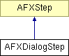

# AFXDialogStep

This class provides dialog steps in GUI procedures. 

### AFXDialogStep(owner, dialog, prompt)

Constructor that takes a prompt for the prompt area.
| **Argument** | **Type** | **Default** | **Description** |
| --- | --- | --- | --- |
| owner | AFXProcedure |  | Procedure creating the step. |
| dialog | AFXDataDialog |  | Dialog box to be posted in this step. |
| prompt | String |  |  |

### AFXDialogStep(owner, dialog)

Constructor that supplies a default prompt for the prompt area.
| **Argument** | **Type** | **Default** | **Description** |
| --- | --- | --- | --- |
| owner | AFXProcedure |  | Procedure creating the step. |
| dialog | AFXDataDialog |  | Dialog box to be posted in this step. |

### onCancel()

Called when the step is cancelled.

Reimplemented from AFXStep.

### onExecute()

Called to execute steps returned by getFirstStep and getNextStep.

Reimplemented from AFXStep.

### onResume()

Called when the step is resumed.

Reimplemented from AFXStep.

### onSuspend()

Called when the step is suspended.

Reimplemented from AFXStep.

