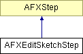

# AFXEditSketchStep

This class is used to provide pick steps in GUI procedures. 

### AFXEditSketchStep(owner, sketchName, prompt='Edit a sketch')

Constructor.
| **Argument** | **Type** | **Default** | **Description** |
| --- | --- | --- | --- |
| owner | AFXProcedure |  | Procedure creating the step. |
| sketchName | String |  | Name of sketch to edit, blank if create. |
| prompt | String | 'Edit a sketch' | Step's prompt displayed in prompt area. |

### onCancel()

Called when the step is cancelled.

Reimplemented from AFXStep.

### onExecute()

Called to execute the steps returned by getFirstStep and getNextStep.

Reimplemented from AFXStep.

### onResume()

Called when the step is resumed.

Reimplemented from AFXStep.

### onSuspend()

Called when the step is suspended.

Reimplemented from AFXStep.

