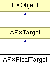

# AFXFloatTarget

This class is designed for floating-point targets. 

### AFXFloatTarget(initialValue=0.0)

Constructor.
| **Argument** | **Type** | **Default** | **Description** |
| --- | --- | --- | --- |
| initialValue | Float | 0.0 | Initial value. |

### getTypeName()

Returns the name of the target type ("Float").

Implements AFXTarget.

### getValue()

Returns the target's current value.

### setValue(newValue)

Sets the target's current value.
| **Argument** | **Type** | **Default** | **Description** |
| --- | --- | --- | --- |
| newValue | Float |  | New value. |

