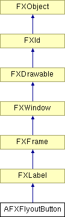

# AFXFlyoutButton

This class contains a button that acts like a regular FXButton when pressed and released quickly but displays a popup menu when pressed and held for a short time duration.

### AFXFlyoutButton(p, pup=None, act=0, opts=AFXFLYOUT_NORMAL, x=0, y=0, w=0, h=0, pl=0, pr=0, pt=0, pb=0)

Constructor.
| **Argument** | **Type** | **Default** | **Description** |
| --- | --- | --- | --- |
| p | FXComposite |  | Parent widget. |
| pup | FXPopup | None | Popup containing flyout items. |
| act | Int | 0 | Current button index (0-based). |
| opts | Int | AFXFLYOUT_NORMAL | Options and hints. |
| x | Int | 0 | X coordinate of origin. |
| y | Int | 0 | Y coordinate of origin. |
| w | Int | 0 | Width of the widget. |
| h | Int | 0 | Height of the widget. |
| pl | Int | 0 | Left padding (margin). |
| pr | Int | 0 | Right padding (margin). |
| pt | Int | 0 | Top padding (margin). |
| pb | Int | 0 | Bottom padding (margin). |

### canFocus()

Returns True (because a flyout button can receive focus).

Reimplemented from FXWindow.

### create()

Creates the flyout button.

Reimplemented from FXLabel.

### detach()

Detaches server-side resources for the flyout button.

Reimplemented from FXLabel.

### disable()

Disables the flyout button.

Reimplemented from FXLabel.

### enable()

Enables the flyout button.

Reimplemented from FXLabel.

### getButtonStyle()

Returns the flyout button style.

### getCurrentItem()

Returns the current item.

### getPane()

Returns the popup menu.

### getState()

Returns the flyout button state.

### setButtonStyle(style)

Sets the flyout button style.
| **Argument** | **Type** | **Default** | **Description** |
| --- | --- | --- | --- |
| style | Int |  | Button style (see Flags for flyout button options.) |

### setCurrentItem(item)

Sets the current item.
| **Argument** | **Type** | **Default** | **Description** |
| --- | --- | --- | --- |
| item | AFXFlyoutItem |  | Item. |

### setCurrentItem(index, setCheck=False)

Sets the current item and depresses the button if setCheck is True. The specified item index is 0-based, and only valid items are counted (items such as separators are not counted).
| **Argument** | **Type** | **Default** | **Description** |
| --- | --- | --- | --- |
| index | Int |  | Index. |
| setCheck | Bool | False | Value of check button. |

### setPane(pup)

Sets the popup menu.
| **Argument** | **Type** | **Default** | **Description** |
| --- | --- | --- | --- |
| pup | FXPopup |  | Popup menu. |

### setState(state)

Sets the flyout button state.
| **Argument** | **Type** | **Default** | **Description** |
| --- | --- | --- | --- |
| state | Int |  | State (see FXButton's Button state bits). |

### Class flags

### **Message ID's.**

| **ID_AFXFLYOUT_TIMER** | ID for the popup timer. |
| --- | --- |
| **ID_HIDE_ITEM** | ID used when hiding flyout item. |

### Global flags

### **Flags for flyout button options.**

| **AFXFLYOUT_AUTOGRAY** | Automatically gray out when no target. |
| --- | --- |
| **AFXFLYOUT_AUTOHIDE** | Automatically hide when no target. |
| **AFXFLYOUT_TOOLBAR** | Toolbar style button. |
| **AFXFLYOUT_HORIZONTAL** | Popup horizontal. |
| **AFXFLYOUT_VERTICAL** | Popup vertical. |
| **AFXFLYOUT_RADIO** | Current item is always active. |

