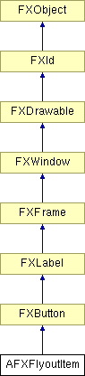

# AFXFlyoutItem

This class contains a button that is placed in the popup menu of the flyout button. 

### AFXFlyoutItem(p, text, ic=None, tgt=None, sel=0, opts=ICON_ABOVE_TEXT| BUTTON_TOOLBAR| FRAME_RAISED| FRAME_THICK, x=0, y=0, w=0, h=0, pl=0, pr=0, pt=0, pb=0)

Constructor.
| **Argument** | **Type** | **Default** | **Description** |
| --- | --- | --- | --- |
| p | FXComposite |  | Parent widget. |
| text | String |  | Label string. |
| ic | FXIcon | None | Icon. |
| tgt | FXObject | None | Message target. |
| sel | Int | 0 | Message ID. |
| opts | Int | ICON_ABOVE_TEXT| BUTTON_TOOLBAR| FRAME_RAISED| FRAME_THICK | Options and hints. |
| x | Int | 0 | X coordinate of origin. |
| y | Int | 0 | Y c coordinate of origin. |
| w | Int | 0 | Width of the widget. |
| h | Int | 0 | Height of the widget. |
| pl | Int | 0 | Left padding (margin). |
| pr | Int | 0 | Right padding (margin). |
| pt | Int | 0 | Top padding (margin). |
| pb | Int | 0 | Bottom padding (margin). |

### canFocus()

Returns True (because a flyout item can receive focus).

Reimplemented from FXButton.

### hide()

Hides the flyout item.

Reimplemented from FXWindow.

### setIcon(ic)

Sets the icon for the flyout item.

Reimplemented from FXLabel.
| **Argument** | **Type** | **Default** | **Description** |
| --- | --- | --- | --- |
| ic | FXIcon |  |  |

