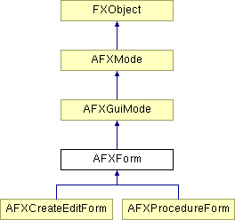

# AFXForm

This class is the abstract base class for forms. 

### AFXForm(owner)

Constructor.
| **Argument** | **Type** | **Default** | **Description** |
| --- | --- | --- | --- |
| owner | AFXGuiObjectManager |  | Owner (a module or a toolset) of the form. |

### activate()

Performs the necessary tasks when the form is activated.

Reimplemented from AFXGuiMode.

### cancel(tgt=None, msg=0)

Requests a cancellation of the form. When the cancel operation completes, successfully or not, the target will be sent the given message. The message data pointer will be non-zero for successful cancellation and zero if the cancel operation was abandoned for some purpose.
| **Argument** | **Type** | **Default** | **Description** |
| --- | --- | --- | --- |
| tgt | FXObject | None | Completion message target. |
| msg | Int | 0 | Completion message ID. |

### commit()

Performs the necessary tasks when the form is committed.

Implements AFXGuiMode.

### continueMode()

Used to get the next dialog box in the mode.

Implements AFXGuiMode.

### deactivateIfNeeded()

Deactivates the form if the user pressed the OK button of the currently posted dialog box. This method is called after the commands are processed successfully.

### getFirstDialog()

Returns the first dialog box to be posted.

### getNextDialog(previousDialog)

Returns the next dialog box to be posted.
| **Argument** | **Type** | **Default** | **Description** |
| --- | --- | --- | --- |
| previousDialog | AFXDialog |  | Previous dialog box. |

### issueCommands(writeToReplay=True, writeToJournal=False)

Generates commands based on the current state, sends the commands, and deactivates the form if necessary. If the commands did not complete successfully, a dialog box will be posted with an error message.
| **Argument** | **Type** | **Default** | **Description** |
| --- | --- | --- | --- |
| writeToReplay | Bool | True | True if commands should be written to the replay file; False if not. |
| writeToJournal | Bool | False | True if commands should be written to the journal file; False if not. |

### setModal(postModalDialogs)

Sets the modal state; if True, dialogs will be posted as modal. By default the form posts dialogs as non-modal.
| **Argument** | **Type** | **Default** | **Description** |
| --- | --- | --- | --- |
| postModalDialogs | Bool |  | True if the form should post dialogs as modal. |

