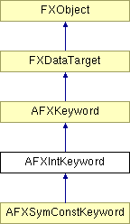

# AFXIntKeyword

This class is designed for the command keywords that have integer values. 

### AFXIntKeyword(command, name, isRequired=False, defaultValue=INT_DEFAULT, evalExpression=True)

Constructor.
| **Argument** | **Type** | **Default** | **Description** |
| --- | --- | --- | --- |
| command | AFXCommand |  | Host command. |
| name | String |  | Keyword name. |
| isRequired | Bool | False | True if the keyword is a required argument of the command. |
| defaultValue | Int | INT_DEFAULT | Default value. |
| evalExpression | Bool | True | True if the keyword supports expression evaluation. |

### getTypeName()

Returns the name of the keyword type.

Implements AFXKeyword.

Reimplemented in AFXSymConstKeyword.

### getValue()

Returns the keyword's current value.

### getValueAsString()

Returns the text string that represents the keyword's current value.

Implements AFXKeyword.

Reimplemented in AFXSymConstKeyword.

### isValueChanged()

Returns True if the keyword value differs from its previous value.

Implements AFXKeyword.

### setDefaultValue(defaultValue)

Sets the keyword's default value.
| **Argument** | **Type** | **Default** | **Description** |
| --- | --- | --- | --- |
| defaultValue | Int |  | Default value. |

### setValue(newValue)

Sets the keyword's current value.
| **Argument** | **Type** | **Default** | **Description** |
| --- | --- | --- | --- |
| newValue | Int |  | New value. |

### setValueToDefault(ignoreUnspecified=False)

Sets the keyword value to its default.
| **Argument** | **Type** | **Default** | **Description** |
| --- | --- | --- | --- |
| ignoreUnspecified | Bool | False | Ignore setting the value if the default is unspecified. |

### setValueToPrevious()

Sets the keyword value to its previous value.

Implements AFXKeyword.

### syncPreviousValue()

Sets the keyword's previous value to its current value.

Implements AFXKeyword.

