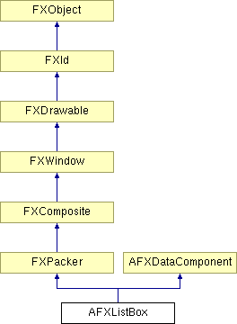

# AFXListBox

This class contains a label that precedes a list box, which allows the user to select entries from a drop-down list.

### AFXListBox(p, nvis, labelText, tgt=None, sel=0, opts=0, x=0, y=0, w=0, h=0, pl=DEFAULT_PAD, pr=DEFAULT_PAD, pt=DEFAULT_PAD, pb=DEFAULT_PAD)

Constructor.
| **Argument** | **Type** | **Default** | **Description** |
| --- | --- | --- | --- |
| p | FXComposite |  | Parent widget. |
| nvis | Int |  | Number of visible items. |
| labelText | String |  | Label string. |
| tgt | FXObject | None | Message target. |
| sel | Int | 0 | Message ID. |
| opts | Int | 0 | Options and hints. |
| x | Int | 0 | X coordinate of origin. |
| y | Int | 0 | Y coordinate of origin. |
| w | Int | 0 | Width of the widget. |
| h | Int | 0 | Height of the widget. |
| pl | Int | DEFAULT_PAD | Left padding (margin). |
| pr | Int | DEFAULT_PAD | Right padding (margin). |
| pt | Int | DEFAULT_PAD | Top padding (margin). |
| pb | Int | DEFAULT_PAD | Bottom padding (margin). |

### appendItem(text, icon=None, sel=0)

Adds an item to the end of the list.
| **Argument** | **Type** | **Default** | **Description** |
| --- | --- | --- | --- |
| text | String |  |  |
| icon | FXIcon | None |  |
| sel | Int | 0 |  |

### clearItems()

Removes all items from the list.

### create()

Creates the list box.

Reimplemented from FXComposite.

### disable()

Disables the list box.

Reimplemented from FXWindow.

### enable()

Enables the list box.

Reimplemented from FXWindow.

### getCurrentItem()

Returns the index of the current item.

### getHelpText()

Returns the status line help text.

### getItemData(index)

Returns the data for the specified item.
| **Argument** | **Type** | **Default** | **Description** |
| --- | --- | --- | --- |
| index | Int |  |  |

### getItemIndexForData(data)

Returns the index of the first item with the associated data or -1 if not found.
| **Argument** | **Type** | **Default** | **Description** |
| --- | --- | --- | --- |
| data |  |  |  |

### getLabelFont()

Returns the label font.

### getLabelText()

Returns the label string.

### getNumItems()

Returns the number of items in the list.

### getNumVisible()

Returns the number of visible items.

### getTipText()

Returns the tool tip message.

### insertItem(index, text, icon=None, sel=0)

Inserts a new item at the specified index position.
| **Argument** | **Type** | **Default** | **Description** |
| --- | --- | --- | --- |
| index | Int |  |  |
| text | String |  |  |
| icon | FXIcon | None |  |
| sel | Int | 0 |  |

### isItemCurrent(index)

Returns True if the item at the specified index position is the current item.
| **Argument** | **Type** | **Default** | **Description** |
| --- | --- | --- | --- |
| index | Int |  |  |

### isReadOnlyState()

Returns True if the list box is set to the read-only state.

### removeItem(index)

Removes the item at the specified index position from the list.
| **Argument** | **Type** | **Default** | **Description** |
| --- | --- | --- | --- |
| index | Int |  |  |

### replaceItem(index, text, icon=None, sel=0)

Replaces the item at the specified index position.
| **Argument** | **Type** | **Default** | **Description** |
| --- | --- | --- | --- |
| index | Int |  |  |
| text | String |  |  |
| icon | FXIcon | None |  |
| sel | Int | 0 |  |

### setCurrentItem(index, notify=False)

Sets the current item. (The index is zero-based).
| **Argument** | **Type** | **Default** | **Description** |
| --- | --- | --- | --- |
| index | Int |  |  |
| notify | Bool | False |  |

### setHelpText(text)

Sets the status line help text.
| **Argument** | **Type** | **Default** | **Description** |
| --- | --- | --- | --- |
| text | String |  |  |

### setItemData(index, ptr)

Sets the data for the specified item.
| **Argument** | **Type** | **Default** | **Description** |
| --- | --- | --- | --- |
| index | Int |  |  |
| ptr | String |  |  |

### setLabelFont(fnt)

Sets the label font.
| **Argument** | **Type** | **Default** | **Description** |
| --- | --- | --- | --- |
| fnt | FXFont |  |  |

### setLabelText(txt)

Sets the label string.
| **Argument** | **Type** | **Default** | **Description** |
| --- | --- | --- | --- |
| txt | String |  |  |

### setNumVisible(nvis)

Sets the number of visible items.
| **Argument** | **Type** | **Default** | **Description** |
| --- | --- | --- | --- |
| nvis | Int |  |  |

### setReadOnlyState(readonly=True)

Sets the read-only state of the list box.
| **Argument** | **Type** | **Default** | **Description** |
| --- | --- | --- | --- |
| readonly | Bool | True |  |

### setTipText(text)

Sets the tool tip message.
| **Argument** | **Type** | **Default** | **Description** |
| --- | --- | --- | --- |
| text | String |  |  |

### Class flags

### **Message ID's.**

| **ID_LIST** | ID for the list box. |
| --- | --- |
| **ID_FIELD** | ID for the text field. |

### Global flags

### **Flags for AFX list box options.**

| **AFXLISTBOX_VERTICAL** | Orient label above list box. |
| --- | --- |
| **AFXLISTBOX_READONLY** | Configure list box to the read-only state. |

