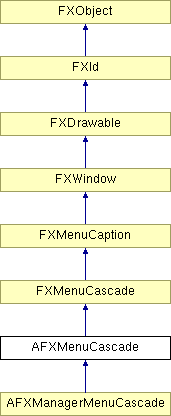

# AFXMenuCascade

This class provides the interface for creating an FXMenuCascade and performing various management activities on it. It will use utility methods so the menu cascade is correctly managed for modules and toolsets. 

### AFXMenuCascade(owner, p, label, ic=None, popup=None)

Constructor.
| **Argument** | **Type** | **Default** | **Description** |
| --- | --- | --- | --- |
| owner | AFXGuiObjectManager |  | Creator of the menu cascade. |
| p | FXComposite |  | Parent widget. |
| label | String |  | Label for the menu button. |
| ic | FXIcon | None | Menu button icon. |
| popup | FXPopup | None | Menu cascade's pullright pane. |

### getOwner()

Returns the owner of the menu cascade.

Reimplemented from FXWindow.

