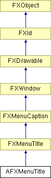

# AFXMenuTitle

This class provides the interface for creating an FXMenuTitle and performing various management activities on it. It will use utility methods so the menu title is correctly managed for modules and procedure toolsets. 

### AFXMenuTitle(owner, label, ic=None, popup=None)

Constructor that takes an owner.
| **Argument** | **Type** | **Default** | **Description** |
| --- | --- | --- | --- |
| owner | AFXGuiObjectManager |  | Owner (module or toolset GUI). |
| label | String |  | Label string. |
| ic | FXIcon | None | Icon. |
| popup | FXPopup | None | Pulldown menu. |

### AFXMenuTitle(parent, label, ic=None, popup=None)

Constructor that takes a parent.
| **Argument** | **Type** | **Default** | **Description** |
| --- | --- | --- | --- |
| parent | FXComposite |  | Parent widget. |
| label | String |  | Label string. |
| ic | FXIcon | None | Icon. |
| popup | FXPopup | None | Pulldown menu. |

### getOwner()

Returns the owner of the menu title.

Reimplemented from FXWindow.

### hide()

Hides the widget.

Reimplemented from FXWindow.

### show()

Shows the widget.

Reimplemented from FXWindow.

