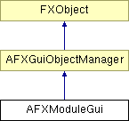

# AFXModuleGui

This is the base class for module GUIs and provides an interface for module GUI management. 

### AFXModuleGui(moduleName, displayTypes)

Constructor.
| **Argument** | **Type** | **Default** | **Description** |
| --- | --- | --- | --- |
| moduleName | String |  | Name used to identify this module. |
| displayTypes | Int |  | Types of primary objects that this module may display. |

### activate()

Activates the module during switch processing (allows for module specific activation requirements).

### deactivate()

Deactivates the module when switching out (allows for module specific deactivation requirements).

### getModuleName()

Returns the name of the module given on construction.

### getToolsetKernelInitializationCommands()

Returns the command string to initialize the toolsets in the kernel that are corresponding to the toolsets registered with the module GUI.

### getTypesToDisplay()

Returns the type of the primary objects which may be displayed when this module is active (this currently assumes a single type).

### hide(location)

Deactivates and hides the module's GUI components in the menubar, toolbar and toolbox.
| **Argument** | **Type** | **Default** | **Description** |
| --- | --- | --- | --- |
| location | Int |  | Location where gui components are placed. |

### registerProcedureToolset(tool)

Registers a procedure toolset (called during construction of derived modules).
| **Argument** | **Type** | **Default** | **Description** |
| --- | --- | --- | --- |
| tool | AFXProcedureToolsetGui |  | Pointer to procedure toolset being registered. |

### registerToolset(tool, opts)

Registers a toolset (called during construction of derived modules).
| **Argument** | **Type** | **Default** | **Description** |
| --- | --- | --- | --- |
| tool | AFXToolsetGui |  | Pointer to toolset being registered. |
| opts | Int |  | Options for creating toolset GUI components. |

### show(location)

Activates and shows the module's GUI components in the menubar, toolbar and toolbox.
| **Argument** | **Type** | **Default** | **Description** |
| --- | --- | --- | --- |
| location | Int |  | Location where gui components are placed. |

### unregisterToolset(name)

Unregisters a toolset.
| **Argument** | **Type** | **Default** | **Description** |
| --- | --- | --- | --- |
| name | String |  | Name of toolset to unregister. |

### Class flags

### **Message ID's.**

| **MISSING ENUMERATOR** | MISSING ENUMERATOR DESCRIPTION |
| --- | --- |

### **Flags for the object to display.**

| **PART** | Displays a part primary object. |
| --- | --- |
| **ASSEMBLY** | Displays an assembly primary object. |
| **ODB** | Displays an ODB primary object. |
| **XY_PLOT** | Displays an XY plot primary object. |
| **SKETCH** | Displays a sketch primary object. |

