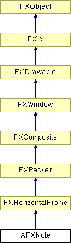

# AFXNote

This class prefixes a given message string by either "Note:" or "Warning:".

### AFXNote(p, message, opts=NOTE_INFORMATION, x=0, y=0)

Constructor.
| **Argument** | **Type** | **Default** | **Description** |
| --- | --- | --- | --- |
| p | FXComposite |  | Parent widget. |
| message | String |  | Note message string. |
| opts | Int | NOTE_INFORMATION | Options and hints. |
| x | Int | 0 | X coordinate of origin. |
| y | Int | 0 | Y coordinate of origin. |

### create()

Creates the note.

Reimplemented from FXComposite.

### detach()

Detaches the server-resources of the note.

Reimplemented from FXComposite.

### disable()

Disables the note.

Reimplemented from FXWindow.

### enable()

Enables the note.

Reimplemented from FXWindow.

### getText()

Returns the note's message string.

### setText(message)

Sets the note's message string.
| **Argument** | **Type** | **Default** | **Description** |
| --- | --- | --- | --- |
| message | String |  | Message. |

### Global flags

### **Flags for note styles.**

| **NOTE_INFORMATION** | Information note. |
| --- | --- |
| **NOTE_WARNING** | Warning note. |

