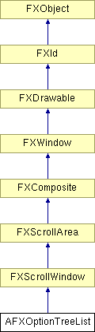

# AFXOptionTreeList

This class provides a scrolled list of groups of options that may be toggled on or off as a group or individually. 

### AFXOptionTreeList(p, nvis, opts=0, x=0, y=0, w=0, h=0, pl=DEFAULT_SPACING, pr=DEFAULT_SPACING, pt=DEFAULT_SPACING, pb=DEFAULT_SPACING, hs=DEFAULT_SPACING, vs=DEFAULT_SPACING)

Constructor.
| **Argument** | **Type** | **Default** | **Description** |
| --- | --- | --- | --- |
| p | FXComposite |  | Parent widget. |
| nvis | Int |  | Number of visible items of list. |
| opts | Int | 0 | Options and hints. |
| x | Int | 0 | X coordinate of origin. |
| y | Int | 0 | Y coordinate of origin. |
| w | Int | 0 | Width of the widget. |
| h | Int | 0 | Height of the widget. |
| pl | Int | DEFAULT_SPACING | Left padding. |
| pr | Int | DEFAULT_SPACING | Right padding. |
| pt | Int | DEFAULT_SPACING | Top padding. |
| pb | Int | DEFAULT_SPACING | Bottom padding. |
| hs | Int | DEFAULT_SPACING | Horizontal spacing. |
| vs | Int | DEFAULT_SPACING | Vertical spacing. |

### addItemFirst(text, tgt=None, msg=0)

Adds a new item with the given text as the first item of the list.
| **Argument** | **Type** | **Default** | **Description** |
| --- | --- | --- | --- |
| text | String |  | Item text. |
| tgt | FXObject | None | Item target. |
| msg | Int | 0 | Item selector. |

### addItemLast(text, tgt=None, msg=0)

Adds a new item with the given text as the last item of the list.
| **Argument** | **Type** | **Default** | **Description** |
| --- | --- | --- | --- |
| text | String |  | Item text. |
| tgt | FXObject | None | Item target. |
| msg | Int | 0 | Item selector. |

### clearItems()

Removes all items from the list.

### computeItemHeight(p=None)

Computes the item size to be used as a base for default height computation.
| **Argument** | **Type** | **Default** | **Description** |
| --- | --- | --- | --- |
| p | AFXOptionTreeItem | None | Item. |

### createItem(text, tgt, msg)

Creates a new tree item object.
| **Argument** | **Type** | **Default** | **Description** |
| --- | --- | --- | --- |
| text | String |  | Item text. |
| tgt | FXObject |  | Item target. |
| msg | Int |  | Item selector. |

### getContentHeight()

Returns the content height.

Reimplemented from FXScrollWindow.

### getContents()

Returns the content window.

### getContentWidth()

Returns the content width.

Reimplemented from FXScrollWindow.

### getDefaultHeight()

Returns the default height.

Reimplemented from FXScrollArea.

### getDefaultWidth()

Returns the default width.

Reimplemented from FXScrollArea.

### getFirstItem()

Returns the first root item.

### getHSpacing()

Returns the horizontal inter-child spacing.

### getLastItem()

Returns the last root item.

### getNumItems()

Returns the number of top-level items.

### getNumVisible()

Returns the number of visible items.

### getPadBottom()

Returns the bottom padding.

### getPadLeft()

Returns the left padding.

### getPadRight()

Returns the right padding.

### getPadTop()

Returns the top padding.

### getVSpacing()

Returns the vertical inter-child spacing.

### layout()

Recalculates layout.

Reimplemented from FXScrollWindow.

### moveContents(x, y)

Moves contents to the specified position.
| **Argument** | **Type** | **Default** | **Description** |
| --- | --- | --- | --- |
| x | Int |  | X location. |
| y | Int |  | Y location |

### removeItem(item)

Removes the given item from the list. This method does nothing if the given item does not exist.
| **Argument** | **Type** | **Default** | **Description** |
| --- | --- | --- | --- |
| item | AFXOptionTreeItem |  | Item to be removed. |

### setHSpacing(hs)

Sets the horizontal inter-child spacing.
| **Argument** | **Type** | **Default** | **Description** |
| --- | --- | --- | --- |
| hs | Int |  | Horizontal spacing. |

### setNumVisible(nvis)

Sets the number of visible items.
| **Argument** | **Type** | **Default** | **Description** |
| --- | --- | --- | --- |
| nvis | Int |  | Number of visible items. |

### setPadBottom(pb)

Sets the bottom padding.
| **Argument** | **Type** | **Default** | **Description** |
| --- | --- | --- | --- |
| pb | Int |  | Bottom padding. |

### setPadLeft(pl)

Sets the left padding.
| **Argument** | **Type** | **Default** | **Description** |
| --- | --- | --- | --- |
| pl | Int |  | Left padding. |

### setPadRight(pr)

Sets the right padding.
| **Argument** | **Type** | **Default** | **Description** |
| --- | --- | --- | --- |
| pr | Int |  | Right padding. |

### setPadTop(pt)

Sets the top padding.
| **Argument** | **Type** | **Default** | **Description** |
| --- | --- | --- | --- |
| pt | Int |  | Top padding. |

### setVSpacing(vs)

Sets the vertical inter-child spacing.
| **Argument** | **Type** | **Default** | **Description** |
| --- | --- | --- | --- |
| vs | Int |  | Vertical spacing. |

### Class flags

### **Message ID's.**

| **ID_CONTENTS** | ID for the content window. |
| --- | --- |

