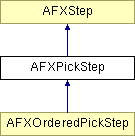

# AFXPickStep

This class is used to provide pick steps in GUI procedures. 

### AFXPickStep(owner, keyword, prompt, entitiesToPick, numberToPick=ONE, highlightLevel=1, sequenceStyle=ARRAY)

Constructor.
| **Argument** | **Type** | **Default** | **Description** |
| --- | --- | --- | --- |
| owner | AFXProcedure |  | Procedure creating the step. |
| keyword | AFXObjectKeyword |  | Object kwd containing pick variable. Part of AFXGuiCommand. |
| prompt | String |  | Step's prompt displayed in prompt area. |
| entitiesToPick | Int |  | Type of entities to pick. |
| numberToPick | pickAmountEnum | ONE | How many entities to pick. |
| highlightLevel | Int | 1 | Highlight level. |
| sequenceStyle | sequenceStyleEnum | ARRAY | Sequence style of picked variables in the command. |

### addElementSetSelection(name)

Adds an element set to the step's selections.
| **Argument** | **Type** | **Default** | **Description** |
| --- | --- | --- | --- |
| name | String |  | Name of set. |

### addGeometrySetSelection(name)

Adds a geometry set to the step's selections.
| **Argument** | **Type** | **Default** | **Description** |
| --- | --- | --- | --- |
| name | String |  | Name of set. |

### addNodeSetSelection(name)

Adds a node set to the step's selections.
| **Argument** | **Type** | **Default** | **Description** |
| --- | --- | --- | --- |
| name | String |  | Name of set. |

### addPointKeyIn(keyword)

Creates a textfield on the prompt line as an alternative method of specifying a point.
| **Argument** | **Type** | **Default** | **Description** |
| --- | --- | --- | --- |
| keyword | AFXTupleKeyword |  | Keyword |

### addSurfaceSelection(name)

Adds a surface to the step's selections.
| **Argument** | **Type** | **Default** | **Description** |
| --- | --- | --- | --- |
| name | String |  | Name of surface. |

### allowRepeatedSelections(value=True)

Allows the picking of prior selections (from prior pick steps of the procedure).
| **Argument** | **Type** | **Default** | **Description** |
| --- | --- | --- | --- |
| value | Bool | True | If True, allow repeated selections between steps. |

### onCancel()

Called when the step is cancelled.

Reimplemented from AFXStep.

Reimplemented in AFXOrderedPickStep.

### onExecute()

Called to execute the steps returned by getFirstStep and getNextStep.

Reimplemented from AFXStep.

Reimplemented in AFXOrderedPickStep.

### onResume()

Called when the step is resumed.

Reimplemented from AFXStep.

### onSuspend()

Called when the step is suspended.

Reimplemented from AFXStep.

### reset()

Allows a step to reset any of its data (if needed) when looping.

Reimplemented from AFXStep.

Reimplemented in AFXOrderedPickStep.

### setEdgeRefinements(refinement)

Sets the refinements to be used when picking edges.
| **Argument** | **Type** | **Default** | **Description** |
| --- | --- | --- | --- |
| refinement | Int |  | Refinement flag. |

### setElementEdgeRefinements(refinement)

Sets the refinements to be used when picking element edges.
| **Argument** | **Type** | **Default** | **Description** |
| --- | --- | --- | --- |
| refinement | Int |  | Refinement flag. |

### setElementFaceRefinements(refinement)

Sets the refinements to be used when picking element faces.
| **Argument** | **Type** | **Default** | **Description** |
| --- | --- | --- | --- |
| refinement | Int |  | Refinement flag. |

### setElementRefinements(refinement)

Sets the refinements to be used when picking elements.
| **Argument** | **Type** | **Default** | **Description** |
| --- | --- | --- | --- |
| refinement | Int |  | Refinement flag. |

### setFaceRefinements(refinement)

Sets the refinements to be used when picking faces.
| **Argument** | **Type** | **Default** | **Description** |
| --- | --- | --- | --- |
| refinement | Int |  | Refinement flag. |

### setInstanceRefinements(refinement)

Sets the refinements to be used when picking instances.
| **Argument** | **Type** | **Default** | **Description** |
| --- | --- | --- | --- |
| refinement | Int |  | Refinement flag. |

### setNodeRefinements(refinement)

Sets the refinements to be used when picking nodes.
| **Argument** | **Type** | **Default** | **Description** |
| --- | --- | --- | --- |
| refinement | Int |  | Refinement flag. |

### setSketchRefinements(refinement)

Sets the refinements to be used when picking sketches.
| **Argument** | **Type** | **Default** | **Description** |
| --- | --- | --- | --- |
| refinement | Int |  | Refinement flag. |

### setXyRefinements(refinement)

Sets the refinements to be used when picking xy objects.
| **Argument** | **Type** | **Default** | **Description** |
| --- | --- | --- | --- |
| refinement | Int |  | Refinement flag. |

### Class flags

### **Flags for the number of entities to pick.**

| **ONE** | Allow only one entity to be picked. |
| --- | --- |
| **MANY** | Allow one or more entities to be picked. |

### **Flags for refining pickable entities.**

| **STRAIGHT** | Allow only straight entities to be picked. |
| --- | --- |
| **WIRE** | Allow only wire entities to be picked. |
| **PLANAR** | Allow only planar entities to be picked. |
| **CONICAL** | Allow only conical entities to be picked. |
| **SHELL** | Allow only shell entities to be picked. |
| **ORPHAN_MESH** | Allow only orphan mesh entities to be picked. |
| **SOLID** | Allow only solid entities to be picked. |
| **GEOMETRY** | Allow only geometry entities to be picked. |
| **POINT** | Allow only point entities to be picked. |
| **BACKGROUND** | Allow only background entities to be picked while sketching. |
| **FOREGROUND** | Allow only sketch entities to be picked. |
| **VERTICAL** | Allow only vertical geometric sketch entities to be picked. |
| **HORIZONTAL** | Allow only horizontal geometric sketch entities to be picked. |
| **CONSTRUCTION** | Allow only construction sketch entities to be picked. |
| **NO_CONSTRUCTION** | Allow only non-construction geometric sketch entities to be picked. |
| **SPOT** | Allow only spot sketch entities to be picked. |
| **CIRCULAR** | Allow only circular sketch entities to be picked. |
| **INTERIOR** | Allow only interior entities to be picked. |
| **EXTERIOR** | Allow only exterior entities to be picked. |

### **Flags for pickable entities.**

| **VERTICES** | Allow vertices to be picked. |
| --- | --- |
| **EDGES** | Allow edges to be picked. |
| **FACES** | Allow faces to be picked. |
| **CELLS** | Allow cells to be picked. |
| **STRINGERS** | Allow stringers to be picked. |
| **SKINS** | Allow skins to be picked. |
| **ELEMENT_EDGES** | Allow element edges to be picked. |
| **ELEMENT_FACES** | Allow element faces to be picked. |
| **NODES** | Allow nodes to be picked. |
| **ELEMENTS** | Allow elements to be picked. |
| **INSTANCES** | Allow part instances in the model database to be picked. |
| **MAX_DIMENSION** | Allow picking only objects of the highest dimension (1D, 2D, 3D). |
| **REFERENCE_POINTS** | Allow reference points to be picked. |
| **INTERESTING_POINTS** | Allow interesting points to be picked. |
| **DATUM_POINTS** | Allow datum points to be picked. |
| **DATUM_AXES** | Allow datum axes to be picked. |
| **DATUM_PLANES** | Allow datsum planes be picked. |
| **DATUM_CSYS** | Allow datum CSYS's to be picked. |
| **REMOVABLE_EDGES** | Allow edges to be removed from face selections. |
| **FEATURES** | Allow features to be picked. |
| **SKETCH_VERTICES** | Allow sketch vertices to be picked. |
| **SKETCH_GEOMETRIES** | Allow sketch geometries to be picked. |
| **SKETCH_DIMENSIONS** | Allow sketch dimensions to be picked. |
| **SKETCH_CONSTRAINTS** | Allow sketch constraints to be picked. |
| **SKETCH_COORDINATES** | Allow sketch coordinates to be picked must add keyin. |
| **SKIN_ELEMENTS** | Allow elements on skins to be picked. |
| **STRINGER_ELEMENTS** | Allow elements on stringers to be picked. |
| **POINTS** | Allow all types of points to be picked. |
| **LINES** | Allow all types of lines to be picked. |
| **PLANES** | Allow all types of planes to be picked. |

### **Flags for the command sequence style of the picked items.**

| **TUPLE** | Specify pick as a comma separated tuple of single items. |
| --- | --- |
| **ARRAY** | Specify pick as a plus separated sequence items. |

