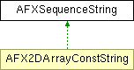

# AFXSequenceString

This class supports parsing and modification of strings containing sequences of elements separated with some separator character. 

### AFXSequenceString(value='', sep=',')

Constructor.
| **Argument** | **Type** | **Default** | **Description** |
| --- | --- | --- | --- |
| value | String | '' | String with initial sequence values. |
| sep | String | ',' | Separator character for sequence elements. |

### AFXSequenceString()

Undefined copy constructor (this class has no copy semantics).

### forceNumElements(num, fill)

Forces the content string to contain a tuple with the given number of elements.
| **Argument** | **Type** | **Default** | **Description** |
| --- | --- | --- | --- |
| num | Int |  | New number of elements. |
| fill | String |  | String to insert in empty spaces. |

### getContentString()

Returns a string containing values of the sequence elements.

Reimplemented in AFX2DArrayConstString.

### getElementSeparator()

Returns the element separator character.

### getLength(index)

Returns the length in characters of a sequence element.
| **Argument** | **Type** | **Default** | **Description** |
| --- | --- | --- | --- |
| index | Int |  | Element index. |

### getNumElements()

Returns the number of elements in this sequence.

### getPosition(index)

Returns the position in the content string of the beginning character of the sequence element.
| **Argument** | **Type** | **Default** | **Description** |
| --- | --- | --- | --- |
| index | Int |  | Element index. |

### getValue(index)

Returns the value of a sequence element.
| **Argument** | **Type** | **Default** | **Description** |
| --- | --- | --- | --- |
| index | Int |  | Element index. |

### insert(index, numElements, val)

Inserts many copies of an element.
| **Argument** | **Type** | **Default** | **Description** |
| --- | --- | --- | --- |
| index | Int |  | Element index at which inserting begins. |
| numElements | Int |  | Number of elements to insert. |
| val | String |  | Value for the new elements. |

### isValidSequence()

Returns True if this object contains a valid sequence.

### remove(index, numElements)

Removes elements starting at the given index.
| **Argument** | **Type** | **Default** | **Description** |
| --- | --- | --- | --- |
| index | Int |  | Element index at which removal begins. |
| numElements | Int |  | Number of elements to remove. |

### setContentString(seqstr)

Resets all values for the sequence elements.
| **Argument** | **Type** | **Default** | **Description** |
| --- | --- | --- | --- |
| seqstr | String |  | Sequence string with new values. |

### setElementSeparator(sep)

Sets the element separator character.
| **Argument** | **Type** | **Default** | **Description** |
| --- | --- | --- | --- |
| sep | String |  | Separator character. |

### setLength(index, length)

Sets the length of the sequence element.
| **Argument** | **Type** | **Default** | **Description** |
| --- | --- | --- | --- |
| index | Int |  | Element index. |
| length | Int |  | New length (in characters). |

### setPosition(index, position)

Sets the position of the sequence element.
| **Argument** | **Type** | **Default** | **Description** |
| --- | --- | --- | --- |
| index | Int |  | Element index. |
| position | Int |  | New position within the string. |

### setValue(index, value, replaceAll=False)

Sets the value of a sequence element.
| **Argument** | **Type** | **Default** | **Description** |
| --- | --- | --- | --- |
| index | Int |  | Element index. |
| value | String |  | New value. |
| replaceAll | Bool | False | If False (default), leading and trailing spaces will be preserved, otherwise, all space between separators will be replaced with the new value. |

### trimWhiteSpace(index)

Adjusts the position and length of the element to trim leading and trailing white spaces.
| **Argument** | **Type** | **Default** | **Description** |
| --- | --- | --- | --- |
| index | Int |  | Element index. |

