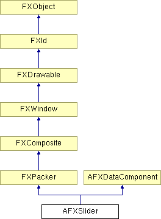

# AFXSlider

This class provides a slider, which allows the user to specify a value by dragging its value indicator.

### AFXSlider(p, tgt=None, sel=0, opts=AFXSLIDER_NORMAL, x=0, y=0, w=0, h=0, pl=0, pr=0, pt=0, pb=0)

Constructor.
| **Argument** | **Type** | **Default** | **Description** |
| --- | --- | --- | --- |
| p | FXComposite |  | Parent widget. |
| tgt | FXObject | None | Message target. |
| sel | Int | 0 | Message ID. |
| opts | Int | AFXSLIDER_NORMAL | Options and hints. |
| x | Int | 0 | X coordinate of origin. |
| y | Int | 0 | Y coordinate of origin. |
| w | Int | 0 | Width of the widget. |
| h | Int | 0 | Height of the widget. |
| pl | Int | 0 | Left padding (margin). |
| pr | Int | 0 | Right padding (margin). |
| pt | Int | 0 | Top padding (margin). |
| pb | Int | 0 | Bottom padding (margin). |

### canFocus()

Returns True because a slider can receive focus.

Reimplemented from FXWindow.

### disable()

Disables the slider.

Reimplemented from FXWindow.

### enable()

Enables the slider.

Reimplemented from FXWindow.

### getDecimalPlaces()

Returns the number of decimal points displayed.

### getDefaultHeight()

Returns the default height.

Reimplemented from FXPacker.

### getDefaultWidth()

Returns the default width.

Reimplemented from FXPacker.

### getIncrement()

Returns the slider's auto-increment/decrement value.

### getMaxLabelText()

Returns the maximum label's text.

### getMinLabelText()

Returns the minimum label's text.

### getRange()

Returns a sequence of ints (low, high) representing the widget's allowable minimum and maximum values.

### getSliderStyle()

Returns the slider's style.

### getTipText()

Returns the slider's tip text.

### getTitleLabelJustify()

Returns the title label's justification mode.

### getTitleLabelText()

Returns the title label's text.

### getValue()

Returns the slider's value.

### recalc()

Recalculates the slider. Redefined to handle slider movement.

Reimplemented from FXWindow.

### setDecimalPlaces(dp)

Sets the number of decimal points displayed.
| **Argument** | **Type** | **Default** | **Description** |
| --- | --- | --- | --- |
| dp | Int |  | Number of decimal places. |

### setIncrement(inc)

Sets the slider's auto-increment/decrement value.
| **Argument** | **Type** | **Default** | **Description** |
| --- | --- | --- | --- |
| inc | Int |  | Increment. |

### setMaxLabelText(text)

Sets the maximum label's text.
| **Argument** | **Type** | **Default** | **Description** |
| --- | --- | --- | --- |
| text | String |  | Max label text. |

### setMinLabelText(text)

Sets the minimum label's text.
| **Argument** | **Type** | **Default** | **Description** |
| --- | --- | --- | --- |
| text | String |  | Min label text. |

### setRange(lo, hi)

Sets the slider's maximum and minimum values.
| **Argument** | **Type** | **Default** | **Description** |
| --- | --- | --- | --- |
| lo | Int |  | Minimum value. |
| hi | Int |  | Maximum value. |

### setSliderStyle(style)

Sets the slider's style.
| **Argument** | **Type** | **Default** | **Description** |
| --- | --- | --- | --- |
| style | Int |  | Style flag. |

### setTipText(text)

Sets the slider's tip text.
| **Argument** | **Type** | **Default** | **Description** |
| --- | --- | --- | --- |
| text | String |  | Tip text. |

### setTitleLabelJustify(mode)

Sets the title label's justification mode.
| **Argument** | **Type** | **Default** | **Description** |
| --- | --- | --- | --- |
| mode | Int |  | Justification mode. |

### setTitleLabelText(text)

Sets the title label's text.
| **Argument** | **Type** | **Default** | **Description** |
| --- | --- | --- | --- |
| text | String |  | Title text. |

### setValue(value)

Sets the slider's value.
| **Argument** | **Type** | **Default** | **Description** |
| --- | --- | --- | --- |
| value | Int |  | Value. |

### show()

Shows the slider.

Reimplemented from FXWindow.

### Class flags

### **Message ID's.**

| **ID_SLIDER** | ID for the slider. |
| --- | --- |
| **ID_LAST** | Last ID for this class. |

### Global flags

### **options for tickmarks.**

| **AFXSLIDER_HORIZONTAL** | Slider shown horizontally. |
| --- | --- |
| **AFXSLIDER_VERTICAL** | Slider shown vertically. |
| **AFXSLIDER_ARROW_UP** | Slider has arrow head pointing up. |
| **AFXSLIDER_ARROW_DOWN** | Slider has arrow head pointing down. |
| **AFXSLIDER_ARROW_LEFT** | Slider has arrow head pointing left. |
| **AFXSLIDER_ARROW_RIGHT** | Slider has arrow head pointing right. |
| **AFXSLIDER_INSIDE_BAR** | Slider is inside the slot rather than overhanging. |
| **AFXSLIDER_SHOW_VALUE** | Show slider value. |
| **AFXSLIDER_ABOVE_TITLE** | Show slider above its title. |
| **AFXSLIDER_AFTER_TITLE** | Show slider after its title. |
| **AFXSLIDER_NORMAL** | Default slider options--slider is horizontal, inside the slot, and shown above its title label. |

