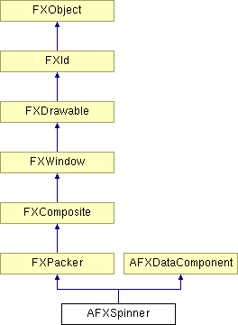

# AFXSpinner

This class contains a label that precedes a spin box that allows the user to specify a value by clicking on its arrow buttons.

### AFXSpinner(p, ncols, labelText, tgt=None, sel=0, opts=0, x=0, y=0, w=0, h=0, pl=DEFAULT_PAD, pr=DEFAULT_PAD, pt=DEFAULT_PAD, pb=DEFAULT_PAD)

Constructor.
| **Argument** | **Type** | **Default** | **Description** |
| --- | --- | --- | --- |
| p | FXComposite |  | Parent widget. |
| ncols | Int |  | Number of columns. |
| labelText | String |  | Label string. |
| tgt | FXObject | None | Message target. |
| sel | Int | 0 | Message ID |
| opts | Int | 0 | Options and hints. |
| x | Int | 0 | X coordinate of the origin. |
| y | Int | 0 | Y coordinate of the origin. |
| w | Int | 0 | Width of the widget. |
| h | Int | 0 | Height of the widget. |
| pl | Int | DEFAULT_PAD | Left padding (margin). |
| pr | Int | DEFAULT_PAD | Right padding (margin). |
| pt | Int | DEFAULT_PAD | Top padding (margin). |
| pb | Int | DEFAULT_PAD | Bottom padding (margin). |

### create()

Creates the spinner.

Reimplemented from FXComposite.

### disable()

Disables the spinner.

Reimplemented from FXWindow.

### enable()

Enables the spinner.

Reimplemented from FXWindow.

### getCheck()

Returns the state of the check button or the radio button.

### getHelpText()

Returns the status line help text.

### getIncrement()

Returns the spinner increment.

### getLabelFont()

Returns the label font.

### getLabelText()

Returns the label string.

### getRange()

Returns a sequence of ints (low, high) representing the widget's allowable minimum and maximum values.

### getTipText()

Returns the tool tip message.

### getValue()

Returns the spinner value.

### isEditable()

Returns True if the text in the text field may be edited.

### isReadOnlyState()

Returns True if the spinner appears in the read-only state.

### setCheck(state)

Sets the state of the check button or the radio button.
| **Argument** | **Type** | **Default** | **Description** |
| --- | --- | --- | --- |
| state | Bool |  | State. |

### setCheckButtonSelector(sel)

Sets the message ID of the check button or the radio button.
| **Argument** | **Type** | **Default** | **Description** |
| --- | --- | --- | --- |
| sel | Int |  | Selector. |

### setCheckButtonTarget(tgt)

Sets the message target of the check button or the radio button.
| **Argument** | **Type** | **Default** | **Description** |
| --- | --- | --- | --- |
| tgt | FXObject |  | Target. |

### setEditable(edit=True)

Sets the editable state for the input field.
| **Argument** | **Type** | **Default** | **Description** |
| --- | --- | --- | --- |
| edit | Bool | True | If True, input field is editable. |

### setHelpText(text)

Sets the status line help text.
| **Argument** | **Type** | **Default** | **Description** |
| --- | --- | --- | --- |
| text | String |  | Help text. |

### setIncrement(incr)

Sets the spinner increment.
| **Argument** | **Type** | **Default** | **Description** |
| --- | --- | --- | --- |
| incr | Int |  | Increment. |

### setLabelFont(fnt)

Sets the label font.
| **Argument** | **Type** | **Default** | **Description** |
| --- | --- | --- | --- |
| fnt | FXFont |  | Label font. |

### setLabelText(txt)

Sets the label string.
| **Argument** | **Type** | **Default** | **Description** |
| --- | --- | --- | --- |
| txt | String |  | Label text. |

### setRange(low, high)

Sets the spinner range.
| **Argument** | **Type** | **Default** | **Description** |
| --- | --- | --- | --- |
| low | Int |  | Minimum value. |
| high | Int |  | Maximum value. |

### setReadOnlyState(readonly=True)

Sets the read-only state of the spinner.
| **Argument** | **Type** | **Default** | **Description** |
| --- | --- | --- | --- |
| readonly | Bool | True | State. |

### setTipText(text)

Sets the tool tip message.
| **Argument** | **Type** | **Default** | **Description** |
| --- | --- | --- | --- |
| text | String |  | Tooltip text. |

### setValue(val, notify=False)

Sets the spinner's value.
| **Argument** | **Type** | **Default** | **Description** |
| --- | --- | --- | --- |
| val | Int |  | Value. |
| notify | Bool | False | Notification flag. |

### Class flags

### ** **

| **ID_BUTTON** | ID for the check or radio button. |
| --- | --- |
| **ID_SPINNER** | ID for the spinner. |

### Global flags

### **Flags for AFX spinner options.**

| **AFXSPINNER_CHECKBUTTON** | Use a check button instead of a label. |
| --- | --- |
| **AFXSPINNER_RADIOBUTTON** | Use a radio button instead of a label. |
| **AFXSPINNER_VERTICAL** | Orient label or button above spinner. |
| **AFXSPINNER_READONLY** | Configure spinner to the read-only state. |

