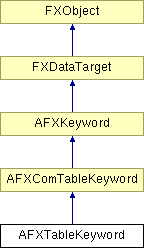

# AFXTableKeyword

This class is designed for command keywords that have table values. 

### AFXTableKeyword(command, name, isRequired=False, minLength=0, maxLength=-1, opts=0)

Constructor.
| **Argument** | **Type** | **Default** | **Description** |
| --- | --- | --- | --- |
| command | AFXGuiCommand |  | Host command. |
| name | String |  | Keyword name. |
| isRequired | Bool | False | True if this keyword is a required argument. |
| minLength | Int | 0 | Minimum (and default) row length. |
| maxLength | Int | -1 | Maximum row length (-1 => unlimited). |
| opts | Int | 0 | Options. |

### getTypeName()

Returns the name of the table keyword type.

Reimplemented from AFXComTableKeyword.

