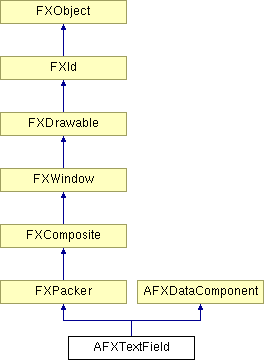

# AFXTextField

This class contains a label that precedes a text field that allows the user to enter in text.

### AFXTextField(p, ncols, labelText, tgt=None, sel=0, opts=AFXTEXTFIELD_STRING, x=0, y=0, w=0, h=0, pl=DEFAULT_PAD, pr=DEFAULT_PAD, pt=DEFAULT_PAD, pb=DEFAULT_PAD)

Constructor.
| **Argument** | **Type** | **Default** | **Description** |
| --- | --- | --- | --- |
| p | FXComposite |  | Parent widget. |
| ncols | Int |  | Number of columns. |
| labelText | String |  | Label string. |
| tgt | FXObject | None | Message target. |
| sel | Int | 0 | Message ID. |
| opts | Int | AFXTEXTFIELD_STRING | Options and hints. |
| x | Int | 0 | X coordinate of origin. |
| y | Int | 0 | Y coordinate of origin. |
| w | Int | 0 | Width of the widget. |
| h | Int | 0 | Height of the widget. |
| pl | Int | DEFAULT_PAD | Left padding (margin). |
| pr | Int | DEFAULT_PAD | Right padding (margin). |
| pt | Int | DEFAULT_PAD | Top padding (margin). |
| pb | Int | DEFAULT_PAD | Bottom padding (margin). |

### create()

Creates the text field.

Reimplemented from FXComposite.

### disable()

Disables the text field.

Reimplemented from FXWindow.

### enable()

Enables the text field.

Reimplemented from FXWindow.

### getCheck()

Returns the state of the check button or the radio button.

### getCursorPos()

Returns the cursor position.

### getDefaultWidth()

Returns the default width of the text field.

Reimplemented from FXPacker.

### getExponentType()

Returns the exponent type of the text field for real and complex types.

### getImaginaryText()

Returns the imaginary text for the complex text field.

### getJustify()

Returns the text justification mode.

### getLabelFont()

Returns the label's font.

### getLabelText()

Returns the label text.

### getNumColumns()

Returns the number of columns.

### getPrecision()

Returns the precision of the text field for real and complex types.

### getText()

Returns the text.

### getValueType()

Returns the value type (AFXTEXTFIELD_FLOAT, etc.) of the text field.

### isEditable()

Returns True if the text in the input field may be edited.

### isReadOnlyState()

Returns True if the text field appears in the read-only state.

### isVerticalLayout()

Returns True if the layout orientation is vertical.

### setCheck(state)

Sets the state of the check button or the radio button.
| **Argument** | **Type** | **Default** | **Description** |
| --- | --- | --- | --- |
| state | Bool |  | Check state. |

### setCheckButtonSelector(sel)

Sets the message ID of the check button or the radio button.
| **Argument** | **Type** | **Default** | **Description** |
| --- | --- | --- | --- |
| sel | Int |  | Selector. |

### setCheckButtonTarget(checkVal=False)

Sets the message target of the check button or the radio button.
| **Argument** | **Type** | **Default** | **Description** |
| --- | --- | --- | --- |
| checkVal | Bool | False | Check state. |

### setCursorPos(pos)

Sets the cursor position.
| **Argument** | **Type** | **Default** | **Description** |
| --- | --- | --- | --- |
| pos | Int |  | Position. |

### setEditable(edit=True)

Sets the editable state for the text field.
| **Argument** | **Type** | **Default** | **Description** |
| --- | --- | --- | --- |
| edit | Bool | True | If True, text can be edited. |

### setExponentType(e)

Sets the exponent type of the text field for real and complex types.
| **Argument** | **Type** | **Default** | **Description** |
| --- | --- | --- | --- |
| e | FXExponent |  | Exponent type. |

### setFocus()

Moves the focus to the text field.

Reimplemented from FXWindow.

### setFocusAndSelection()

Sets the focus to the input field and selects its contents.

### setFocusToCheckButton()

Moves the focus to the check button or the radio button (if existed) of the widget.

### setFocusToImaginaryTextField()

Moves the focus to the input field for the imaginary part.

### setFocusToTextField()

Moves the focus to the input field of the widget.

### setImaginaryFocusAndSelection()

Sets the focus to the input field for the imaginary part and selects its contents.

### setImaginaryText(text)

Sets the imaginary text for the complex text field.
| **Argument** | **Type** | **Default** | **Description** |
| --- | --- | --- | --- |
| text | String |  | Imaginary text field text. |

### setJustify(mode)

Sets the text justification mode.
| **Argument** | **Type** | **Default** | **Description** |
| --- | --- | --- | --- |
| mode | Int |  | Justification flag. |

### setLabelFont(fnt)

Sets the label's text font.
| **Argument** | **Type** | **Default** | **Description** |
| --- | --- | --- | --- |
| fnt | FXFont |  | Label font. |

### setLabelText(txt)

Sets the label text.
| **Argument** | **Type** | **Default** | **Description** |
| --- | --- | --- | --- |
| txt | String |  | Label text. |

### setNumColumns(cols)

Sets the number of columns. Note: The column width is based on the width of "m" of the font used.
| **Argument** | **Type** | **Default** | **Description** |
| --- | --- | --- | --- |
| cols | Int |  | Number of columns. |

### setPrecision(p)

Sets the precision of the text field for real and complex types. Limitation: If an AFXTextField widget uses an AFXFloatKeyword object as its target, the widget must have AFXTEXTFIELD_FLOAT as one of its options for the precision setting to take effect.
| **Argument** | **Type** | **Default** | **Description** |
| --- | --- | --- | --- |
| p | Int |  | Precision. |

### setReadOnlyState(readonly=True)

Sets the read-only state of the text field.
| **Argument** | **Type** | **Default** | **Description** |
| --- | --- | --- | --- |
| readonly | Bool | True | Read-only state. |

### setSelection(pos, len)

Select the specified number of characters starting at given position.
| **Argument** | **Type** | **Default** | **Description** |
| --- | --- | --- | --- |
| pos | Int |  | Position. |
| len | Int |  | Length. |

### setText(text)

Sets the text in the input field.
| **Argument** | **Type** | **Default** | **Description** |
| --- | --- | --- | --- |
| text | String |  | Text field text. |

### setValueType(type)

Sets the value type (AFXTEXTFIELD_FLOAT, etc.) of the text field.
| **Argument** | **Type** | **Default** | **Description** |
| --- | --- | --- | --- |
| type | Int |  | Value type. |

### setVerticalLayout(vertical)

Sets the layout orientation of the text field.
| **Argument** | **Type** | **Default** | **Description** |
| --- | --- | --- | --- |
| vertical | Bool |  | Vertical flag. |

### Class flags

### **Message ID's.**

| **ID_SETIMAGINARYVALUE** | ID for setting imaginary values. |
| --- | --- |
| **ID_GETIMAGINARYVALUE** | ID for getting imaginary values. |
| **ID_BUTTON** | ID for the check/radio button. |
| **ID_TEXT** | ID for the text field. |
| **ID_IMG_TEXT** | ID for the text field with imaginary part. |

### Global flags

### **Flags for AFX textfield options.**

| **AFXTEXTFIELD_STRING** | Value field is a string. |
| --- | --- |
| **AFXTEXTFIELD_INTEGER** | Value field is an integer. |
| **AFXTEXTFIELD_FLOAT** | Value field is a double. |
| **AFXTEXTFIELD_COMPLEX** | Value fields consist of the real and imaginay components of a complex number. |
| **AFXTEXTFIELD_CHECKBUTTON** | Use a check button instead of a label. |
| **AFXTEXTFIELD_RADIOBUTTON** | Use a radio button instead of a label. |
| **AFXTEXTFIELD_VERTICAL** | Orient label or button above text field. |
| **AFXTEXTFIELD_READONLY** | Configure text field to the read-only state. |
| **AFXTEXTFIELD_IME** | Allow IME (Japanese etc.) input. |

