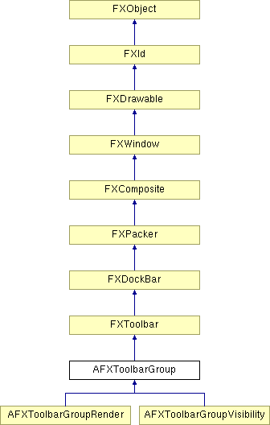

# AFXToolbarGroup

This class creates a container to be used for groups in the toolbar. It creates a vertical separator after the group. It will use utility methods so the group is correctly managed. 

### AFXToolbarGroup(owner, name='', title='')

Constructor.
| **Argument** | **Type** | **Default** | **Description** |
| --- | --- | --- | --- |
| owner | AFXGuiObjectManager |  | Creator of the group. |
| name | String | '' | English toolset name. |
| title | String | '' | Name appearing in the title bar when the group is floating. |

### getDefaultHeight()

Returns the default height.

Reimplemented from FXToolbar.

### getDefaultWidth()

Returns the default width.

Reimplemented from FXToolbar.

### getName()

Returns the English identifier for the group.

### getOwner()

Returns the creator of the group.

Reimplemented from FXWindow.

### getTitle()

Returns the name appearing in the title bar when the group is floating.

### hide()

Hide this window.

Reimplemented from FXWindow.

Reimplemented in AFXToolbarGroupRender, and AFXToolbarGroupVisibility.

### isActive()

Return True if the window is active.

Reimplemented from FXWindow.

### layout()

Calculates layout.

Reimplemented from FXToolbar.

### setName(name)

Sets the English identifier for the group.
| **Argument** | **Type** | **Default** | **Description** |
| --- | --- | --- | --- |
| name | String |  |  |

### setTitle(title)

Sets the name appearing in the title bar when the group is floating.
| **Argument** | **Type** | **Default** | **Description** |
| --- | --- | --- | --- |
| title | String |  |  |

### show()

Show this window.

Reimplemented from FXWindow.

Reimplemented in AFXToolbarGroupRender, and AFXToolbarGroupVisibility.

