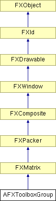

# AFXToolboxGroup

This class creates a container to be used for groups in the toolbox. It will use utility methods so the group is correctly managed for modules and toolsets. 

### AFXToolboxGroup(owner, parent=None)

Constructor.
| **Argument** | **Type** | **Default** | **Description** |
| --- | --- | --- | --- |
| owner | AFXGuiObjectManager |  | Creator of the toolbox group. |
| parent | FXComposite | None | Parent widget. |

### getOwner()

Returns the owner of the toolbox group.

Reimplemented from FXWindow.

