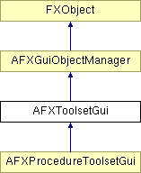

# AFXToolsetGui

This is the base class for toolset GUIs and provides an interface for managing the toolset's GUI items. It provides a mechanism to add in menubar, toolbar, and toolbox GUI items. 

### AFXToolsetGui(toolsetName)

Constructor.
| **Argument** | **Type** | **Default** | **Description** |
| --- | --- | --- | --- |
| toolsetName | String |  | Toolset name passed in from derived toolsets. |

### activate()

Activates the toolset (if there is no mode factory, then this method need not be redefined).

### deactivate()

Deactivates the toolset (if there is no mode factory, then this method need not be redefined).

### getToolsetName()

Returns the name of the toolset given on construction.

### hide(location)

Hides the GUI components in the menubar, toolbar, and toolbox.
| **Argument** | **Type** | **Default** | **Description** |
| --- | --- | --- | --- |
| location | Int |  | Flags indicating the location where GUI components are placed. Possible values are GUI_IN_NONE, GUI_IN_MENUBAR, GUI_IN_TOOL_PANE, GUI_IN_TOOLBAR, and GUI_IN_TOOLBOX. |

### show(location)

Shows the GUI components in the menubar, toolbar, and toolbox.
| **Argument** | **Type** | **Default** | **Description** |
| --- | --- | --- | --- |
| location | Int |  | Flags indicating the location where GUI components are placed. Possible values are GUI_IN_NONE, GUI_IN_MENUBAR, GUI_IN_TOOL_PANE, GUI_IN_TOOLBAR, and GUI_IN_TOOLBOX. |

