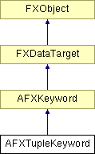

# AFXTupleKeyword

This class manages values which are sent as tuples in a command.

Widgets used to edit the whole tuple should have their message ID set to 0. It is also possible to edit individual elements of the tuple. In order to edit the N-th tuple element, the widget's message ID should be set to N (N is 1-based).

### AFXTupleKeyword(command, name, isRequired=False, minLength=0, maxLength=-1, opts=0)

Constructor.
| **Argument** | **Type** | **Default** | **Description** |
| --- | --- | --- | --- |
| command | AFXCommand |  | Host command. |
| name | String |  | Keyword name. |
| isRequired | Bool | False | True if this keyword is a required argument. |
| minLength | Int | 0 | Minimum (and default) tuple length. |
| maxLength | Int | -1 | Maximum tuple length (-1 => unlimited). |
| opts | Int | 0 | Options. |

### equal(index, a, b)

Returns True if the two tuple element values compare equal (index is not used).
| **Argument** | **Type** | **Default** | **Description** |
| --- | --- | --- | --- |
| index | Int |  | Element index (not used). |
| a | String |  | First value. |
| b | String |  | Second value. |

### getDefaultStyle()

Returns the default style for elements.

### getDefaultType()

Returns the default type for elements.

### getDefaultValues()

Returns the default values for this tuple.

### getElementStyle(index)

Returns the style of one element. Will never return AFXTUPLE_STYLE_DEFAULT!
| **Argument** | **Type** | **Default** | **Description** |
| --- | --- | --- | --- |
| index | Int |  | Element index. |

### getElementType(index)

Returns the type of one element. Will never return AFXTUPLE_TYPE_DEFAULT!
| **Argument** | **Type** | **Default** | **Description** |
| --- | --- | --- | --- |
| index | Int |  | Element index. |

### getFormattedValue(index)

Returns the formatted value of the tuple element, suitable for placing in a command. If the element has AFXTUPLE_EVALUATE style and its contents are invalid, an exception will be thrown.
| **Argument** | **Type** | **Default** | **Description** |
| --- | --- | --- | --- |
| index | Int |  | Element index. |

### getLength()

Returns the length of the tuple.

### getMaxLength()

Returns the maximum length of this tuple, or -1 for unbounded length.

### getMinLength()

Returns the minimum length of this tuple.

### getTypeName()

Returns the name of the tuple keyword type.

Implements AFXKeyword.

### getValue(index)

Returns the value of a tuple element.
| **Argument** | **Type** | **Default** | **Description** |
| --- | --- | --- | --- |
| index | Int |  | Element index. |

### getValueAsDouble()

Returns the keyword's value as a float; returns False upon failure.

### getValueAsInt()

Returns the keyword's value as an integer; returns False upon failure.

### getValueAsString()

Returns the formatted string that represents the current keyword value in a command.

Implements AFXKeyword.

### getValueForBlank(index)

Returns the value substituted for blank tuple element.
| **Argument** | **Type** | **Default** | **Description** |
| --- | --- | --- | --- |
| index | Int |  | Element index. |

### getValues()

Returns a string containing values (separated by commas) of the tuple elements.

### getValuesForBlanks()

Returns a string containing values substituted for blanks for the tuple elements.

### insertElements(index, numCols)

Inserts elements starting at the given index.
| **Argument** | **Type** | **Default** | **Description** |
| --- | --- | --- | --- |
| index | Int |  | Starting index. |
| numCols | Int |  | Number of elements to insert. |

### isValueChanged()

Returns True if the keyword value differs from its previous value.

Implements AFXKeyword.

### removeElements(index, numCols)

Removes elements starting at the given index.
| **Argument** | **Type** | **Default** | **Description** |
| --- | --- | --- | --- |
| index | Int |  | Starting index. |
| numCols | Int |  | Number of elements to remove. |

### setDefaultStyle(style)

Sets the default style for elements.
| **Argument** | **Type** | **Default** | **Description** |
| --- | --- | --- | --- |
| style | Int |  | New default element style. |

### setDefaultType(type)

Sets the default type for elements.
| **Argument** | **Type** | **Default** | **Description** |
| --- | --- | --- | --- |
| type | Int |  | New default type. |

### setDefaultValues(values)

Sets the default values for this tuple.
| **Argument** | **Type** | **Default** | **Description** |
| --- | --- | --- | --- |
| values | String |  | Sequence string with default values. |

### setElementStyle(index, style)

Sets the style of one element.
| **Argument** | **Type** | **Default** | **Description** |
| --- | --- | --- | --- |
| index | Int |  | Element index. |
| style | Int |  | New element style. |

### setElementType(index, type)

Sets the type of one element.
| **Argument** | **Type** | **Default** | **Description** |
| --- | --- | --- | --- |
| index | Int |  | Element index. |
| type | Int |  | New element type. |

### setLengthRange(minLength, maxLength)

Sets the range of allowable tuple lengths.
| **Argument** | **Type** | **Default** | **Description** |
| --- | --- | --- | --- |
| minLength | Int |  | New minimum length. |
| maxLength | Int |  | New maximum length, or -1 for unbounded length. |

### setMaxLength(length)

Sets the maximum length of this tuple.
| **Argument** | **Type** | **Default** | **Description** |
| --- | --- | --- | --- |
| length | Int |  | New maximum length, or -1 for unbounded length. |

### setMinLength(length)

Sets the minimum length of this tuple.
| **Argument** | **Type** | **Default** | **Description** |
| --- | --- | --- | --- |
| length | Int |  | New minimum length. |

### setValue(index, value)

Sets the value of the tuple element; returns False upon failure.
| **Argument** | **Type** | **Default** | **Description** |
| --- | --- | --- | --- |
| index | Int |  | Element index. |
| value | String |  | New value. |

### setValueForBlank(index, value)

Sets the value substituted for a blank tuple element.
| **Argument** | **Type** | **Default** | **Description** |
| --- | --- | --- | --- |
| index | Int |  | Element index. |
| value | String |  | New value. |

### setValues(values)

Sets values for all tuple elements (use commas to separate values within the string).
| **Argument** | **Type** | **Default** | **Description** |
| --- | --- | --- | --- |
| values | String |  | Tuple string with new values. |

### setValuesForBlanks(values)

Sets all values substituted for blanks for the tuple elements.
| **Argument** | **Type** | **Default** | **Description** |
| --- | --- | --- | --- |
| values | String |  | Tuple string with values. |

### setValueToDefault(ignoreUnspecified=False)

Sets the keyword value to its default.
| **Argument** | **Type** | **Default** | **Description** |
| --- | --- | --- | --- |
| ignoreUnspecified | Bool | False | Should ignore if default is an unspecified value. |

### setValueToPrevious()

Sets the keyword value to its previous value.

Implements AFXKeyword.

### syncPreviousValue()

Sets the keyword's previous value to its current value.

Implements AFXKeyword.

### Class flags

### **Message ID's.**

| **ID_PRINTSNIPPET** | For debugging. |
| --- | --- |

### Global flags

### **Flags for tuple keyword options.**

| **AFXTUPLE_TYPE_ANY** | Any type is accepted. |
| --- | --- |
| **AFXTUPLE_TYPE_DEFAULT** | Element type is the same as the tuple default type. |
| **AFXTUPLE_TYPE_INT** | Element is an integer number. |
| **AFXTUPLE_TYPE_FLOAT** | Element is a floating-point number. |
| **AFXTUPLE_TYPE_STRING** | Element is a string. |
| **AFXTUPLE_TYPE_BOOL** | Element is True or False. |
| **AFXTUPLE_TYPE_MASK** | Mask for element types. |
| **AFXTUPLE_ALLOW_EMPTY** | Allow empty values for the element. |
| **AFXTUPLE_DEFAULT_IF_EMPTY** | Always substitute the default for an empty value. |
| **AFXTUPLE_EVALUATE** | Evaluate integer and float elements. |
| **AFXTUPLE_STYLE_DEFAULT** | Use tuple default element style. |
| **AFXTUPLE_STYLE_MASK** | Mask for element styles. |

