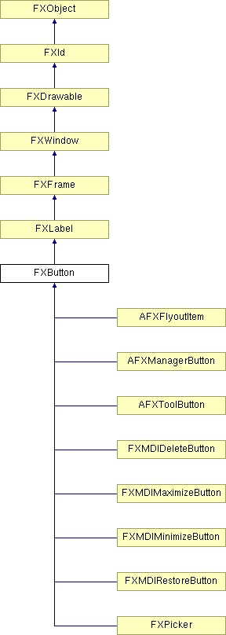

# FXButton

A button provides a push button, with optional icon and/or text label. When pressed, the button widget sends a SEL_COMMAND to its target.

### FXButton(p, text, ic=None, tgt=None, sel=0, opts=BUTTON_NORMAL, x=0, y=0, w=0, h=0, pl=DEFAULT_PAD, pr=DEFAULT_PAD, pt=DEFAULT_PAD, pb=DEFAULT_PAD)

Construct button with text and icon.
| **Argument** | **Type** | **Default** | **Description** |
| --- | --- | --- | --- |
| p | FXComposite |  |  |
| text | String |  |  |
| ic | FXIcon | None |  |
| tgt | FXObject | None |  |
| sel | Int | 0 |  |
| opts | Int | BUTTON_NORMAL |  |
| x | Int | 0 |  |
| y | Int | 0 |  |
| w | Int | 0 |  |
| h | Int | 0 |  |
| pl | Int | DEFAULT_PAD |  |
| pr | Int | DEFAULT_PAD |  |
| pt | Int | DEFAULT_PAD |  |
| pb | Int | DEFAULT_PAD |  |

### canFocus()

Returns True because a button can receive focus.

Reimplemented from FXWindow.

Reimplemented in AFXFlyoutItem.

### getButtonStyle()

Get the button style flags.

### getState()

Get the button state.

### setButtonStyle(style)

Set the button style flags.
| **Argument** | **Type** | **Default** | **Description** |
| --- | --- | --- | --- |
| style | Int |  |  |

### setDefault(enable=True)

Set as default button.

Reimplemented from FXWindow.
| **Argument** | **Type** | **Default** | **Description** |
| --- | --- | --- | --- |
| enable | Bool | True |  |

### setState(s)

Set the button state.
| **Argument** | **Type** | **Default** | **Description** |
| --- | --- | --- | --- |
| s | Int |  |  |

### Global flags

### **Button state bits**

| **STATE_UP** | Button is up. |
| --- | --- |
| **STATE_DOWN** | Button is down. |
| **STATE_ENGAGED** | Button is engaged. |
| **STATE_UNCHECKED** | Same as STATE_UP (used for check buttons or radio buttons). |
| **STATE_CHECKED** | Same as STATE_ENGAGED (used for check buttons or radio buttons). |

### **Button flags**

| **BUTTON_AUTOGRAY** | Automatically gray out when not updated. |
| --- | --- |
| **BUTTON_AUTOHIDE** | Automatically hide button when not updated. |
| **BUTTON_TOOLBAR** | Toolbar style button [flat look]. |
| **BUTTON_DEFAULT** | May become default button when receiving focus. |
| **BUTTON_INITIAL** | This button is the initial default button. |
| **BUTTON_NORMAL** | Normal button style. |

