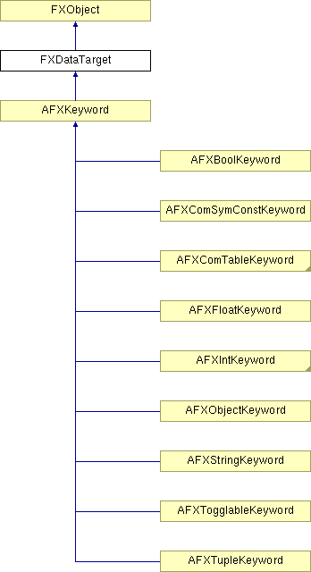

# FXDataTarget

A Data Target allows a valuator widget such as a Slider or Text Field to be directly connected with a variable in the program. Whenever the valuator control changes, the variable connected through the data target is automatically updated; conversely, whenever the program changes a variable, all the connected valuator widgets will be updated to reflect this new value on the display. Data Targets also allow connecting Radio Buttons, Menu Commands, and so on to a variable. In this case, the new value of the connected variable is computed by substracting ID_OPTION from the message ID. 

### FXDataTarget(tgt=None, sel=0)

Associate with nothing.
| **Argument** | **Type** | **Default** | **Description** |
| --- | --- | --- | --- |
| tgt | FXObject | None |  |
| sel | Int | 0 |  |

### FXDataTarget(value, tgt=None, sel=0)

Associate with character variable.
| **Argument** | **Type** | **Default** | **Description** |
| --- | --- | --- | --- |
| value | String |  |  |
| tgt | FXObject | None |  |
| sel | Int | 0 |  |

### FXDataTarget(value, tgt=None, sel=0)

Associate with unsigned character variable.
| **Argument** | **Type** | **Default** | **Description** |
| --- | --- | --- | --- |
| value | Int |  |  |
| tgt | FXObject | None |  |
| sel | Int | 0 |  |

### FXDataTarget(value, tgt=None, sel=0)

Associate with signed short variable.
| **Argument** | **Type** | **Default** | **Description** |
| --- | --- | --- | --- |
| value | Int |  |  |
| tgt | FXObject | None |  |
| sel | Int | 0 |  |

### FXDataTarget(value, tgt=None, sel=0)

Associate with unsigned short variable.
| **Argument** | **Type** | **Default** | **Description** |
| --- | --- | --- | --- |
| value | Int |  |  |
| tgt | FXObject | None |  |
| sel | Int | 0 |  |

### FXDataTarget(value, tgt=None, sel=0)

Associate with int variable.
| **Argument** | **Type** | **Default** | **Description** |
| --- | --- | --- | --- |
| value | Int |  |  |
| tgt | FXObject | None |  |
| sel | Int | 0 |  |

### FXDataTarget(value, tgt=None, sel=0)

Associate with unsigned int variable.
| **Argument** | **Type** | **Default** | **Description** |
| --- | --- | --- | --- |
| value | Int |  |  |
| tgt | FXObject | None |  |
| sel | Int | 0 |  |

### FXDataTarget(value, tgt=None, sel=0)

Associate with float variable.
| **Argument** | **Type** | **Default** | **Description** |
| --- | --- | --- | --- |
| value | Float |  |  |
| tgt | FXObject | None |  |
| sel | Int | 0 |  |

### FXDataTarget(value, tgt=None, sel=0)

Associate with double variable.
| **Argument** | **Type** | **Default** | **Description** |
| --- | --- | --- | --- |
| value | Float |  |  |
| tgt | FXObject | None |  |
| sel | Int | 0 |  |

### FXDataTarget(value, tgt=None, sel=0)

Associate with string variable.
| **Argument** | **Type** | **Default** | **Description** |
| --- | --- | --- | --- |
| value | String |  |  |
| tgt | FXObject | None |  |
| sel | Int | 0 |  |

### connect(value)

Associate with string variable.
| **Argument** | **Type** | **Default** | **Description** |
| --- | --- | --- | --- |
| value | String |  |  |

### connect(value)

Associate with double variable.
| **Argument** | **Type** | **Default** | **Description** |
| --- | --- | --- | --- |
| value | Float |  |  |

### connect(value)

Associate with float variable.
| **Argument** | **Type** | **Default** | **Description** |
| --- | --- | --- | --- |
| value | Float |  |  |

### connect(value)

Associate with unsigned int variable.
| **Argument** | **Type** | **Default** | **Description** |
| --- | --- | --- | --- |
| value | Int |  |  |

### connect(value)

Associate with int variable.
| **Argument** | **Type** | **Default** | **Description** |
| --- | --- | --- | --- |
| value | Int |  |  |

### connect(value)

Associate with unsigned short variable.
| **Argument** | **Type** | **Default** | **Description** |
| --- | --- | --- | --- |
| value | Int |  |  |

### connect(value)

Associate with signed short variable.
| **Argument** | **Type** | **Default** | **Description** |
| --- | --- | --- | --- |
| value | Int |  |  |

### connect(value)

Associate with unsigned character variable.
| **Argument** | **Type** | **Default** | **Description** |
| --- | --- | --- | --- |
| value | Int |  |  |

### connect(value)

Associate with character variable.
| **Argument** | **Type** | **Default** | **Description** |
| --- | --- | --- | --- |
| value | String |  |  |

### connect()

Associate with nothing.

### getData()

Return pointer to data its connected to.

### getSelector()

Get the message identifier for this data target.

### getTarget()

Get the message target object for this data target, if any.

### getType()

Return type of data its connected to.

### setSelector(sel)

Set the message identifier for this data target.
| **Argument** | **Type** | **Default** | **Description** |
| --- | --- | --- | --- |
| sel | Int |  |  |

### setTarget(t)

Set the message target object for this data target.
| **Argument** | **Type** | **Default** | **Description** |
| --- | --- | --- | --- |
| t | FXObject |  |  |

### Class flags

### ** **

| **ID_VALUE** | Will cause the FXDataTarget to ask sender for value. |
| --- | --- |
| **ID_OPTION** | ID_OPTION+i will set the value to i where -10000<=i<=10000. |

